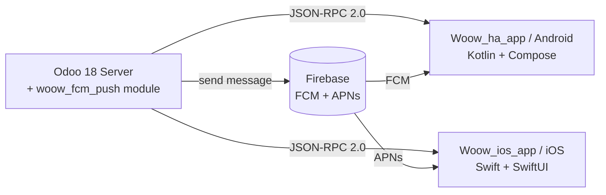
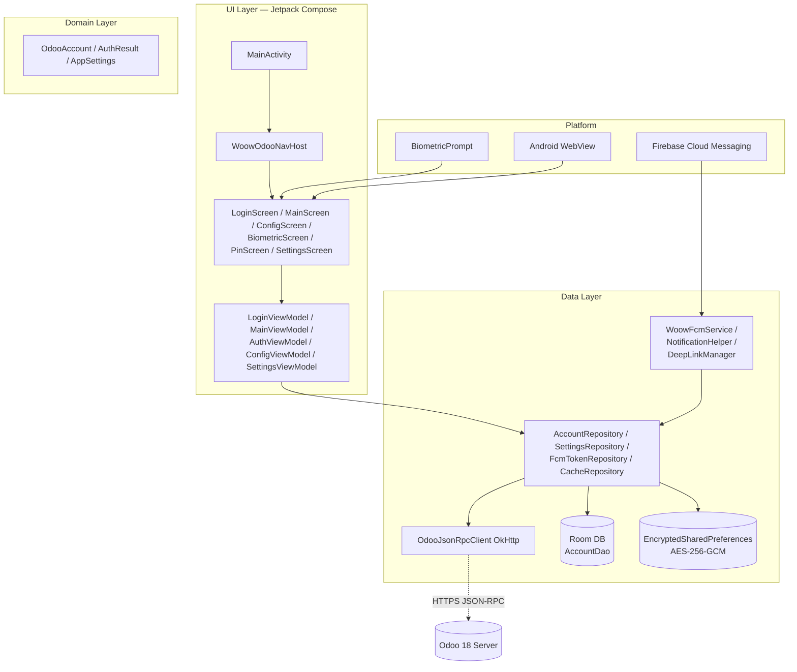
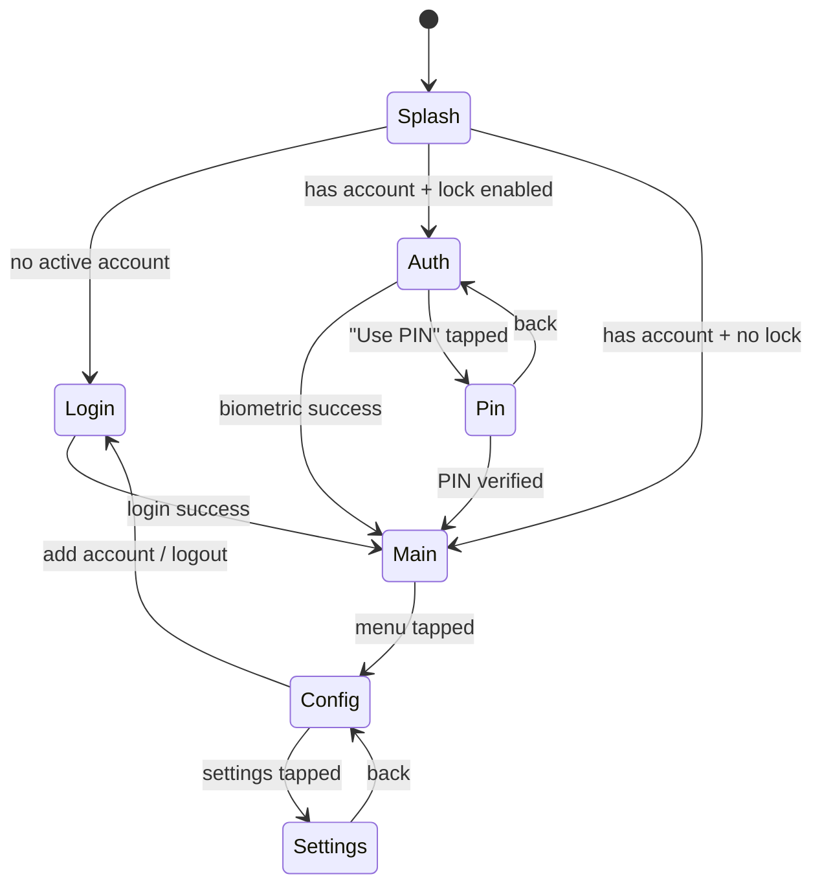
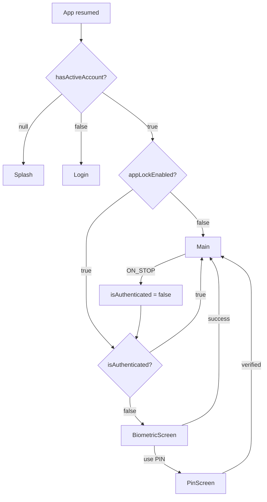
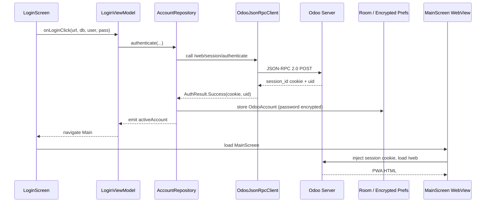
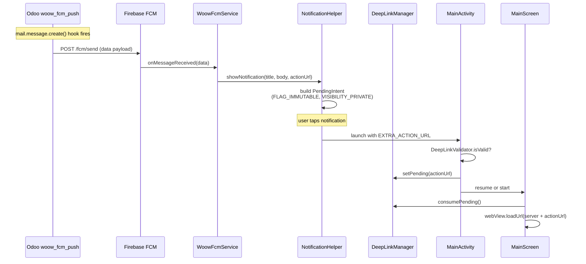
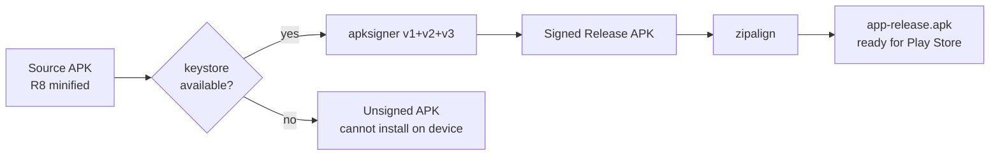

# WoowTech Odoo — Android

> Native Android companion app for the Odoo ERP platform, built entirely in Kotlin with Jetpack Compose. This repository is the **reference implementation** that the iOS port (`Woow_ios_app`) mirrors feature-for-feature.

[](https://kotlinlang.org)
[](https://developer.android.com/jetpack/compose)
[](https://developer.android.com/studio)
[](https://developer.android.com/studio/releases/platforms)
[](https://developer.android.com/studio/releases/platforms)

---

## Table of Contents

1. [Project Overview](#1-project-overview)
2. [Architecture](#2-architecture)
3. [Project Structure](#3-project-structure)
4. [Prerequisites](#4-prerequisites)
5. [Setup Steps](#5-setup-steps)
6. [Firebase / FCM Setup](#6-firebase--fcm-setup)
7. [Signing Setup](#7-signing-setup)
8. [Build Commands](#8-build-commands)
9. [Configuration](#9-configuration)
10. [Key Features](#10-key-features)
11. [Security Model](#11-security-model)
12. [Testing](#12-testing)
13. [Troubleshooting](#13-troubleshooting)
14. [Tech Stack](#14-tech-stack)
15. [Contributing & Code Style](#15-contributing--code-style)

---

## 1. Project Overview

**WoowTech Odoo** is a mobile shell that wraps the Odoo 18 web interface in a hardened WebView and layers native Android features on top:

- Multi-account storage with encrypted credential management.
- Biometric / PIN app lock with PBKDF2 (600,000 iterations) and exponential backoff.
- Firebase Cloud Messaging (FCM) push notifications for chatter, discuss channels, mentions and activities — backed by the `woow_fcm_push` Odoo module.
- Deep linking (`woowodoo://open/...`) from notifications into specific Odoo records.
- Dynamic brand theming (user-pickable accent color) on Material 3.
- Trilingual UI: English, Traditional Chinese, Simplified Chinese.

### Relationship to the iOS Port

This Android app is the **source of truth** for product behavior. The iOS port (`Woow_ios_app`, SwiftUI + Swift 5.9) mirrors the same feature surface, the same Odoo JSON-RPC contract, and the same FCM event types. Any behavior change here is expected to be replicated on iOS — see `docs/plans/2026-03-25-ios-porting-plan.md` and `docs/plans/2026-03-25-ios-implementation-milestones.md`.



---

## 2. Architecture

The app follows **MVVM + light Clean Architecture** with Hilt dependency injection. A single Activity hosts a Compose navigation graph; all state flows from repositories through ViewModels into Compose screens via `StateFlow` + `collectAsStateWithLifecycle()`.

### 2.1 Layer Overview



### 2.2 Single-Activity Navigation Graph



### 2.3 Auth Gate Flow

The `AuthViewModel` combines three `StateFlow`s to decide the start destination. `LifecycleEventEffect(ON_STOP)` re-arms the gate whenever the app is backgrounded.



### 2.4 Data Flow — Login → WebView Session



### 2.5 FCM End-to-End Flow



---

## 3. Project Structure

All application code lives under `app/src/main/java/io/woowtech/odoo/`. Packages are organized **by feature**, not by layer.

```
WoowTechOdoo/
├── app/
│   ├── build.gradle.kts                # Module-level Gradle (AGP, Compose, Hilt, Firebase)
│   ├── google-services.json            # Firebase config — NOT committed, you must add it
│   ├── proguard-rules.pro              # R8 rules for release builds
│   └── src/
│       ├── main/
│       │   ├── AndroidManifest.xml
│       │   ├── java/io/woowtech/odoo/
│       │   │   ├── WoowOdooApp.kt              # @HiltAndroidApp, Timber, FCM token log, notification channel
│       │   │   ├── ui/
│       │   │   │   ├── MainActivity.kt         # Single ComponentActivity, deep link handler
│       │   │   │   ├── navigation/
│       │   │   │   │   └── NavGraph.kt         # Sealed Screen routes, WoowOdooNavHost
│       │   │   │   ├── auth/
│       │   │   │   │   ├── AuthViewModel.kt    # Auth gate state combiner
│       │   │   │   │   ├── BiometricScreen.kt  # BiometricPrompt integration
│       │   │   │   │   └── PinScreen.kt        # PIN keypad with lockout UI
│       │   │   │   ├── login/
│       │   │   │   │   ├── LoginScreen.kt
│       │   │   │   │   └── LoginViewModel.kt
│       │   │   │   ├── main/
│       │   │   │   │   ├── MainScreen.kt       # WebView host, cookie injection
│       │   │   │   │   └── MainViewModel.kt
│       │   │   │   ├── config/
│       │   │   │   │   ├── ConfigScreen.kt         # Account picker, logout
│       │   │   │   │   ├── ConfigViewModel.kt
│       │   │   │   │   ├── SettingsScreen.kt      # App lock, theme color, language
│       │   │   │   │   └── SettingsViewModel.kt
│       │   │   │   └── theme/
│       │   │   │       ├── Color.kt            # Dynamic accent + Material 3 roles
│       │   │   │       ├── Theme.kt            # WoowTechOdooTheme composable
│       │   │   │       └── Type.kt
│       │   │   ├── data/
│       │   │   │   ├── api/
│       │   │   │   │   └── OdooJsonRpcClient.kt   # OkHttp + JSON-RPC 2.0 (no Retrofit for RPC)
│       │   │   │   ├── local/
│       │   │   │   │   ├── AppDatabase.kt         # Room singleton
│       │   │   │   │   ├── AccountDao.kt
│       │   │   │   │   └── EncryptedPrefs.kt      # EncryptedSharedPreferences wrapper
│       │   │   │   ├── repository/
│       │   │   │   │   ├── AccountRepository.kt
│       │   │   │   │   ├── SettingsRepository.kt  # PIN hash, lockout state
│       │   │   │   │   ├── FcmTokenRepository.kt  # interface
│       │   │   │   │   ├── FcmTokenRepositoryImpl.kt
│       │   │   │   │   └── CacheRepository.kt     # WebView cache manager
│       │   │   │   ├── security/
│       │   │   │   │   └── EncryptionHelper.kt    # AES-256-GCM utilities
│       │   │   │   └── push/
│       │   │   │       ├── WoowFcmService.kt      # FirebaseMessagingService subclass
│       │   │   │       ├── NotificationHelper.kt  # Builds PendingIntent + channel
│       │   │   │       ├── DeepLinkManager.kt     # Pending URL broker (singleton)
│       │   │   │       └── DeepLinkValidator.kt   # Allowlist (same-host, scheme check)
│       │   │   ├── domain/model/
│       │   │   │   ├── OdooAccount.kt             # Immutable data class
│       │   │   │   ├── AuthResult.kt              # sealed interface
│       │   │   │   └── AppSettings.kt
│       │   │   └── di/
│       │   │       └── AppModule.kt               # Hilt @Provides bindings
│       │   └── res/
│       │       ├── values/                        # English strings (default)
│       │       ├── values-zh-rTW/                 # Traditional Chinese
│       │       ├── values-zh-rCN/                 # Simplified Chinese
│       │       ├── xml/
│       │       │   ├── network_security_config.xml
│       │       │   ├── backup_rules.xml
│       │       │   ├── data_extraction_rules.xml
│       │       │   └── file_paths.xml             # FileProvider paths
│       │       └── mipmap-*/ic_launcher*.webp
│       ├── test/                                  # JUnit 5 unit tests (MockK + Turbine)
│       └── androidTest/                           # Instrumented / Compose UI tests
├── build.gradle.kts                      # Top-level plugin aliases
├── settings.gradle.kts                   # Root project name, module includes
├── gradle.properties                     # JVM args, androidX flags
├── gradle/
│   ├── libs.versions.toml                # Version catalog (single source of truth)
│   └── wrapper/gradle-wrapper.properties # Gradle distribution URL
├── local.properties                      # sdk.dir (auto-generated, gitignored)
├── docs/                                 # Architecture, test plans, PRDs
├── scripts/                              # verify-on-device.py, e2e-production-test.py
├── releases/                             # Built APK artifacts (gitignored)
└── README.md                             # You are here
```

### Package Responsibilities

| Package | Responsibility |
| ------- | -------------- |
| `WoowOdooApp` | `@HiltAndroidApp` entry. Plants Timber (debug only). Creates notification channel `woow_odoo_messages` with `IMPORTANCE_HIGH`. Fetches current FCM token for debugging. |
| `ui.MainActivity` | Single Activity. Enables edge-to-edge. Handles deep link intents from notification taps. Hosts the Compose nav graph. |
| `ui.navigation` | `Screen` sealed class + `WoowOdooNavHost`. Computes `startDestination` from the three auth flows. |
| `ui.auth` | Biometric + PIN lock screens. Consumes `AuthViewModel`. |
| `ui.login` | Server URL + DB + credentials form. Calls `AccountRepository.authenticate()`. |
| `ui.main` | WebView host. Injects session cookie and accent-color CSS. Consumes `DeepLinkManager`. |
| `ui.config` | Account list, add/remove, settings entry. |
| `ui.theme` | `WoowTechOdooTheme` Composable, Material 3 color scheme with dynamic accent. |
| `data.api` | Raw OkHttp JSON-RPC 2.0 client. We deliberately don't use Retrofit for RPC — the `params` object varies per method. |
| `data.local` | Room DB + `EncryptedSharedPreferences`. |
| `data.repository` | Single source of truth for each data domain. Exposes `Flow`s. |
| `data.security` | AES-256-GCM key management backed by Android Keystore. |
| `data.push` | All FCM & notification plumbing. |
| `domain.model` | Pure Kotlin immutable models. No Android dependencies. |
| `di` | Hilt `@Module` definitions. |

---

## 4. Prerequisites

Before you clone, install these on your workstation.

| Tool | Required Version | Notes |
| ---- | ---------------- | ----- |
| **Android Studio** | Ladybug (2024.2.1) or newer | Required for AGP 8.3 + Kotlin 2.0 + Compose Compiler plugin |
| **JDK** | 17 (LTS) | Bundled with Android Studio as `jbr-17`, or install Temurin 17 |
| **Android SDK Platform** | API 34 (Android 14) | Target + compile |
| **Android SDK Platform** | API 29 (Android 10) | Minimum supported |
| **Android SDK Build-Tools** | 34.0.0 | Must match compileSdk |
| **Gradle** | 8.3+ | Provided via `./gradlew` wrapper — do not install manually |
| **Git** | 2.40+ | LFS not required |
| **Firebase CLI** | optional, latest | For push testing via `firebase messaging:send` |
| **Python 3** | 3.10+ | Only for running `scripts/verify-on-device.py` and `scripts/e2e-production-test.py` |

**OS:** macOS 13+, Windows 10+, or Ubuntu 22.04+. All examples in this README use macOS/Linux shell syntax.

**Hardware:** 16 GB RAM recommended (8 GB will work but slowly). At least 20 GB free disk for Android SDK + Gradle caches.

---

## 5. Setup Steps

Written for a junior engineer on day one. Skip any step you've already done.

### 5.1 Clone the Repository

```bash
git clone git@github.com:WOOWTECH/Woow_odoo_app.git
cd Woow_odoo_app
```

If you only have HTTPS access:

```bash
git clone https://github.com/WOOWTECH/Woow_odoo_app.git
```

### 5.2 Open in Android Studio

1. Launch Android Studio.
2. **Welcome screen → Open** (not "New Project").
3. Select the cloned `Woow_odoo_app` directory and click **Open**.
4. Trust the project when prompted. Android Studio will start a Gradle sync automatically.
5. If you see the yellow **"Project SDK is not defined"** banner, click **Configure → Project Structure → SDK Location** and point the Android SDK entry at `$ANDROID_HOME` (usually `~/Library/Android/sdk` on macOS).

### 5.3 Install SDK Platforms

The first sync will offer to install any missing components. If it doesn't:

1. **Tools → SDK Manager → SDK Platforms** tab.
2. Check **Android 14.0 (API 34)** — required for `compileSdk` and `targetSdk`.
3. Check **Android 10.0 (API 29)** — required for the minimum supported emulator.
4. Switch to the **SDK Tools** tab.
5. Check **Android SDK Build-Tools 34.0.0**, **Android SDK Platform-Tools**, **Android SDK Command-line Tools (latest)**.
6. Click **Apply**, wait for install to finish.

### 5.4 Accept SDK Licenses

Gradle will refuse to build if any license is unaccepted.

```bash
# macOS / Linux
yes | $ANDROID_HOME/cmdline-tools/latest/bin/sdkmanager --licenses

# or from Android Studio
# Tools → SDK Manager → "Accept" each unaccepted license
```

### 5.5 Configure `local.properties`

This file is **gitignored** — every machine writes its own. Android Studio usually generates it on first sync; verify the contents:

```properties
# local.properties  (at repo root)
sdk.dir=/Users/YOU/Library/Android/sdk
```

On Windows, use forward slashes: `sdk.dir=C\:\\Users\\YOU\\AppData\\Local\\Android\\Sdk`.

### 5.6 Verify Gradle Wrapper

From the repo root, confirm the wrapper is executable and picks up Gradle 8.x:

```bash
./gradlew --version
```

Expected output contains `Gradle 8.x` and `Kotlin 2.0.x`. If the wrapper is missing `+x`, run:

```bash
chmod +x gradlew
```

### 5.7 First Build (without Firebase)

The Google Services plugin is **conditional** — it only applies when `app/google-services.json` exists. This means you can produce a debug APK immediately, without Firebase, to confirm the toolchain is healthy:

```bash
./gradlew :app:assembleDebug
```

The APK lands at `app/build/outputs/apk/debug/app-debug.apk`. Push notifications will not work until you complete [Section 6](#6-firebase--fcm-setup).

---

## 6. Firebase / FCM Setup

**This is the most error-prone part of onboarding and also the part most critical to product behavior.** Push notifications are the reason the app exists as a native shell rather than a bookmarked PWA. Every step below matters.

### 6.1 Overview — What Has to Line Up

```mermaid
flowchart LR
    A[Firebase Console<br/>create project] --> B[Register Android App<br/>package=io.woowtech.odoo]
    B --> C[Download google-services.json]
    C --> D[Place in app/]
    D --> E[google-services plugin<br/>parses JSON at build]
    E --> F[FirebaseApp.initializeApp<br/>via ContentProvider]
    F --> G[WoowOdooApp onCreate<br/>requests token]
    G --> H[FcmTokenRepository<br/>POST to Odoo]
    H --> I[Odoo stores token<br/>on res.users]
    I --> J[woow_fcm_push module<br/>sends via Admin SDK]
    J --> K[WoowFcmService<br/>onMessageReceived]
```



### 6.2 Create the Firebase Project

1. Go to https://console.firebase.google.com and sign in with a Google account that has access to the WoowTech org.
2. Click **Add project**.
3. Project name: `woow-odoo-<env>` (e.g. `woow-odoo-dev`). The production project is already `woow-odoo-de2cb`.
4. Accept the default "Google Analytics for Firebase" setting — disable it if you don't need analytics; the FCM flow does not require it.
5. Wait for project provisioning (~30 seconds).

### 6.3 Register the Android App

1. In your new Firebase project, click the **Android icon** on the project overview to start "Add an app".
2. **Android package name**: `io.woowtech.odoo`
   - For debug builds you additionally need `io.woowtech.odoo.debug` (the `applicationIdSuffix` from `app/build.gradle.kts`). Register it as a separate Android app under the same Firebase project.
3. **App nickname**: `WoowTech Odoo (release)` or `...debug`.
4. **Debug signing certificate SHA-1** (required for App Check, optional for plain FCM):

   ```bash
   # Debug keystore — auto-generated, password is "android"
   keytool -list -v \
     -keystore ~/.android/debug.keystore \
     -alias androiddebugkey \
     -storepass android -keypass android
   ```

   Copy the `SHA1` line (format `AB:CD:EF:...`) and paste it into the Firebase form. You can skip this if you're only sending plain FCM messages.

5. Click **Register app**.

### 6.4 Download `google-services.json`

1. Firebase Console will present **Download google-services.json** immediately after registration.
2. Save the file to `app/google-services.json` (inside the `app/` module, **not** the repo root).
3. Verify:

   ```bash
   ls -l app/google-services.json
   ```

4. This file **must not be committed**. Check `.gitignore`:

   ```
   app/google-services.json
   app/firebase-service-account.json
   ```

   If you ever see `google-services.json` appear in `git status`, stop and fix the gitignore before proceeding.

### 6.5 Gradle Plugin Setup

All three snippets below should already exist in the repo — this is here so a junior engineer can audit them against a fresh check-out.

**`gradle/libs.versions.toml`** — version catalog entries:

```toml
[versions]
firebaseBom = "33.7.0"
googleServices = "4.4.2"

[libraries]
firebase-bom = { group = "com.google.firebase", name = "firebase-bom", version.ref = "firebaseBom" }
firebase-messaging = { group = "com.google.firebase", name = "firebase-messaging" }

[plugins]
google-services = { id = "com.google.gms.google-services", version.ref = "googleServices" }
```

**Top-level `build.gradle.kts`** — declare the plugin without applying it:

```kotlin
plugins {
    alias(libs.plugins.android.application) apply false
    alias(libs.plugins.kotlin.android) apply false
    alias(libs.plugins.kotlin.compose) apply false
    alias(libs.plugins.hilt) apply false
    alias(libs.plugins.ksp) apply false
    alias(libs.plugins.google.services) apply false   // <-- here
}
```

**`app/build.gradle.kts`** — conditionally apply + add dependencies:

```kotlin
plugins {
    alias(libs.plugins.android.application)
    alias(libs.plugins.kotlin.android)
    alias(libs.plugins.kotlin.compose)
    alias(libs.plugins.hilt)
    alias(libs.plugins.ksp)
}

// Apply google-services plugin only when google-services.json exists.
// This lets contributors build debug APKs without Firebase configured.
if (file("google-services.json").exists()) {
    apply(plugin = libs.plugins.google.services.get().pluginId)
}

dependencies {
    // Firebase — BoM aligns all firebase-* library versions
    implementation(platform(libs.firebase.bom))
    implementation(libs.firebase.messaging)
    // ...
}
```

**Why the `if (file(...).exists())` guard?** Forks, CI, and new contributors should still be able to produce an unsigned debug APK without you hand-delivering `google-services.json`. The plugin crashes the build if the JSON is missing, so we skip applying it instead.

### 6.6 `POST_NOTIFICATIONS` Permission (Android 13+)

Since Android 13 (API 33), apps must declare and request the runtime `POST_NOTIFICATIONS` permission or notifications will silently drop.

**Manifest** (already present):

```xml
<uses-permission android:name="android.permission.POST_NOTIFICATIONS" />
```

**Runtime request** — performed from a Composable on the first screen after login:

```kotlin
val permissionLauncher = rememberLauncherForActivityResult(
    contract = ActivityResultContracts.RequestPermission()
) { granted ->
    Timber.d("POST_NOTIFICATIONS granted=%s", granted)
}

LaunchedEffect(Unit) {
    if (Build.VERSION.SDK_INT >= Build.VERSION_CODES.TIRAMISU) {
        permissionLauncher.launch(Manifest.permission.POST_NOTIFICATIONS)
    }
}
```

The `NotificationHelper` wraps its `notify()` call in a `try/catch (SecurityException)` so a denied permission degrades gracefully rather than crashing.

### 6.7 Service Declaration — `WoowFcmService`

Already wired in `AndroidManifest.xml`:

```xml
<service
    android:name=".data.push.WoowFcmService"
    android:exported="false">
    <intent-filter>
        <action android:name="com.google.firebase.MESSAGING_EVENT" />
    </intent-filter>
</service>
```

`WoowFcmService` extends `FirebaseMessagingService`, is annotated `@AndroidEntryPoint` (so Hilt can inject `NotificationHelper`), and handles:

- `onNewToken(token)` — called when FCM issues a new registration token. Forward to `FcmTokenRepository.registerTokenForAllAccounts(token)`.
- `onMessageReceived(message)` — extracts `title`, `body`, `odoo_action_url`, `event_type` from the data payload, then calls `NotificationHelper.showNotification()`.

### 6.8 Notification Channel

Android 8+ requires a channel before `notify()` succeeds. `WoowOdooApp.createNotificationChannels()` creates channel `woow_odoo_messages` with `IMPORTANCE_HIGH` at app start.

### 6.9 Verify with a Firebase Console Test Message

1. Install a debug build on a device: `./gradlew :app:installDebug`.
2. Launch the app once, log in with a test Odoo account, and watch logcat:

   ```bash
   adb logcat | grep FCM_TOKEN
   ```

   Copy the long token string (~163 characters).

3. Firebase Console → **Engage → Messaging → New Campaign → Notifications**.
4. Fill **Notification title** = "Test", **Notification text** = "Hello from Firebase".
5. Click **Send test message**. Paste the FCM token and **Test**.
6. A notification should appear in ~2 seconds. Tap it — the app opens `MainActivity`.

If you want to test the full data-payload path (the one actually used by `woow_fcm_push`), use the Firebase Admin SDK or the REST API, not the Console UI, because the Console only sends `notification` payloads and skips `onMessageReceived()` when the app is in the background.

**Minimal Admin SDK test (Python):**

```bash
pip install firebase-admin
```

```python
import firebase_admin
from firebase_admin import credentials, messaging

cred = credentials.Certificate("app/firebase-service-account.json")
firebase_admin.initialize_app(cred)

msg = messaging.Message(
    token="PASTE_FCM_TOKEN_HERE",
    data={
        "title": "New message from Alan",
        "body": "Please review the quote",
        "odoo_action_url": "/web#id=42&model=sale.order&view_type=form",
        "event_type": "chatter",
    },
)
print(messaging.send(msg))
```

The `firebase-service-account.json` comes from **Project Settings → Service accounts → Generate new private key**. Treat it like a production secret: it is in `.gitignore` and must **never** be committed.

### 6.10 Token Registration with Odoo

`FcmTokenRepositoryImpl` posts the token to the `woow_fcm_push` module endpoint (JSON-RPC `fcm.token.register`) whenever:

1. The app starts (in case the stored Odoo-side token is stale).
2. `onNewToken()` fires.
3. A new account is added (the same token is registered per-account).

---

## 7. Signing Setup

### 7.1 Debug Signing

Handled automatically by the Android Gradle Plugin. Every install uses `~/.android/debug.keystore`. No action required.

### 7.2 Release Signing — Keystore Generation

**Do this once per app**. The keystore you generate here must be reused for every subsequent release, or Play Store will reject the upload.

```bash
keytool -genkey -v \
  -keystore ~/keystores/woow-odoo-release.jks \
  -alias woow-odoo \
  -keyalg RSA \
  -keysize 4096 \
  -validity 10000
```

You'll be asked for:

- **Keystore password**: long, random (use a password manager).
- **Key password**: can be the same as keystore password.
- **Your name / org**: `WOOWTECH`, Taiwan.

Back up the resulting `.jks` file to **two** separate secure locations. If you lose it you cannot ship updates to the same app listing.

### 7.3 Gradle Properties — Never Commit Credentials

Store the credentials in your **user-level** Gradle properties (not the project's `gradle.properties`):

```bash
# ~/.gradle/gradle.properties
WOOW_RELEASE_STORE_FILE=/Users/YOU/keystores/woow-odoo-release.jks
WOOW_RELEASE_STORE_PASSWORD=<keystore password>
WOOW_RELEASE_KEY_ALIAS=woow-odoo
WOOW_RELEASE_KEY_PASSWORD=<key password>
```

Then in `app/build.gradle.kts`:

```kotlin
android {
    signingConfigs {
        create("release") {
            val props = project.findProperty("WOOW_RELEASE_STORE_FILE") as String?
            if (props != null) {
                storeFile = file(props)
                storePassword = project.property("WOOW_RELEASE_STORE_PASSWORD") as String
                keyAlias = project.property("WOOW_RELEASE_KEY_ALIAS") as String
                keyPassword = project.property("WOOW_RELEASE_KEY_PASSWORD") as String
            }
        }
    }
    buildTypes {
        release {
            signingConfig = signingConfigs.findByName("release")
            isMinifyEnabled = true
            isShrinkResources = true
        }
    }
}
```

### 7.4 Signing Flow Diagram



---

## 8. Build Commands

All commands run from the repository root.

```bash
# Debug APK (no Firebase required if google-services.json absent)
./gradlew :app:assembleDebug
# Output: app/build/outputs/apk/debug/app-debug.apk

# Release APK (needs google-services.json + signing config)
./gradlew :app:assembleRelease
# Output: app/build/outputs/apk/release/app-release.apk

# Install + launch on the first connected device or emulator
./gradlew :app:installDebug
adb shell am start -n io.woowtech.odoo.debug/io.woowtech.odoo.ui.MainActivity

# Clean build (nuke build/ directories)
./gradlew clean

# Unit tests
./gradlew :app:testDebugUnitTest

# Instrumented tests (requires connected device)
./gradlew :app:connectedDebugAndroidTest

# Lint
./gradlew :app:lint

# Everything CI runs
./gradlew clean :app:assembleDebug :app:testDebugUnitTest :app:lint
```

### Build Variants

Defined in `app/build.gradle.kts`:

| Variant | `applicationId` | R8 | Debuggable | Used For |
| ------- | --------------- | -- | ---------- | -------- |
| `debug` | `io.woowtech.odoo.debug` | off | yes | Daily dev |
| `release` | `io.woowtech.odoo` | on (`isMinifyEnabled=true`, `isShrinkResources=true`) | no | Play Store, signed APK distribution |

The two `applicationId`s let you install **debug and release side by side** on the same device — useful when diagnosing production issues against a local build.

---

## 9. Configuration

### 9.1 Odoo Server URL

Users type their server URL on the login screen (stored per-account). There is no build-time server URL. For the default **test server**:

```
URL:      https://woowtechaicoder-odootest.woowtech.io/
Database: woowtechaicoder_odootest
```

### 9.2 Network Security

`res/xml/network_security_config.xml` enforces HTTPS and disables cleartext:

- `android:usesCleartextTraffic="false"` in the manifest.
- `android:networkSecurityConfig="@xml/network_security_config"` pins TLS.
- No custom CA overrides — the app trusts only the system trust store.

If you need to hit a self-signed staging server, add a `<domain-config cleartextTrafficPermitted="false">` block with your staging host **and** install the self-signed cert to the user trust store on the test device.

### 9.3 Languages

English is the default (fallback). `res/values-zh-rTW/` is Traditional Chinese, `res/values-zh-rCN/` is Simplified Chinese. When adding new strings:

1. Add to `res/values/strings.xml` (English).
2. Add the same key to both `zh-rTW` and `zh-rCN` resource files.
3. Run `./gradlew :app:lint` — `MissingTranslation` will catch gaps.

Never hardcode user-facing strings; always `stringResource(R.string.key)`.

---

## 10. Key Features

### 10.1 Multi-Account Management

`AccountRepository` stores a list of `OdooAccount` in Room (`AccountDao`) with passwords encrypted at rest via `EncryptionHelper` (AES-256-GCM, key wrapped by the Android Keystore). Exactly one account is `isActive = true`; switching accounts reloads the WebView with the new cookie.

### 10.2 WebView Integration

`MainScreen` hosts an `AndroidView { WebView(...) }` composable and:

- Sets `settings.javaScriptEnabled = true`, `domStorageEnabled = true`.
- Disables `allowFileAccess` and `allowContentAccess`.
- Injects the Odoo `session_id` cookie on first load.
- Intercepts `shouldOverrideUrlLoading` to block navigation to hosts other than the active account's `serverUrl`.
- Handles file uploads via `WebChromeClient.onShowFileChooser` + `FileProvider`.
- Consumes any pending deep link (`DeepLinkManager.consumePending()`) after authentication completes.

### 10.3 Theming

`ui.theme.Theme.kt` exposes `WoowTechOdooTheme { content }` built on Material 3. The user's chosen accent color (persisted in `EncryptedPrefs`) drives `primary`, `onPrimary`, and a CSS variable injected into the WebView so Odoo buttons match.

### 10.4 Biometric + PIN App Lock

- Biometric via `androidx.biometric:biometric` — `BiometricPrompt.Authenticate(STRONG)`.
- PIN is 6 digits, hashed with **PBKDF2WithHmacSHA256, 600,000 iterations, 32-byte random salt**.
- Lockout uses **exponential backoff**: 3 attempts → 30 s; 4 → 5 min; 5 → 30 min; 6+ → 1 hr.
- Lockout clock uses `SystemClock.elapsedRealtime()` — immune to user clock changes.
- **No skip button on biometric screen** (security audit requirement).
- App lock is re-armed by `LifecycleEventEffect(Lifecycle.Event.ON_STOP)` in `NavGraph.kt`.

### 10.5 FCM Push Notifications

See [Section 6](#6-firebase--fcm-setup). Event types recognized by the notification grouping:

| `event_type` | Source | Grouping |
| ------------ | ------ | -------- |
| `chatter` | `mail.message.create()` on business records | `chatter` |
| `discuss` | `discuss.channel.message_post()` | `discuss` |
| `mention` | `mail.message` with `partner_ids` | `mention` |
| `activity` | `mail.activity.create()` | `activity` |

Unknown `event_type` falls back to the `odoo_messages` group.

---

## 11. Security Model

| Layer | Control |
| ----- | ------- |
| **Storage** | `EncryptedSharedPreferences` (AES-256-SIV for keys, AES-256-GCM for values) for tokens, PIN hash, settings. Passwords in Room rows are AES-256-GCM–encrypted via `EncryptionHelper` before insert. |
| **Keystore** | Master key is backed by the hardware-backed Android Keystore where available. |
| **Transport** | `usesCleartextTraffic="false"`. HTTPS + TLS 1.2+. No custom trust managers. |
| **Cookies** | `CookieStore` backed by `ConcurrentHashMap` (thread-safe). Third-party cookies disabled. |
| **WebView** | Same-host only (origin lock), `allowFileAccess = false`, `allowContentAccess = false`, `setDomStorageEnabled(true)` only. |
| **Deep links** | `DeepLinkValidator` rejects schemes other than `woowodoo://`, rejects `javascript:` and `data:` URIs, enforces same-host for action URLs. |
| **Notifications** | `VISIBILITY_PRIVATE` (hide content on lock screen). PendingIntent uses `FLAG_IMMUTABLE` (required API 31+). |
| **Auth gate** | `LifecycleEventEffect(ON_STOP)` flips `isAuthenticated` to `false`, so switching apps re-requires biometric/PIN. |
| **Biometric** | `BiometricPrompt` with `BIOMETRIC_STRONG` authenticator — Class 3 biometrics only. |
| **PIN** | PBKDF2-HMAC-SHA256, 600,000 iterations, 32-byte salt. Exponential lockout via `SystemClock.elapsedRealtime()`. |
| **Logging** | Timber planted **only** in debug (`if (BuildConfig.DEBUG)`). OkHttp logging interceptor `Level.BODY` in debug, `Level.NONE` in release. |
| **Secrets** | `google-services.json` and `firebase-service-account.json` are gitignored. `~/.gradle/gradle.properties` holds keystore credentials. |

---

## 12. Testing

### 12.1 Test Stack

| Kind | Framework | Location |
| ---- | --------- | -------- |
| Unit (pure Kotlin) | JUnit 5 + MockK + Turbine | `app/src/test/` |
| Instrumented | JUnit 4 + Espresso + Compose UI Test | `app/src/androidTest/` |
| On-device smoke | `uiautomator2` (Python) | `scripts/verify-on-device.py` |
| E2E production | `uiautomator2` | `scripts/e2e-production-test.py` |

Current status (per `docs/plans/2026-03-23-test-plan.md`): **178 unit tests** / **30 device checks** / **22 E2E tests** / **7 Odoo module tests**.

### 12.2 Run Commands

```bash
# Unit tests (fast, ~20 s)
./gradlew :app:testDebugUnitTest

# Single test class
./gradlew :app:testDebugUnitTest --tests "io.woowtech.odoo.data.repository.AccountRepositoryTest"

# Instrumented tests (requires device)
./gradlew :app:connectedDebugAndroidTest

# Device smoke test (requires USB device + uiautomator2 installed)
pip install uiautomator2
python3 scripts/verify-on-device.py

# E2E production test (needs real credentials in env)
python3 scripts/e2e-production-test.py

# Screenshot-based E2E report
python3 scripts/e2e-verification-report.py
```

### 12.3 Test Naming

Kotlin tests:

```kotlin
@Test
fun `Given app locked when correct PIN entered then navigates to Main`() { ... }
```

Python test names: `test_{method}_given{X}_returns{Y}`.

### 12.4 Screenshot Verification Rule (non-negotiable)

**Never** `time.sleep(n); d.screenshot()` blindly. Always poll for expected content first:

```python
for attempt in range(15):
    time.sleep(2)
    if d(text="WoowTech Odoo").exists(timeout=1):
        d.screenshot("step.png")
        break
else:
    raise AssertionError("expected content not found after 30 s")
```

---

## 13. Troubleshooting

### 13.1 Firebase — `FirebaseApp is not initialized`

**Symptom:** crash on launch with `Default FirebaseApp is not initialized in this process`.

**Cause:** `google-services.json` was not picked up by the build.

**Fix:**

1. Confirm `app/google-services.json` exists.
2. Confirm `apply(plugin = libs.plugins.google.services.get().pluginId)` actually ran — grep the Gradle output for `google-services`.
3. Verify the `package_name` inside `google-services.json` matches **both** `io.woowtech.odoo` and `io.woowtech.odoo.debug` (it should contain one entry per variant).
4. Clean and rebuild: `./gradlew clean :app:assembleDebug`.

### 13.2 FCM — Token logs but push never arrives

1. Is `POST_NOTIFICATIONS` granted? Settings → Apps → WoowTech Odoo → Notifications → On.
2. Is the notification channel created? In logcat you should see `Notification channel created: woow_odoo_messages`.
3. Is the device online and battery-optimized off?
4. Send from the **Admin SDK** (`data` payload), not the Console UI (`notification` payload) — the `notification`-only path skips `onMessageReceived` when the app is backgrounded.
5. Inspect `adb logcat -s FirebaseMessaging` for drop reasons.

### 13.3 Build — `SDK location not found`

`local.properties` is missing or malformed. Re-sync in Android Studio, or write it manually (see [5.5](#55-configure-localproperties)).

### 13.4 Build — `Compose Compiler version mismatch`

With Kotlin 2.0+, the Compose Compiler is a **plugin** (`org.jetbrains.kotlin.plugin.compose`), not a version-pinned dependency. If you see mismatch errors:

- Confirm `alias(libs.plugins.kotlin.compose)` is applied in `app/build.gradle.kts`.
- Confirm `kotlin = "2.0.21"` and the Compose BOM (`2024.02.00`) are the versions in `libs.versions.toml`.
- Delete `~/.gradle/caches/` and resync as a last resort.

### 13.5 Gradle Sync — `Could not find com.google.gms:google-services`

Happens if the plugin was applied without `google-services.json` in place. Either:

- Drop `google-services.json` into `app/`, or
- Remove the `apply(plugin = ...)` call (the `if (file(...).exists())` guard does this for you — make sure you haven't deleted that guard).

### 13.6 Signing — `jarsigner: unable to open jks`

Wrong path in `~/.gradle/gradle.properties`. Use an **absolute** path. On Windows use forward slashes or escaped backslashes.

### 13.7 R8 — `Missing classes detected while running R8`

Release build fails because a library was stripped. Add keep rules to `app/proguard-rules.pro` for the offending package. OkHttp, Retrofit, Gson, and Firebase already have consumer rules bundled; custom serializable models may need manual `-keep class io.woowtech.odoo.domain.model.** { *; }`.

### 13.8 WebView — Blank page after login

1. Check `session_id` cookie was stored: `adb shell run-as io.woowtech.odoo.debug cat app_webview/Cookies`.
2. Confirm `setDomStorageEnabled(true)`.
3. Look for CSP violations in `chrome://inspect` (remote debug).
4. If `network_security_config.xml` pins TLS 1.3 but the server only serves 1.2, relax the config.

### 13.9 Biometric — No biometrics enrolled

The `BiometricPrompt` throws `BIOMETRIC_ERROR_NONE_ENROLLED`. Either enroll a fingerprint on the test device, or use the emulator's **Extended Controls → Fingerprint → Touch Sensor**.

### 13.10 `Translation not found` Lint Error

You added an English string but forgot `zh-rTW` or `zh-rCN`. Either add the translations or suppress for non-user-facing strings with `translatable="false"`.

---

## 14. Tech Stack

### 14.1 Languages & Runtimes

- **Kotlin** 2.0.21 (K2 compiler)
- **JVM** target 17 (bytecode + Kotlin)
- **Gradle** 8.3 with Kotlin DSL

### 14.2 Build & Tooling

- **Android Gradle Plugin** 8.3.0
- **KSP** 2.0.21-1.0.28 (replaces kapt for Hilt + Room)
- **Compose Compiler Plugin** (Kotlin 2.0+ first-party)

### 14.3 UI

- **Jetpack Compose BOM** 2024.02.00
- **Material 3** (`androidx.compose.material3:material3`)
- **Material Icons Extended**
- **Navigation Compose** 2.7.7
- **Coil** 2.5.0 (image loading)

### 14.4 Architecture & State

- **Hilt** 2.50 + **hilt-navigation-compose** 1.2.0
- **Lifecycle Runtime / ViewModel Compose** 2.7.0
- **Kotlin Coroutines** 1.8.0 + Flow
- **Kotlinx Coroutines Test**
- **Turbine** 1.1.0 (Flow testing)

### 14.5 Data

- **Room** 2.6.1 (`runtime`, `ktx`, `compiler`)
- **DataStore Preferences** 1.0.0 (for non-sensitive settings; encrypted prefs for secrets)
- **EncryptedSharedPreferences** (androidx.security:security-crypto 1.1.0-alpha06)

### 14.6 Networking

- **OkHttp** 4.12.0 + logging-interceptor
- **Retrofit** 2.9.0 + converter-gson (used for non-JSON-RPC APIs)
- **Gson** 2.10.1
- Custom `OdooJsonRpcClient` for JSON-RPC 2.0 (the `params` object varies per method, so Retrofit's typed interfaces don't fit cleanly).

### 14.7 Firebase

- **Firebase BoM** 33.7.0
- **firebase-messaging** (version resolved by BoM)
- **google-services** Gradle plugin 4.4.2

### 14.8 Security & Biometric

- **androidx.biometric:biometric** 1.2.0-alpha05
- **androidx.security:security-crypto** 1.1.0-alpha06

### 14.9 Logging

- **Timber** 5.0.1 (never `android.util.Log` — debug-only planting; leaks in production otherwise)

### 14.10 Testing

- **JUnit Jupiter (5)** 5.10.2 — unit tests (`useJUnitPlatform()`)
- **JUnit 4** 4.13.2 — for Robolectric / AndroidX Test interop
- **MockK** 1.13.10
- **Turbine** 1.1.0
- **AndroidX Test** + **Espresso Core** 3.5.1
- **Compose UI Test** (BOM-aligned)

---

## 15. Contributing & Code Style

### 15.1 Golden Rules (from `CLAUDE.md`)

1. **Kotlin only** — no Java code accepted.
2. **Jetpack Compose only** — no new XML layouts.
3. **Timber for logging** — never `android.util.Log`. Guard expensive logs with `BuildConfig.DEBUG`.
4. **`collectAsStateWithLifecycle()`** — never bare `collectAsState()`.
5. **Immutable models** — use `copy()` instead of mutation.
6. **Named parameters** when calling functions with 2+ primitive/same-typed args.
7. **No strings for logic** — use `sealed class`/`sealed interface` over magic strings.
8. **PIN hashing** — PBKDF2 with 600,000 iterations + random salt. Never SHA-256.
9. **Time for lockouts** — `SystemClock.elapsedRealtime()`. Never `System.currentTimeMillis()`.
10. **No `runBlocking`**. No `synchronized {}` blocks — use `Mutex` or lock-free structures.
11. **OkHttp logging** — `Level.BODY` in debug, `Level.NONE` in release. Guard explicitly.
12. **MVVM**: ViewModels expose `StateFlow`, never touch Compose classes. Repositories are the single source of truth.
13. **Hilt**: prefer custom `@Qualifier` annotations over `@Named("string")`.
14. **Public APIs get KDoc** — focus on the "why", not the "what".

### 15.2 Commit Message Format

```
type(phase): short description

<optional body>
```

- **types**: `security`, `feat`, `fix`, `refactor`, `test`, `chore`, `docs`.
- **phases** (optional): `B0` (security), `B1` (colors), `B2` (zh-CN), `B3` (biometric), `B4` (cache), `A1` (Firebase), `A2` (Odoo module).

Examples:

```
security(B0): replace android.util.Log with Timber, guard OkHttp logging
feat(A1): wire FcmTokenRepository to Odoo woow_fcm_push endpoint
fix(A1): treat data-only payloads as high-priority in WoowFcmService
test: add 12 unit tests for DeepLinkValidator allowlist
```

### 15.3 Before You Push

```bash
./gradlew ktlintFormat              # format
./gradlew :app:testDebugUnitTest    # 0 failures required
./gradlew :app:lint                 # 0 errors
./gradlew :app:assembleDebug        # build green
python3 scripts/verify-on-device.py # if a device is connected
```

### 15.4 Pull Request Checklist

- [ ] Covered by at least one unit test (for business logic) or Compose UI test (for screens).
- [ ] No string literals in production code — added to `res/values/strings.xml` + both Chinese locales.
- [ ] No new `Log.*` calls — only `Timber`.
- [ ] Any new API call has error handling and Timber context.
- [ ] No secrets, tokens, or personal data committed.
- [ ] If behavior visible to end users, update `docs/plans/*` and/or the changelog.
- [ ] If the change has an iOS equivalent, note it so the iOS port team can mirror it.

---

## Contact

- Website — https://aiot.woowtech.io
- Email — woowtech@designsmart.com.tw
- Repo — https://github.com/WOOWTECH/Woow_odoo_app
- iOS port — https://github.com/WOOWTECH/Woow_ios_app
- Odoo FCM module — https://github.com/WOOWTECH/woow_odoo_fcm_push

---

*Last updated: 2026-04-15.*
