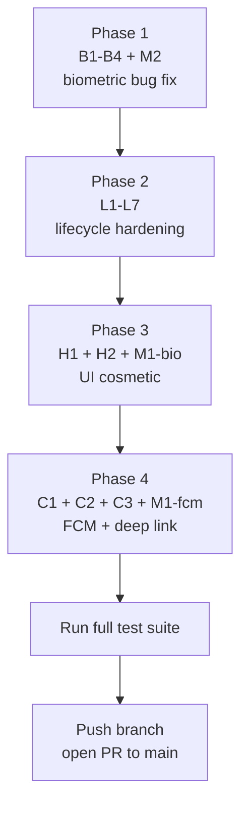

# Consolidated Feature Completion Plan

**Date:** 2026-04-16
**Branch:** `dev_missing_features_security` (based on `security/b0-logging` at `58d3453`)
**Supersedes:** 3 docs from the abandoned `feature/biometric-restoration` branch

---

## Why This Plan Exists

`feature/biometric-restoration` was branched from stale `main` (`72137b0`), missing 45 commits of security/feature work on `security/b0-logging`. Its 5 commits:
1. Redid PBKDF2 work already on b0 (`ab22963`)
2. Redid biometric skip removal already on b0 (`5179ac1`)
3. Redid lockout timing already on b0
4. BUT also contained genuinely new fixes: FragmentActivity, lifecycle hardening, cosmetic features

**Decision:** Abandon `feature/biometric-restoration`, cherry-pick ONLY its new work onto this branch, and complete remaining cosmetic features the old branch couldn't reach.

---

## Audit Findings (against `dev_missing_features_security`)

### CRITICAL — User-facing lies

| ID | UX | File:Line | Issue | Fix |
|----|----|-----------|-------|-----|
| C1 | UX-35-40 | `WoowFcmService.kt:29-31` | `onNewToken()` never wires to repo | Inject `FcmTokenRepository`, call `registerTokenForAllAccounts()` |
| C2 | UX-26/27 | `MainActivity.kt:56` | `serverHost = ""` — host check can never match | Read active account's server host from `AccountRepository` |
| C3 | UX-67-69 | `AccountRepository.kt:84-97` | Logout doesn't unregister FCM token | Call `FcmTokenRepository.unregisterToken()` before clearing session |

### HIGH — Silent degradation

| ID | UX | File:Line | Issue | Fix |
|----|----|-----------|-------|-----|
| H1 | UX-57 | `SettingsScreen.kt` (missing entry) | Toggle UI absent; backend exists but dead | Add toggle + read flag in animation specs |
| H2 | UX-59/61 | `SettingsRepository.kt:122-125` | Language persists but never applied live | Call `LocaleManager.setApplicationLocales()` (API 33+) + `Activity.recreate()` fallback |

### MEDIUM

| ID | UX | File:Line | Issue | Fix |
|----|----|-----------|-------|-----|
| M1 | UX-35-40 | `FcmTokenRepositoryImpl.kt:46-47, 54-55` | Local store only, no HTTP POST | Implement POST to `/woow_fcm_push/register` + `/unregister` |
| M2 | UX-20 | `NavGraph.kt:42-44` | Lifecycle exists but no `FLAG_SECURE` | Window-level `FLAG_SECURE` in `MainActivity.onCreate()` |

### Missing from abandoned biometric-restoration branch

| ID | From commit | Status on b0 | Must re-apply? |
|----|-------------|--------------|----------------|
| B1 | a6b4a24 — MainActivity `ComponentActivity → FragmentActivity` | **Still broken on b0** — still extends `ComponentActivity` | **YES (blocker for real biometric)** |
| B2 | a6b4a24 — BiometricPromptHelper extraction | Not present on b0 | YES |
| B3 | a6b4a24 — BiometricCryptoManager | Not present on b0 | YES |
| B4 | a6b4a24 — `PinEntryResult` sealed class + `enterPinDigit` iOS parity | Not present on b0 | YES |
| B5 | 6e59250 — 8 lifecycle fixes (L1-L8) | Not present on b0 | YES |
| B6 | a6b4a24 — PBKDF2 PIN hash | **Already on b0 (ab22963)** | NO (skip) |
| B7 | a6b4a24 — biometric skip removal | **Already on b0 (5179ac1)** | NO (skip) |
| B8 | a6b4a24 — exponential lockout | **Already on b0 (784df32)** | NO (skip) |

---

## Implementation Phases

### Phase 1 — Real biometric bug (blocker)
- B1: `MainActivity.kt` → `FragmentActivity`
- B2: Extract `BiometricPromptHelper` (testable wrapper)
- B3: `BiometricCryptoManager` (AES-256-GCM Keystore, `setUserAuthenticationRequired(true)`, `BIOMETRIC_STRONG`)
- B4: `PinEntryResult` sealed class + `enterPinDigit` port from iOS
- M2: Window-level `FLAG_SECURE` in `MainActivity.onCreate()`

**Tests:** 25+ unit tests (reuse from abandoned branch — AuthViewModelTest, BiometricPromptHelperTest, BiometricCryptoManagerTest)

### Phase 2 — Lifecycle hardening (B5)
- L1: `ProcessLifecycleOwner` observer leak — `removeObserver` in `onDestroy`
- L2: Imperative auth guard in `NavGraph` — force `Screen.Auth` when `requiresAuth && !isAuthenticated`
- L3: `LaunchedEffect(activity)` prevents double biometric prompt on rotation
- L4: `BiometricPromptHelper.cancelPendingAuthentication()` + `DisposableEffect`
- L5: `android:configChanges` on MainActivity (root cause for L1/L3/L4)
- L6: Window-level `FLAG_SECURE` (consolidated with M2)
- L7: PinScreen initial-composition lockout race fix
- L8: Document Navigation type-safe routes need 2.8+ (deferred)

**Tests:** 9 lifecycle unit tests (AuthViewModelLifecycleTest, BiometricPromptHelperCancelTest, MainActivityRecreationTest instrumented skeletons)

### Phase 3 — Cosmetic fixes (reachable on this branch)

| Fix | Files | Effort |
|-----|-------|--------|
| **H1 Reduce Motion** | `SettingsScreen.kt` + `BiometricScreen.kt` + `PinScreen.kt` | 1h |
| **H2 Language live refresh** | `SettingsScreen.kt` | 30min |
| **M1-bio capability re-validate** | `SettingsRepository.updateBiometric()` | 30min |

### Phase 4 — Cosmetic fixes newly reachable (require b0's infrastructure)

| Fix | Files | Effort |
|-----|-------|--------|
| **C1 FCM registration** | `WoowFcmService.kt` + `FcmTokenRepositoryImpl.kt` | 3h |
| **C2 Deep-link host validation** | `MainActivity.kt` + `AccountRepository` lookup | 2h |
| **C3 Logout FCM unregister** | `AccountRepository.logout()` + repo call | 1h |
| **M1-fcm actual POST** | `FcmTokenRepositoryImpl.kt` HTTP calls | included in C1 |

---

## Proposed Implementation Order

Rationale: Phase 1 first because all downstream testing depends on the real biometric path working. Phase 4 last because those fixes need the earlier infrastructure stable to test end-to-end.

---

## Total Effort Estimate

| Phase | Effort |
|-------|--------|
| 1 — Biometric bug | 1 day |
| 2 — Lifecycle hardening | 0.5 day |
| 3 — UI cosmetic | 0.25 day |
| 4 — FCM + deep link | 0.75 day |
| **Total** | **~2.5 engineer-days + 1 day device verification** |

---

## Reuse from abandoned branch

The 5 commits on `origin2/feature/biometric-restoration` can be **cherry-picked with conflict resolution** instead of re-implemented from scratch. Expected conflicts:

- `AuthViewModel.kt` — b0 already has the auth invalidation; biometric-restoration adds `PinEntryResult` + `enterPinDigit`. Keep both by merging logic.
- `SettingsRepository.kt` — b0 already has PBKDF2 + exponential lockout; biometric-restoration adds `updateBiometric(canEnable)` validation. Keep b0's crypto, add the validation.
- `BiometricScreen.kt` — b0 has the inline prompt code; biometric-restoration extracts the helper. Replace inline with helper.
- `MainActivity.kt` — b0 has `ComponentActivity`; biometric-restoration changes to `FragmentActivity`. Take biometric-restoration version.
- `NavGraph.kt` — b0 has basic lifecycle handling; biometric-restoration adds L2 imperative guard. Merge.

**Cherry-pick order:**
1. `a6b4a24` — resolve all 5 file conflicts favoring new helper extractions + FragmentActivity, keeping b0's PBKDF2/lockout
2. `6e59250` — L1-L8 lifecycle fixes (less conflict expected)
3. `00e54f5` — cosmetic UI fixes (minor conflict on SettingsScreen)

Skip: `f423b04`, `76ffffb` (docs superseded by this plan).

---

## Verification Plan

### Unit tests
Target coverage:
- `AuthViewModel` — 20+ tests (PIN entry, requiresAuth, lifecycle, PinEntryResult)
- `BiometricPromptHelper` — 12+ tests (availability, callbacks, cancellation)
- `BiometricCryptoManager` — 5 tests (3 device-only, 2 JVM)
- `SettingsRepository` — 25+ tests (PBKDF2, migration, lockout, capability validation)
- `FcmTokenRepository` — 6+ tests (registration, auth, unregister, failure handling)
- `DeepLinkValidator` integration — 3+ tests (empty host, active host, external host)
- Language switch — 3 tests
- Reduce Motion — 3 tests

**Target total: 80+ tests, all passing.**

### Manual verification (when device available)
1. Fresh install → login → enable App Lock + PIN + Biometric
2. Cold launch → biometric prompt appears (not skipped silently)
3. Biometric fail 3× → route to PIN
4. PIN wrong 5× → lockout 30s; wrong 10× → lockout 5m
5. Background → foreground → biometric re-prompts
6. Rotation during biometric prompt → NO double prompt
7. `adb force-stop` → relaunch → lands on Auth (not MainScreen)
8. Recents screenshot of auth screen → blank/redacted (FLAG_SECURE)
9. Firebase Console → send test message → phone receives
10. Logout → Firebase Console → send test message → **no** delivery
11. Change language to zh-CN → UI updates immediately
12. Toggle Reduce Motion ON → biometric/PIN animations are instantaneous

---

## Risks

| Risk | Likelihood | Mitigation |
|------|-----------|-----------|
| Cherry-pick conflicts are worse than expected | Medium | Fall back to manual re-implementation; abandoned branch code is available for reference |
| PBKDF2 parity between b0's implementation and biometric-restoration's | Low | Both use 600K iterations, PBKDF2WithHmacSHA256 — semantically identical |
| `FragmentActivity` migration breaks deep-link handling | Low | `FragmentActivity` extends `ComponentActivity`; Hilt + enableEdgeToEdge inherited |
| FCM POST format mismatch with server | Medium | Verify against `/Users/alanlin/woow_fcm_push/README.md` §5 API contract |
| User's lack of test device delays verification | High | Every fix must have a unit test; flag items requiring device verification in PR |

---

## What This Plan Closes

- 3 critical cosmetic features (C1, C2, C3)
- 2 high cosmetic features (H1, H2)
- 2 medium gaps (M1-bio, M2)
- 5 commits' worth of biometric restoration work (re-applied cleanly on newer base)
- 8 lifecycle findings (L1-L8)

**Total issues resolved by this branch: 20+ distinct findings across biometric, cosmetic, and lifecycle security.**

---

## Follow-ups (out of scope)

- Instrumented tests for `BiometricCryptoManager` Keystore (needs emulator/device)
- Navigation Compose 2.8+ upgrade for type-safe routes (L8)
- On-device verification of full suite
