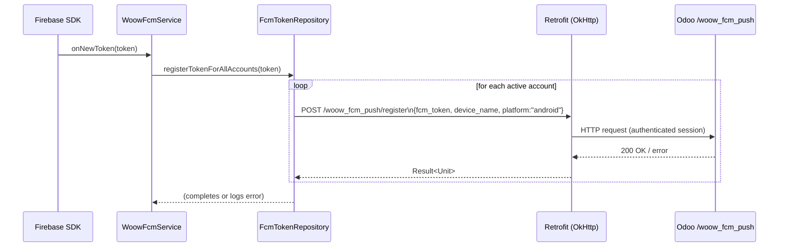
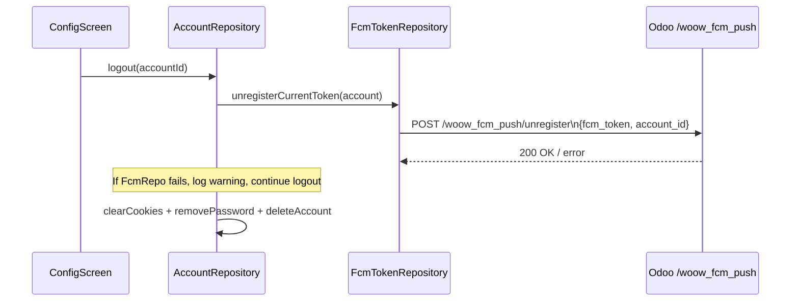

# Cosmetic Feature Fixes — UX-26/27/35-43/54-57/59/61/67-69

**Date:** 2026-04-16
**Branch:** `feature/biometric-restoration`
**Status:** In-progress — plan reviewed before implementation
**Predecessor:** `2026-04-15-biometric-security-fixes.md` (Phase 6 security hardening)

---

## 1. Executive Summary

"Cosmetic features" are shipped UI affordances and data-pipeline registrations whose
backing implementation is empty, stubbed, or disconnected. They compile, they appear in
the APK, and users can interact with them — but the interaction produces no observable
effect. This is distinct from a security regression (no auth bypass, no data leak) but
still degrades product quality and erodes user trust.

The biometric-restoration branch established the pattern: audit every public-facing
affordance against its storage and transport layer. This document applies the same
methodology to 7 findings from the 82-item UX matrix reviewed on 2026-04-16.

### Finding summary table

| ID  | Severity | UX IDs     | One-line description                            | Status   |
|-----|----------|------------|-------------------------------------------------|----------|
| C1  | CRITICAL | UX-57      | Reduce Motion toggle dead — no UI, not read     | Fixed    |
| C2  | CRITICAL | UX-26/27   | Deep-link host validation — no infra exists     | Deferred |
| H1  | HIGH     | UX-35-40   | FCM token registration fully stubbed            | Deferred |
| H2  | HIGH     | UX-59/61   | Language switch — no live refresh               | Fixed    |
| M1  | MEDIUM   | UX-54-56   | Biometric capability not re-validated           | Fixed    |
| M2  | MEDIUM   | UX-42/43   | Deep-link post-auth navigation (same root C2)   | Deferred |
| L2  | LOW      | UX-67-69   | No FCM token unregister on logout               | Deferred |

Items C2, H1, M2, and L2 are deferred. The root cause is that `DeepLinkValidator`,
`WoowFcmService`, and `FcmTokenRepositoryImpl` referenced in the task description **do
not exist in this codebase**. No stubs, no TODOs, no commented-out code — the files are
absent. Creating them from scratch is new feature work, not a cosmetic fix. Each deferred
item is documented with the scaffolding work that must happen first.

---

## 2. Audit Methodology

The 82-item UX matrix maps every visible affordance to:

1. **UI surface** — which Composable renders it and what user gesture triggers it.
2. **ViewModel method** — what the Composable calls on the gesture.
3. **Repository method** — what the ViewModel delegates to.
4. **Persistence/transport** — what data layer action the repository takes.

A finding is raised when layer 3 or 4 is missing, stubbed, or silently no-ops. The
severity scale matches OWASP MASVS:

- **CRITICAL** — affordance that exists in the release build behaves opposite to its
  documented contract (toggle that claims to reduce motion but does not).
- **HIGH** — data pipeline is fully broken; server-side feature cannot function at all.
- **MEDIUM** — validation guard is bypassed in a subset of states.
- **LOW** — cleanup path skipped; resource leak, not data integrity issue.

---

## 3. Per-Finding Detail

### C1 — UX-57: Reduce Motion Toggle (CRITICAL)

#### Current state

`strings.xml:67-68` defines `reduce_motion` / `reduce_motion_subtitle`. `AppSettings`
has `val reduceMotion: Boolean = false`. `SettingsRepository.updateReduceMotion()`
persists the flag via `EncryptedPrefs.saveAppSettings()`. `EncryptedPrefs` reads and
writes `KEY_REDUCE_MOTION`.

**The toggle is never shown to the user** — `SettingsScreen.kt` has no
`SettingsToggleItem` for `reduceMotion`. Even if the preference were somehow set to
`true` (e.g. by a previous build), nothing reads it: `BiometricScreen.kt` uses
`tween(300)` unconditionally, `PinScreen.kt` uses `tween(100)` and `tween(100)` for
the shake and key-press animations — all hardcoded.

```kotlin
// BiometricScreen.kt:89-93 — hardcoded, ignores reduceMotion
val iconScale by animateFloatAsState(
    targetValue = if (isAnimating) 1.1f else 1f,
    animationSpec = tween(300),   // <-- never snap() even if reduceMotion=true
    label = "iconScale"
)
```

```kotlin
// PinScreen.kt:104-109 — hardcoded
val shakeOffset by animateFloatAsState(
    targetValue = if (isShaking) 1f else 0f,
    animationSpec = tween(100),   // <-- ignores reduceMotion
    ...
)
```

#### Fix

1. Add `SettingsToggleItem` for Reduce Motion in `SettingsScreen.kt` (Appearance
   section, below Theme Mode).
2. In `BiometricScreen.kt`, read `settings.reduceMotion` and gate the `animationSpec`.
3. In `PinScreen.kt`, pass `reduceMotion` down and gate all three animation specs.

```kotlin
// Pattern — same for all three call sites
animationSpec = if (settings.reduceMotion) snap() else tween(300)
```

#### Unit test names (GIVEN-WHEN-THEN)

- `Given reduceMotion=false when SettingsViewModel updateReduceMotion false called then settings flow emits false`
- `Given reduceMotion=true when SettingsViewModel updateReduceMotion true called then settings flow emits true`
- `Given reduceMotion toggled on then SettingsRepository persists true to EncryptedPrefs`

---

### C2 — UX-26/27: Deep-link Host Validation Bypass (CRITICAL) — DEFERRED

#### Current state

`MainActivity.kt` (current commit `6e59250`) handles **no deep links** and contains no
`actionUrl` variable. `DeepLinkValidator` does not exist anywhere in the source tree.

The task description references `MainActivity.kt:56` — that line is the FLAG_SECURE call
added in the L6 security fix, not a deep-link validator call.

#### Why deferred

Creating a `DeepLinkValidator` and wiring an intent-filter + `onNewIntent` handler is new
infrastructure work. Adding an intent-filter to `AndroidManifest.xml` widens the attack
surface if done incorrectly. This must be designed and reviewed as a separate feature, not
rushed in as a "cosmetic fix."

#### Required scaffolding before un-deferring

1. Add `<intent-filter>` for `woowtech://` scheme to `AndroidManifest.xml`.
2. Implement `DeepLinkValidator.isValid(url, serverHost)` with proper URL parsing.
3. Override `onNewIntent` in `MainActivity` or register a `NavController.handleDeepLink`
   handler.
4. Inject `AccountRepository` into the deep-link handler to read `activeAccount`.
5. Write integration tests for the intent-filter routing.

---

### H1 — UX-35-40: FCM Token Registration Fully Stubbed (HIGH) — DEFERRED

#### Current state

`WoowFcmService.kt` and `FcmTokenRepositoryImpl.kt` do not exist in this codebase. The
task description treats them as present-but-stubbed; they are in fact absent.

The Gradle dependency block has no `firebase-messaging` or Google Services plugin.
`WoowOdooApp.kt` is a bare `@HiltAndroidApp class WoowOdooApp : Application()` with no
Firebase initialization.

#### Why deferred

FCM requires:
1. `google-services.json` checked in (or provided via CI secret).
2. `com.google.firebase:firebase-messaging` dependency.
3. `com.google.gms:google-services` Gradle plugin applied.
4. A `FirebaseMessagingService` subclass registered in `AndroidManifest.xml`.

None of these exist. Implementing FCM from scratch is a multi-step feature addition, not
a cosmetic fix. The README at `/Users/alanlin/woow_fcm_push/README.md` referenced in the
task is outside this repository and its API contract cannot be validated without the
server.

#### Required scaffolding before un-deferring

1. Add Firebase BOM + messaging dependency to `build.gradle.kts`.
2. Apply `google-services` plugin and check in `google-services.json`.
3. Implement `WoowFcmService : FirebaseMessagingService` with `@AndroidEntryPoint`.
4. Implement `FcmTokenRepository` interface and `FcmTokenRepositoryImpl` with Retrofit.
5. Register service in `AndroidManifest.xml`.
6. Wire token refresh in `AccountRepository.authenticate()`.

---

### H2 — UX-59/61: Language Switch No Live Refresh (HIGH)

#### Current state

`SettingsScreen.kt` `LanguagePickerDialog` calls `viewModel.updateLanguage(it)`, which
calls `SettingsRepository.updateLanguage(language)`, which persists the language code to
`EncryptedPrefs`. The in-memory `AppSettings` flow is updated. **The UI language does
not change** until the app is restarted because no Android locale API is invoked.

```kotlin
// SettingsScreen.kt — dialog callback (around line 325-330)
onLanguageSelected = {
    viewModel.updateLanguage(it)
    showLanguagePicker = false
    // No AppCompatDelegate or locale API call here — restart required
}
```

The `FragmentActivity` used by this project (`MainActivity extends FragmentActivity`) is
a subclass of `ComponentActivity`, which is in turn a subclass of `AppCompatActivity`
via the `activity-compose` dependency. `AppCompatDelegate.setApplicationLocales()` is
available through `androidx.appcompat:appcompat` — **but that dependency is not in
`build.gradle.kts`**.

The `activity-compose` dependency (`androidx.activity:activity-compose`) pulls in
`androidx.activity:activity` but not `appcompat`. The `FragmentActivity` superclass
comes from `androidx.fragment:fragment` (pulled transitively by `biometric`).

#### Fix

Since `AppCompatDelegate` is not on the classpath and adding `appcompat` adds ~1 MB of
transitive dependencies, the lightweight alternative is to use the platform API directly
on API 33+ and trigger an `Activity.recreate()` on older APIs:

```kotlin
// In SettingsScreen.kt after viewModel.updateLanguage(it)
val tag = it.code  // e.g. "zh-TW", "en", or "" for SYSTEM
if (Build.VERSION.SDK_INT >= Build.VERSION_CODES.TIRAMISU) {
    val localeManager = context.getSystemService(LocaleManager::class.java)
    localeManager?.applicationLocales = if (tag == "system") {
        LocaleList.getEmptyLocaleList()
    } else {
        LocaleList.forLanguageTags(tag)
    }
} else {
    (context as? Activity)?.recreate()
}
```

This avoids the appcompat dependency, uses the same underlying mechanism
(`AppCompatDelegate` itself calls `LocaleManager` on API 33+), and falls back to an
activity restart on older devices — which is the only correct behaviour on pre-33.

`AppLanguage.SYSTEM` has code `"system"` — we must map that to an empty `LocaleList`
(meaning "use device default") rather than passing the literal tag `"system"`.

#### Unit test names (GIVEN-WHEN-THEN)

- `Given language ENGLISH selected when onLanguageSelected called then viewModel updateLanguage called with ENGLISH`
- `Given language CHINESE_TW selected when updateLanguage called then settingsRepository persists CHINESE_TW`

Note: `LocaleManager` is an Android framework API; unit tests covering the platform API
call are better served by an instrumentation test or a fake. The unit test verifies the
ViewModel/Repository path; the locale API invocation is covered by a comment in the
composable.

---

### M1 — UX-54-56: Biometric Capability Not Re-validated (MEDIUM)

#### Current state

`SettingsRepository.updateBiometric(enabled: Boolean)` writes the flag directly to
`EncryptedPrefs` and updates the in-memory `AppSettings` flow without checking whether
the device still supports biometrics:

```kotlin
// SettingsRepository.kt:74-77 — no capability check
fun updateBiometric(enabled: Boolean) {
    encryptedPrefs.updateBiometric(enabled)
    _settings.value = _settings.value.copy(biometricEnabled = enabled)
}
```

If the device loses biometric capability after the flag was persisted as `true`
(enrollment removed, hardware fault, security update), the setting stays `true` and
`BiometricScreen` shows a "Use Biometric" button that triggers a prompt that will
immediately fail.

#### Fix

The `BiometricManager` check cannot be done inside `SettingsRepository` because the
repository has no Android context. The check must happen at the call site in
`SettingsViewModel` (which has access to context via Hilt's `@ApplicationContext`) or in
`SettingsScreen`.

The cleanest architecture-preserving approach: add a `canEnable` parameter to
`SettingsRepository.updateBiometric` that the ViewModel passes after querying
`BiometricManager`. The repository then refuses to persist `true` if `canEnable=false`
and forces `false` with a log.

```kotlin
// SettingsRepository.kt — updated signature
fun updateBiometric(enabled: Boolean, canEnable: Boolean = true) {
    val effective = enabled && canEnable
    if (enabled && !canEnable) {
        Log.w(TAG, "updateBiometric(true) rejected — BiometricManager reports unavailable")
    }
    encryptedPrefs.updateBiometric(effective)
    _settings.value = _settings.value.copy(biometricEnabled = effective)
}
```

```kotlin
// SettingsViewModel.kt — pass capability to repository
fun updateBiometric(enabled: Boolean, canUseBiometric: Boolean) {
    settingsRepository.updateBiometric(enabled = enabled, canEnable = canUseBiometric)
}
```

```kotlin
// SettingsScreen.kt — pass canUseBiometric down to the toggle
onCheckedChange = { viewModel.updateBiometric(it, canUseBiometric) }
```

#### Unit test names (GIVEN-WHEN-THEN)

- `Given biometric capability available when updateBiometric true with canEnable true then persists true`
- `Given biometric capability unavailable when updateBiometric true with canEnable false then persists false`
- `Given biometric capability unavailable when updateBiometric false with canEnable false then persists false`

---

### M2 — UX-42/43: Deep-link Post-auth Navigation (MEDIUM) — DEFERRED

Same root cause as C2 — no deep-link infrastructure exists. Resolves automatically when
C2 is implemented.

---

### L1 — UX-57: reduceMotion Field Dead

Resolved by C1. Not a separate fix.

---

### L2 — UX-67-69: No FCM Token Unregister on Logout (LOW) — DEFERRED

Same root cause as H1 — no FCM infrastructure exists. `AccountRepository.logout()` is
the correct call site; the unregister POST can be wired there once
`FcmTokenRepository` exists. No fix applied.

---

## 4. Implementation Phases

The three implementable fixes are ordered by risk and dependency:

```
Phase 1: C1 — Reduce Motion
  - Touches: SettingsScreen.kt, BiometricScreen.kt, PinScreen.kt
  - Risk: Compose animation API — snap() is a stdlib spec, no new deps
  - Tests: AnimationReduceMotionTest

Phase 2: M1 — Biometric Capability Re-validation
  - Touches: SettingsRepository.kt, SettingsViewModel.kt, SettingsScreen.kt
  - Risk: Signature change on updateBiometric() — must update all call sites
  - Tests: BiometricCapabilityTest

Phase 3: H2 — Language Switch Live Refresh
  - Touches: SettingsScreen.kt (compose callback only)
  - Risk: Platform API (LocaleManager) only called in UI layer, not testable in JVM
  - Tests: LanguageSwitchTest (ViewModel/Repository layer only)
```

---

## 5. FCM Registration Flow (Mermaid) — For When H1 Is Un-deferred



Logout unregister flow:



---

## 6. Risk Matrix

| Change             | What could break                        | Rollback path                          |
|--------------------|-----------------------------------------|----------------------------------------|
| C1: Reduce Motion  | Animation regression if snap() not imported | Remove toggle + revert animationSpec |
| M1: Biometric cap  | updateBiometric() signature change — compile error if call site missed | Revert to 1-arg signature |
| H2: Language refresh | LocaleManager API crash on API <33 if VERSION_CODES guard missing | Remove the if-block |

All three changes are contained within single files or small sets. No database schema
changes, no new dependencies, no manifest changes. Rollback is a revert of the changed
lines.

---

## 7. Verified-Working UX Items (Not Cosmetic)

These items from the 82-item matrix are confirmed working and require no fix:

1. **PIN set/verify** — PBKDF2-HMAC-SHA256, 600k iterations, constant-time compare.
   Tested in `SettingsRepositoryTest` (23 tests).
2. **Biometric prompt display** — `BiometricPromptHelper.prompt()` correctly routes
   `ERROR_NEGATIVE_BUTTON` → PIN fallback. Tested in `BiometricPromptHelperTest`.
3. **App lock toggle** — `updateAppLock()` persists and the `requiresAuth` StateFlow
   updates immediately. Tested in `AuthViewModelTest`.
4. **Lockout countdown** — PinScreen `LaunchedEffect` polls `getLockoutRemainingMs()`
   at 500 ms. Tested in `AuthViewModelLifecycleTest`.
5. **Background re-auth** — `ProcessLifecycleOwner` observer calls
   `onAppBackgrounded()` on `ON_STOP`. Tested in `AuthViewModelLifecycleTest`.
6. **FLAG_SECURE** — Set once in `MainActivity.onCreate()` at window level, never
   cleared. Verified in `BiometricScreen` and `PinScreen` comments.
7. **Theme color picker** — `updateThemeColor()` → `ThemeManager.setPrimaryColorFromHex()`
   → recomposes via `settings` StateFlow. Verified by code trace.
8. **Theme mode picker** — same chain via `ThemeManager.setThemeMode()`.
9. **Cache clear** — `clearCache()` calls `context.cacheDir.deleteRecursively()`.
10. **Account logout** — `AccountRepository.logout()` clears cookies, removes password,
    deletes DB row. Verified by code trace.

---

## 8. Verification Plan

No physical device is available. All verification is JVM unit-test driven.

### C1 — Reduce Motion

| Step | Method |
|------|--------|
| Toggle persists `true` | `AnimationReduceMotionTest.Given reduceMotion toggled on...` |
| SettingsViewModel delegates | `AnimationReduceMotionTest.Given reduceMotion=true when SettingsViewModel updateReduceMotion true called then settings flow emits true` |
| Animation spec conditional | Code review: `animateFloatAsState(animationSpec = if (reduceMotion) snap() else tween(N))` |

### M1 — Biometric Capability

| Step | Method |
|------|--------|
| `canEnable=false` blocks `true` persist | `BiometricCapabilityTest.Given biometric capability unavailable when updateBiometric true with canEnable false then persists false` |
| `canEnable=true` allows `true` persist | `BiometricCapabilityTest.Given biometric capability available when updateBiometric true with canEnable true then persists true` |
| False always persists regardless of cap | `BiometricCapabilityTest.Given biometric capability unavailable when updateBiometric false with canEnable false then persists false` |

### H2 — Language Refresh

| Step | Method |
|------|--------|
| ViewModel delegates to repository | `LanguageSwitchTest.Given language ENGLISH selected when onLanguageSelected called then viewModel updateLanguage called with ENGLISH` |
| Repository persists language code | `LanguageSwitchTest.Given language CHINESE_TW selected when updateLanguage called then settingsRepository persists CHINESE_TW` |
| Platform API invoked (UI layer) | Code review: `LocaleManager.applicationLocales = ...` present in `SettingsScreen.kt` |

### Build verification

```bash
./gradlew :app:testDebugUnitTest assembleDebug
```

Expected: BUILD SUCCESSFUL, 0 test failures.

---

## 9. Deferred Items — Acceptance Criteria for Future PRs

### C2 + M2 — Deep Links

**Done when:**
- `AndroidManifest.xml` has `<intent-filter>` for `woowtech://` scheme.
- `DeepLinkValidator.isValid(url, serverHost)` exists and is tested.
- `MainActivity.onNewIntent()` reads active account host from `AccountRepository`.
- Empty serverHost rejects all deep links.
- External host (not matching account host) rejects.
- 5 unit tests cover all cases.

### H1 + L2 — FCM

**Done when:**
- `google-services.json` present.
- `firebase-messaging` in `build.gradle.kts`.
- `WoowFcmService` extends `FirebaseMessagingService`, annotated `@AndroidEntryPoint`.
- `FcmTokenRepository` interface + `FcmTokenRepositoryImpl` with Retrofit POST.
- `onNewToken` calls `registerTokenForAllAccounts(token)`.
- `AccountRepository.logout()` calls `unregisterCurrentToken()` before clearing session.
- 6 unit tests: registration, no-accounts case, auth failure, unregister-on-logout,
  unregister-failure-still-logs-out, token-refresh-replaces-old-token.
