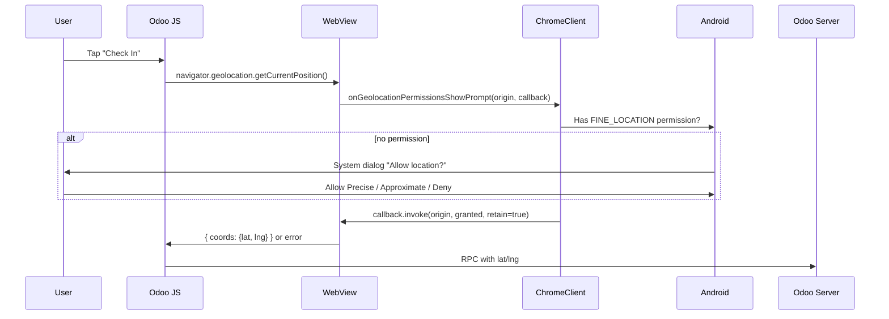
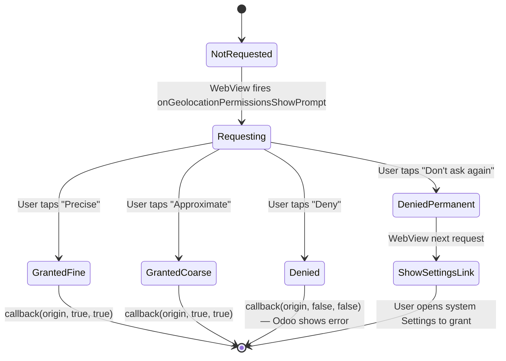

# Brainstorm — Location Permission for Odoo Attendances Clock-In

**Date:** 2026-04-25
**Branch target:** new feature branch (off `dev_missing_features_security` after merge)
**Status:** Brainstorm / pre-design — open questions before commit to design

---

## 1. The use case

Employees use **Odoo Attendances (`hr_attendance`)** to clock in/out from their phones. The web frontend already captures GPS via HTML5 `navigator.geolocation.getCurrentPosition()` and stores it on `hr.attendance.in_latitude / in_longitude / out_latitude / out_longitude` (Odoo 17.0+).

**Today, in our WebView wrapper, this fails silently.** Reasons confirmed in the survey:
1. App doesn't declare any location permission in `AndroidManifest.xml`
2. WebView's `WebChromeClient.onGeolocationPermissionsShowPrompt()` is not overridden — Chromium silently denies geolocation when no callback is wired
3. No runtime permission request is triggered — even if the WebView asked, Android would reject with no user prompt

End result: clock-in works, but `in_latitude`/`in_longitude` are always 0.

---

## 2. Android location permissions — the 3 levels

| Permission | Accuracy | Use case fit | Decision |
|------------|----------|--------------|----------|
| `ACCESS_COARSE_LOCATION` | ~1 km (cell tower / Wi-Fi) | Privacy-conscious city-level tracking | **Declare** as the floor — Android 12+ users may grant this only |
| `ACCESS_FINE_LOCATION` | ~10 m (GPS) | Accurate clock-in geo-tag | **Declare and request** — primary need |
| `ACCESS_BACKGROUND_LOCATION` | Either, but while app NOT in foreground | Continuous tracking (delivery, fleet) | **Do NOT request** — clock-in only fires when app is open. Background = privacy red flag + Play Store review hurdle |

**Decision:** Declare FINE + COARSE only. Request FINE at runtime when the user first triggers a clock-in flow in the WebView (lazy permission — better UX than asking on app launch).

---

## 3. Odoo backend findings (from survey)

### What Odoo stores (17.0+, `hr_attendance` core)

```python
# Per check-in event AND per check-out event:
in_latitude, in_longitude     (Float, 7 decimal places)
in_country_name, in_city      (Char, derived from IP server-side)
in_ip_address, in_browser     (Char)
# ... and out_* equivalents
```

- **No geofencing in core** — no "valid location" radius. If we want "must be within 100m of office", that's 3rd-party (`attendance_gps_geofence` on Odoo Apps) or custom.
- **GPS comes from browser**, NOT from the server's IP geolocation (city/country are IP-derived).
- **iOS detection bug in Odoo's JS** — the kiosk JS at `addons/hr_attendance/static/src/public_kiosk/public_kiosk_app.js` skips geolocation when UA contains iOS. Our Android wrapper does NOT spoof iOS UA, so we're unaffected — but the iOS port WILL need a workaround (override UA or inject location via JS bridge).

### Admin enablement

- Odoo 17+: native, on by default once `hr_attendance` is installed
- No "Enable geolocation" toggle in core — capture happens whenever the browser grants permission
- Admin path: **Apps → Attendances → Configuration → Settings → Mode = Kiosk Mode** (geolocation is automatic in kiosk flow)

---

## 4. Design Options

### Option A — Pure WebView (recommended)



**Pros:**
- Standard pattern — Chromium does the heavy lifting
- Odoo's web frontend just works (no Odoo-side changes)
- Same code path as desktop Chrome — predictable
- Per-origin grant is remembered by WebView's GeolocationPermissions DB

**Cons:**
- Requires HTTPS (already enforced in our app)
- iOS port needs a different approach (WKWebView geolocation has its own quirks)

### Option B — Native injection via JS bridge

Native code reads location via `FusedLocationProviderClient`, then injects into WebView via `evaluateJavascript("window.__nativeLocation = {lat, lng}")`. Odoo's JS would need a custom hook.

**Verdict:** **Skip.** Requires Odoo-side modifications, breaks vanilla Odoo install. Only worth it if Option A is infeasible.

### Option C — Hybrid (native location, JS bridge fallback)

Use Option A as primary; Option B as fallback only when WebView geolocation reports `PERMISSION_DENIED` after Android grant succeeds (the rare race condition).

**Verdict:** Reserve as future enhancement; not needed for v1.

**Recommended: Option A.**

---

## 5. Implementation Sketch

### Files to change

| File | Change |
|------|--------|
| `app/src/main/AndroidManifest.xml` | Add `ACCESS_FINE_LOCATION` + `ACCESS_COARSE_LOCATION` |
| `app/src/main/java/io/woowtech/odoo/ui/main/MainScreen.kt` | Override `onGeolocationPermissionsShowPrompt` + `onGeolocationPermissionsHidePrompt` in existing `WebChromeClient` |
| `app/src/main/java/io/woowtech/odoo/ui/main/MainScreen.kt` (or new file) | Use `ActivityResultContracts.RequestMultiplePermissions` to request runtime grant on demand |
| `app/src/main/java/io/woowtech/odoo/data/repository/SettingsRepository.kt` | (Optional) Add `locationEnabled` user preference toggle for Settings UI |
| `app/src/main/java/io/woowtech/odoo/ui/config/SettingsScreen.kt` | (Optional) Add Settings toggle "Allow location for clock-in" |
| `app/src/main/res/values/strings.xml` (+ zh-rTW, zh-rCN) | New strings: rationale dialog, settings label |

### Pseudocode for the core wiring

```kotlin
// MainScreen.kt — extend WebChromeClient
webChromeClient = object : WebChromeClient() {
    override fun onGeolocationPermissionsShowPrompt(
        origin: String,
        callback: GeolocationPermissions.Callback
    ) {
        // Validate origin: only allow our active account's host
        val activeHost = accountRepository.activeAccount.value?.serverHost
        if (origin == null || activeHost == null || !origin.contains(activeHost)) {
            callback.invoke(origin, false, false)
            Timber.w("Geolocation request rejected — origin %s not in active account host", origin)
            return
        }
        // Check Android permission; ask user if needed
        if (hasFineLocationPermission(context)) {
            callback.invoke(origin, true, true)  // grant, retain
        } else {
            requestPermissionLauncher.launch(arrayOf(ACCESS_FINE_LOCATION, ACCESS_COARSE_LOCATION))
            // Defer callback until permission result is delivered
            pendingGeolocationCallback = origin to callback
        }
    }
}
```

### Permission state machine



---

## 6. Open Questions for the User

These need answers before moving from brainstorm to design:

1. **Odoo version** — confirm we're on 17.0 or 18.0 (geolocation only exists 17+). The current docker container shows `odoo18_ecpay` — implies 18.0. Confirm?

2. **Mode** — does the org use:
   - Kiosk Mode (one shared device at the door)?
   - Manual selection (employees use their own phone)?
   The geolocation flow is the same code path, but the UI affordance differs.

3. **Mandatory or optional?**
   - **Mandatory**: clock-in is rejected if user denies location → strict, may frustrate users with broken GPS
   - **Optional**: clock-in succeeds without location, just no geo-tag stored → friendlier, allows partial data
   - Odoo's stock behavior is **optional** (RPC falls back without coords); we can match this.

4. **Should the app expose a Settings toggle** to enable/disable location independent of the Android permission? (Some users may grant Android permission system-wide but want per-app opt-out.) Recommend YES — defensive privacy posture.

5. **iOS parity timeline** — the iOS app will need similar work but via WKWebView's `requestGeolocationAuthorization` (iOS 15+). Should we plan iOS in parallel or land Android first?

6. **Geofencing requirement?**
   - "Reject clock-in if more than 100m from office" — needs a 3rd-party Odoo module OR our own server-side check
   - Out of scope unless explicitly requested

7. **Background location?** — Confirming we do NOT need this. (Background = continuous tracking, far stronger user-consent burden, Play Store review attention.)

---

## 7. Risks & Considerations

| Risk | Mitigation |
|------|------------|
| User denies → Odoo clock-in fails | Match Odoo's "optional" behavior; show friendly toast; offer "open Settings" |
| Stale GPS fix on cold start | `getCurrentPosition` uses fresh fix by default; acceptable |
| Battery drain | Foreground-only, single-fix per clock-in — negligible |
| Privacy review (Play Store) | Background NOT requested; declare clear data-usage purpose in privacy policy + Play data safety |
| Mock-location apps | Could fake clock-in location. Detect via `Location.isFromMockProvider()` if security matters. (Out of scope v1.) |
| Origin validation | WebView geolocation prompt fires on ANY origin — must validate against the active account's host (otherwise a hijacked iframe could read GPS) |
| HTTPS requirement | Already enforced by `OdooJsonRpcClient` and WebView allowlist; non-issue |
| Permission revoked mid-session | Re-request on next `onGeolocationPermissionsShowPrompt`; no special handling needed |

---

## 8. Phased Plan (after questions answered)

**Phase 1 — Core wiring (≈4 hours)**
- Manifest permissions
- WebChromeClient overrides + origin validation
- Runtime permission request via ActivityResultContracts
- Unit tests: origin allowlist, permission state transitions

**Phase 2 — UX polish (≈3 hours)**
- Settings toggle
- Rationale dialog ("Why we need location")
- Strings in all 3 languages
- Disabled-state when location toggle is off

**Phase 3 — Tests (≈2 hours)**
- uiautomator2 V26: clock-in with mock location → verify lat/lon stored on hr.attendance
- Unit tests for `WebChromeClient` overrides
- Test hook to seed location-permission-granted state for E2E

**Phase 4 — iOS port (separate ticket, ≈1 day)**
- WKWebView `requestGeolocationAuthorization`
- Info.plist `NSLocationWhenInUseUsageDescription`
- Same origin-validation logic

**Total Android-only: ≈1.5 engineer-days** (excluding iOS).

---

## 9. Verification approach

**Unit (JVM):**
- `WebChromeClient.onGeolocationPermissionsShowPrompt` honors origin allowlist (3 cases: same-host, foreign host, null origin)
- Permission state machine returns correct callback outcome for each grant level

**Device (uiautomator2):**
- Mock location via `adb shell appops set io.woowtech.odoo.debug android:mock_location allow` + `adb shell setprop` OR Android Studio's emulator location panel
- New V26: clock-in flow → assert Odoo `hr.attendance` row has non-zero `in_latitude`/`in_longitude` via JSON-RPC
- Test self-contained per CLAUDE.md "Test Independence" rule

**E2E production:**
- New E2E-15: real clock-in on real phone → check the attendance record on the live Odoo

---

## 10. Decision needed

Please answer questions 1–7 in section 6 so we can convert this brainstorm into a concrete implementation plan with effort estimate sign-off.

If "no answers needed, just go with sensible defaults" — defaults would be:
- Odoo 18, manual-selection mode
- Optional location (matches Odoo stock)
- Settings toggle: yes
- iOS parity: separate ticket
- No geofencing
- No background location
