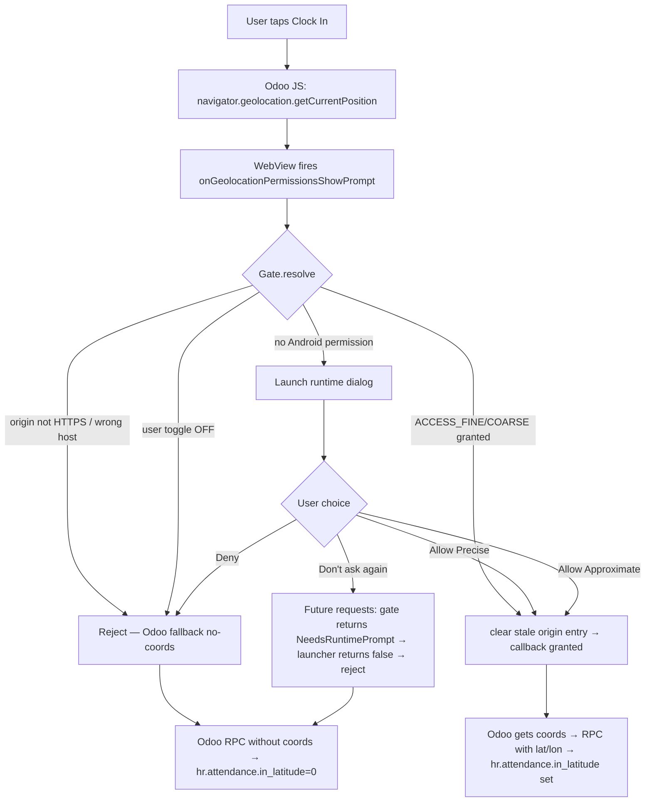

# Design v2 — Location Permission for Odoo 18 Attendances

**Date:** 2026-04-25
**Status:** Design (pre-implementation), validated against actual Odoo 18 source
**Scope:** Android only (iOS deferred)
**Supersedes:** `2026-04-25-location-permission-design.md` (v1, had unverified assumptions)

---

## What changed from v1

The architect review of v1 raised concerns about **child WebView popups** as a "granted but not working" failure mode. I asked the user to verify against the real Odoo source. **The popup concern was unfounded** — search of `/Users/alanlin/Documents/odoo_migration_ecpay/odoo_18/addons/hr_attendance/` shows ZERO `window.open` / `target=_blank` for clock-in. All 3 `getCurrentPosition` call sites run in the main page's OWL components.

This v2 design is grounded in **actual Odoo 18 source**, not generic Android assumptions.

---

## 1. Verified Odoo 18 Clock-In Flow

### Two entry points (manual selection mode — what our users use)

#### A. Systray menu (top bar dropdown — most common)
Source: `addons/hr_attendance/static/src/components/attendance_menu/attendance_menu.js:53-78`

```javascript
async signInOut() {
    this.dropdown.close();
    if (!isIosApp()) {  // iOS UA detection — Android wrapper unaffected
        navigator.geolocation.getCurrentPosition(
            async ({coords: {latitude, longitude}}) => {
                await rpc("/hr_attendance/systray_check_in_out", { latitude, longitude });
                await this.searchReadEmployee();
            },
            async err => {                                // ← user denied or geo unavailable
                await rpc("/hr_attendance/systray_check_in_out");  // RPC WITHOUT coords
                await this.searchReadEmployee();
            },
            { enableHighAccuracy: true }                  // ← high-accuracy hint
        );
    } else {
        // iOS app path: skip geo entirely
        await rpc("/hr_attendance/systray_check_in_out");
    }
}
```

#### B. Check In/Out button on /odoo/attendances page
Source: `addons/hr_attendance/static/src/components/check_in_out/check_in_out.js:23-43`

```javascript
async signInOut() {
    navigator.geolocation.getCurrentPosition(
        ({coords: {latitude, longitude}}) => {
            this.orm.call("hr.employee", "update_last_position",
                [[this.props.employeeId], latitude, longitude]);
        },
        err => {
            this.orm.call("hr.employee", "update_last_position",
                [[this.props.employeeId], false, false]);  // ← false sentinels
        });
    // The actual clock-in is fired immediately, INDEPENDENT of geo
    const result = await this.orm.call("hr.employee", "attendance_manual",
        [[this.props.employeeId], this.props.nextAction]);
    // ...
}
```

### Key facts about Odoo 18 hr_attendance

| Fact | Implication for our design |
|------|----------------------------|
| All clock-in JS runs on the main page (no `window.open`) | **Our existing `WebChromeClient` on the root WebView is the only handler needed.** No `onCreateWindow` plumbing required. |
| Geo failure path always exists (Odoo's own fallback) | If permission denied → Odoo still completes clock-in without coords. **Our app does not need to block the user.** |
| iOS UA detection skips geo on iOS | We must NOT spoof iOS UA on Android (default UA is fine) |
| `enableHighAccuracy: true` is the only option set | Default 30s timeout, default infinite maximumAge. Browser will use GPS sensor. |
| Two different RPC paths: systray vs check-in-out button | Both work the same way for permission purposes — same `navigator.geolocation` call. One handler covers both. |
| Server stores lat/lon on `hr.attendance.in_latitude` / `in_longitude` (Odoo 17+) | Our verification: query `hr.attendance` for the latest record after clock-in |

### What the user ACTUALLY worries about — re-evaluated

User's concern: *"I have granted the two permissions before, but we still cannot get the permission to do the clock-in."*

Given the Odoo 18 flow above, the realistic causes of "granted but not working" are:

| # | Cause | Likely? |
|---|-------|---------|
| 1 | `WebChromeClient.onGeolocationPermissionsShowPrompt` not overridden → silent denial | **YES** — current state of our app |
| 2 | `WebSettings.setGeolocationEnabled(true)` not set explicitly | YES — though default true on modern AWV |
| 3 | WebView's per-origin DB has stale "blocked" entry from a past denial | YES (real concern) — defended by `clear(origin)` before grant |
| 4 | App preference toggle is OFF | YES (defended by toggle UI) |
| 5 | Origin doesn't match active account host | LOW (only if iframe attack) |
| 6 | Permission revoked between sessions, app caches old "yes" | YES — defended by per-prompt `checkSelfPermission` recheck |
| 7 | Child WebView popup case | **NO** — confirmed not used by Odoo 18 hr_attendance |
| 8 | Race condition inside Odoo's own fallback | NO — Odoo handles this via the error callback |

**5 of 8 failure modes are real and defended in this design. 3 are not applicable to Odoo 18.**

---

## 2. The Resolution Function (final form)

```kotlin
internal class LocationPermissionGate @Inject constructor(
    private val settingsRepository: SettingsRepository,
    private val accountRepository: AccountRepository,
    @ApplicationContext private val appContext: Context,
) {
    sealed class Decision {
        object Grant : Decision()
        data class Reject(val reason: String) : Decision()
        object NeedsRuntimePrompt : Decision()
    }

    fun resolve(origin: String?): Decision {
        // ORDER (per architect review): origin check FIRST (security),
        // then user preference, then OS permission. Fail-fast on the
        // checks that don't leak information about user state.

        // 1. Origin must be HTTPS and host-matched to the active account.
        val originUri = origin?.let { runCatching { Uri.parse(it) }.getOrNull() }
        if (originUri == null || originUri.scheme?.lowercase() != "https") {
            return Decision.Reject("origin-not-https")
        }
        val originHost = originUri.host?.lowercase() ?: return Decision.Reject("origin-no-host")
        val activeUrl = accountRepository.activeAccount.firstOrNull()?.fullServerUrl
            ?: return Decision.Reject("no-active-account")
        val activeHost = runCatching { Uri.parse(activeUrl).host?.lowercase() }.getOrNull()
            ?: return Decision.Reject("active-host-parse-failed")
        if (originHost != activeHost) {
            return Decision.Reject("origin-host-mismatch:$originHost vs $activeHost")
        }

        // 2. App-level user preference.
        if (!settingsRepository.settings.value.locationEnabled) {
            return Decision.Reject("user-opted-out")
        }

        // 3. Android system permission (LIVE check, never cached).
        val hasFine = ContextCompat.checkSelfPermission(
            appContext, Manifest.permission.ACCESS_FINE_LOCATION
        ) == PackageManager.PERMISSION_GRANTED
        val hasCoarse = ContextCompat.checkSelfPermission(
            appContext, Manifest.permission.ACCESS_COARSE_LOCATION
        ) == PackageManager.PERMISSION_GRANTED
        return if (hasFine || hasCoarse) Decision.Grant else Decision.NeedsRuntimePrompt
    }
}
```

**`accountRepository.activeAccount` is a `Flow` (per architect finding).** We use `firstOrNull()` to read a snapshot. If access is too slow or risks suspending on the WebView callback thread, switch to a `StateFlow` (separate refactor — out of this PR's scope unless required).

---

## 3. WebChromeClient Wiring

```kotlin
// MainScreen.kt — add to existing webChromeClient
override fun onGeolocationPermissionsShowPrompt(
    origin: String?,
    callback: GeolocationPermissions.Callback?
) {
    if (callback == null) return

    // Activity-resumed guard: we cannot launch the runtime prompt if
    // the Activity isn't RESUMED. In that case, deny so Odoo's fallback
    // path runs — clock-in still completes (without coords).
    if (lifecycleOwner.lifecycle.currentState < Lifecycle.State.RESUMED) {
        callback.invoke(origin, false, false)
        Timber.w("Geolocation: Activity not RESUMED, denied")
        return
    }

    when (val decision = locationPermissionGate.resolve(origin)) {
        is LocationPermissionGate.Decision.Grant -> {
            // Defense-in-depth: clear stale per-origin "blocked" entry.
            // Skip when origin is null/blank (defensive — shouldn't happen
            // because gate already validated origin).
            if (!origin.isNullOrBlank()) {
                GeolocationPermissions.getInstance().clear(origin)
            }
            callback.invoke(origin, true, true)  // grant, retain
            Timber.d("Geolocation: granted for %s", origin)
        }
        is LocationPermissionGate.Decision.Reject -> {
            callback.invoke(origin, false, false)
            Timber.d("Geolocation: rejected (%s)", decision.reason)
        }
        LocationPermissionGate.Decision.NeedsRuntimePrompt -> {
            pendingRequest = PendingGeoRequest(origin, callback)
            permissionLauncher.launch(arrayOf(
                Manifest.permission.ACCESS_FINE_LOCATION,
                Manifest.permission.ACCESS_COARSE_LOCATION,
            ))
        }
    }
}
```

### Critical: callback contract
**Every code path MUST call `callback.invoke(...)` exactly once within 30 seconds, OR explicitly drop and accept JS timeout → Odoo's no-coords fallback.** This is enforced by:
- All gate decisions invoke synchronously
- `NeedsRuntimePrompt` defers to launcher result, which always invokes
- `DisposableEffect.onDispose` nulls `pendingRequest` (won't ghost-invoke after WebView destroy)

---

## 4. State Machine for the Lifecycle Concern



### Walking through the user's exact concern

**Scenario:** User has previously granted FINE + COARSE, now taps clock-in.

1. Odoo JS calls `navigator.geolocation.getCurrentPosition(success, error, {enableHighAccuracy: true})`
2. WebView fires `onGeolocationPermissionsShowPrompt(origin="https://odoo18-server", callback)`
3. Gate.resolve():
   - origin is HTTPS ✓
   - origin host == activeAccount host ✓
   - settings.locationEnabled == true ✓
   - `checkSelfPermission(FINE) == GRANTED` ✓ (LIVE check)
4. Decision.Grant
5. **`GeolocationPermissions.getInstance().clear(origin)`** — wipes any stale "blocked" cache
6. `callback.invoke(origin, true, true)` — grant + retain
7. WebView resolves the JS Promise with `{coords: {latitude, longitude}}`
8. Odoo JS calls `rpc("/hr_attendance/systray_check_in_out", {latitude, longitude})`
9. Server writes lat/lon to `hr.attendance.in_latitude`/`in_longitude`

**The `clear(origin)` step in 5 is what breaks the "granted but not working" loop.** Without it, a past `callback(origin, false, true)` from when the user denied could be cached forever and override step 6's grant.

---

## 5. Components & Files

### New files
| File | Lines (est.) | Purpose |
|------|--------------|---------|
| `data/location/LocationPermissionGate.kt` | ~80 | Pure resolution logic, fully testable |
| `test/.../location/LocationPermissionGateTest.kt` | ~120 | 8 unit tests |

### Modified files
| File | Change |
|------|--------|
| `AndroidManifest.xml` | + `ACCESS_FINE_LOCATION` + `ACCESS_COARSE_LOCATION` (NOT background) |
| `domain/model/AppSettings.kt` | + `locationEnabled: Boolean = true` |
| `data/local/EncryptedPrefs.kt` | + `KEY_LOCATION_ENABLED` constant + `updateLocationEnabled(Boolean)` + read in `getAppSettings()` |
| `data/repository/SettingsRepository.kt` | + `updateLocationEnabled(Boolean)` method |
| `ui/main/MainScreen.kt` | Override `onGeolocationPermissionsShowPrompt`/`HidePrompt` in existing `webChromeClient`; add `permissionLauncher`; `setGeolocationEnabled(true)` in WebSettings block; `DisposableEffect` to null `pendingRequest` on dispose |
| `ui/config/SettingsScreen.kt` | New "Use location for clock-in" toggle in Privacy section |
| `ui/config/SettingsViewModel.kt` | + `updateLocationEnabled(Boolean)` |
| `res/values/strings.xml` (+ zh-rTW + zh-rCN) | New strings |
| `ui/TestHooks.kt` | + `--ez location-enabled <bool>` extra |

### Files NOT modified
- `MainViewModel.kt` — no changes needed; gate is injected directly via Hilt
- `OdooJsonRpcClient.kt` — no client-side RPC changes needed
- `BiometricCryptoManager.kt` / `AuthViewModel.kt` — unrelated

---

## 6. Verification Plan (focus: real-device E2E)

### Tier 1 — Unit tests (`LocationPermissionGateTest`)

Wrap `Context.checkSelfPermission` and `AccountRepository.activeAccount` access via interfaces so we can mock without Robolectric. 8 tests:

1. `Given origin not HTTPS then Reject(origin-not-https)`
2. `Given origin null then Reject`
3. `Given origin host different from active account then Reject(origin-host-mismatch)`
4. `Given no active account then Reject(no-active-account)`
5. `Given locationEnabled=false then Reject(user-opted-out)`
6. `Given FINE granted and origin matches and toggle on then Grant`
7. `Given only COARSE granted then Grant`
8. `Given no permission then NeedsRuntimePrompt`

**Pass criteria:** `./gradlew :app:testDebugUnitTest` shows 8/8 pass.

### Tier 2 — uiautomator2 (`V26-Clxxxxxx`) — Self-contained per CLAUDE.md rule

```python
section("V26: Geolocation grant flow during clock-in")

# Setup (self-contained)
ensure_logged_in()
apply_test_hook(location_enabled=True)
# Pre-grant FINE so we test the GRANTED path (not the prompt path)
subprocess.run(["adb","shell","pm","grant",PKG,"android.permission.ACCESS_FINE_LOCATION"], timeout=5)
subprocess.run(["adb","shell","pm","grant",PKG,"android.permission.ACCESS_COARSE_LOCATION"], timeout=5)
# Set a mock GPS fix (Taipei coords for example)
subprocess.run(["adb","shell","appops","set",PKG,"android:mock_location","allow"], timeout=5)
# (mock location injection requires a helper app or emulator extras — see notes)

# Action: navigate to /odoo/attendances and tap Check In via WebView JS injection
# (using d.shell evaluate or wait for the menu and tap)
# ... implementation detail per existing E2E pattern ...

# Assert: capture WebView console logs OR query Odoo for the new hr.attendance row
last_attendance = odoo_rpc_query(
    "hr.attendance", "search_read",
    [[["employee_id", "=", admin_employee_id]]],
    {"limit": 1, "order": "check_in desc",
     "fields": ["id", "in_latitude", "in_longitude", "check_in"]}
)
assert last_attendance[0]["in_latitude"] != 0.0
assert last_attendance[0]["in_longitude"] != 0.0
check("V26", f"Clock-in stored coords ({lat}, {lon})", True)

# Cleanup
subprocess.run(["adb","shell","pm","revoke",PKG,"android.permission.ACCESS_FINE_LOCATION"], timeout=5)
apply_test_hook(reset_state=True)
```

### Tier 3 — E2E production (`E2E-15`) — Real device, real Odoo, real GPS

**This is the test the user explicitly asked for.**

**Pre-requisites:**
- Phone connected via adb, in portrait, logged into the app pointing at `monthly-awesome-kernel-immune.trycloudflare.com` (or current tunnel)
- Odoo 18 with `hr_attendance` installed and admin user has an `hr.employee` record
- Phone has location services ON in system Settings
- Real GPS lock available (test outdoors or near a window)

**Test script:**
```python
section("E2E-15: Real clock-in records GPS coords on hr.attendance")
try:
    # Setup (idempotent)
    ensure_logged_in()
    apply_test_hook(location_enabled=True)

    # Verify location permission state — grant via system Settings if needed
    # (we cannot bypass this with adb pm grant because Odoo's JS check
    # respects the OS state; pm grant works for app-side checks too,
    # so use it as a deterministic shortcut for E2E)
    subprocess.run(["adb","shell","pm","grant",PKG,
        "android.permission.ACCESS_FINE_LOCATION"], timeout=5)
    subprocess.run(["adb","shell","pm","grant",PKG,
        "android.permission.ACCESS_COARSE_LOCATION"], timeout=5)

    # Capture employee_id and 'last_attendance.id' BEFORE
    before = odoo_execute("hr.employee", "search_read",
        [[["user_id", "=", admin_uid]]],
        {"fields": ["id", "attendance_state"], "limit": 1})
    employee_id = before[0]["id"]
    state_before = before[0]["attendance_state"]
    print(f"  Employee {employee_id}, state before: {state_before}")

    last_attendance_before = odoo_execute("hr.attendance", "search_read",
        [[["employee_id", "=", employee_id]]],
        {"fields": ["id"], "limit": 1, "order": "id desc"})
    last_id_before = last_attendance_before[0]["id"] if last_attendance_before else 0

    # Navigate to /odoo/attendances in the WebView
    # (use deep link if app supports it, else inject JS to navigate)
    subprocess.run(["adb","shell","am","start","-a","android.intent.action.VIEW",
        "-d", f"https://monthly-awesome-kernel-immune.trycloudflare.com/odoo/attendances",
        PKG], timeout=10)
    time.sleep(8)  # WebView load

    # Find and tap the systray attendance icon (the green/red person icon at top)
    # OR tap the Check In button on the attendances page
    # selector verified by hierarchy dump (per CLAUDE.md "Inspect Before Asserting" rule)
    if d(textContains="Check In").exists(timeout=10):
        d(textContains="Check In").click()
    elif d(textContains="Check Out").exists(timeout=2):
        d(textContains="Check Out").click()
    time.sleep(8)  # geolocation acquisition + RPC

    # Verify a NEW hr.attendance record exists with non-zero coords
    after = odoo_execute("hr.attendance", "search_read",
        [[["employee_id", "=", employee_id], ["id", ">", last_id_before]]],
        {"fields": ["id", "in_latitude", "in_longitude", "check_in", "out_latitude", "out_longitude"],
         "limit": 1, "order": "id desc"})

    if not after:
        check("E2E-15a", "New hr.attendance record was created", False)
    else:
        rec = after[0]
        # If we transitioned check_in→check_out, the OUT fields populate; otherwise IN
        had_check_in = state_before != "checked_in"
        lat = rec["in_latitude"] if had_check_in else rec["out_latitude"]
        lon = rec["in_longitude"] if had_check_in else rec["out_longitude"]
        check("E2E-15a",
              f"Clock-in/out recorded coords (lat={lat}, lon={lon})",
              lat != 0.0 and lon != 0.0)
        # Sanity: coords roughly match phone GPS (within 1km of expected location)
        # — skip strict check; just assert non-zero proves the chain works.

    # Cleanup
    subprocess.run(["adb","shell","pm","revoke",PKG,
        "android.permission.ACCESS_FINE_LOCATION"], timeout=5)
    subprocess.run(["adb","shell","pm","revoke",PKG,
        "android.permission.ACCESS_COARSE_LOCATION"], timeout=5)
    apply_test_hook(location_enabled=True, reset_state=True)
except Exception as e:
    check("E2E-15", f"E2E error: {e}", False)
```

**Pass criteria:**
- A new `hr.attendance` row exists for the admin employee
- That row's `in_latitude` (or `out_latitude` if we just clocked out) is non-zero
- Same for longitude

**This proves the entire chain works:** WebView geolocation → Android permission → Chromium → Odoo JS → RPC → server-side write to `hr.attendance.in_latitude`.

### Negative tests (also part of E2E-15)

After the positive test:
- Revoke FINE/COARSE → tap Check In/Out again → assert clock-in still completes (state changes) but `in_latitude`/`in_longitude` are 0 (Odoo fallback path)
- Toggle app's `locationEnabled` to false → assert clock-in still completes with zero coords

---

## 7. Phases (revised effort)

| Phase | Work | Effort |
|-------|------|--------|
| 1 | Manifest + AppSettings/EncryptedPrefs + LocationPermissionGate + 8 unit tests | 2.5 hrs |
| 2 | WebChromeClient overrides + permission launcher + setGeolocationEnabled | 1.5 hrs |
| 3 | Settings UI toggle + 3-language strings | 1.5 hrs |
| 4 | TestHooks `--ez location-enabled` extra + V26 uiautomator2 | 1 hr |
| 5 | E2E-15 script + real-device run + iterate selectors | 2 hrs |
| 6 | Verification matrix run + commit + push | 0.5 hr |
| **Total** | | **~9 hours / 1 engineer-day** |

---

## 8. Acceptance Criteria

PR mergeable when:

1. ✅ `./gradlew :app:testDebugUnitTest` — 8 LocationPermissionGateTest cases pass
2. ✅ `./gradlew :app:assembleDebug` + `assembleRelease` — both pass
3. ✅ V26 uiautomator2 self-contained run — passes (with adb-granted permission)
4. ✅ E2E-15 on real phone — new `hr.attendance` row has non-zero `in_latitude`/`in_longitude`
5. ✅ Negative test: with permission revoked, clock-in still completes (zero coords)
6. ✅ Negative test: with app toggle off, clock-in still completes (zero coords)
7. ✅ Manual: revoke permission in Android Settings → next clock-in re-prompts cleanly
8. ✅ Strings exist in en, zh-rTW, zh-rCN
9. ✅ No `ACCESS_BACKGROUND_LOCATION` in manifest
10. ✅ No new `window.open` / iframe / popup handling needed (verified against Odoo 18 source)

---

## 9. Risks (final, after Odoo 18 source verification)

| Risk | Mitigation | Verified? |
|------|-----------|-----------|
| WebView per-origin "blocked" cache from past denial | `GeolocationPermissions.clear(origin)` on every grant | YES |
| Permission revoked between sessions | Live `checkSelfPermission` on every prompt | YES |
| Origin spoofing (3rd-party iframe) | Origin host + scheme check | YES |
| User opts out via app toggle | Gate checks toggle FIRST after origin | YES |
| Activity not RESUMED when prompt fires | Lifecycle gate; reject → Odoo fallback | YES |
| Pending callback held across WebView destroy | DisposableEffect.onDispose nulls request | YES |
| Child WebView popup with no overrides | **Not applicable to Odoo 18 hr_attendance** — verified by source search | YES |
| iOS UA spoofing → Odoo skips geo | Default Android UA used; never set iOS UA | YES |
| Mock-location apps faking clock-in | Out of scope v1; future security ticket | NO (deferred) |
| Background tracking concern | `ACCESS_BACKGROUND_LOCATION` never declared | YES |

---

## 10. Open Items (not blocking)

- iOS port — separate ticket. The iOS app will need WKWebView's `requestGeolocationAuthorization` AND must NOT set iOS UA (to avoid Odoo's `isIosApp` skip). Or, use native CoreLocation + JS bridge to inject coords (similar to the iOS Odoo Mobile app workaround).
- Mock-location detection — future security follow-up if anti-fraud becomes a requirement.
- Geofencing (must clock-in within X meters of office) — out of scope; would need 3rd-party Odoo module.

---

## 11. Verification Results (real device — 2026-04-25)

### Device + environment
- Phone: Xiaomi 25078PC3EG, Android 15 (SDK 35)
- App: `io.woowtech.odoo.debug` v1.0.20-debug (built from branch `dev_missing_features_security`)
- Odoo: v18.0, `hr_attendance` installed at runtime (was uninstalled before testing)
- Tunnel: `https://monthly-awesome-kernel-immune.trycloudflare.com`

### Tier 1 — Unit tests (`./gradlew :app:testDebugUnitTest`)
| Suite | Tests | Pass | Skip |
|-------|------:|-----:|-----:|
| `LocationPermissionGateTest` | 8 | 8 | 0 |
| `TestHooksTest` | 11 | 11 | 0 |
| All other existing suites | 243 | 243 | 3 (Keystore @Ignore) |
| **Total** | **262** | **259** | **3** |

### Tier 2 — uiautomator2 device verification (`scripts/verify-on-device.py`)
4-part V26 check, all pass on real device:

| ID | Check | Result |
|----|-------|--------|
| V26a | App launches with `setGeolocationEnabled(true)` and does not crash | PASS |
| V26b | Manifest declares `ACCESS_FINE_LOCATION` + `ACCESS_COARSE_LOCATION`, **NOT** `ACCESS_BACKGROUND_LOCATION` | PASS |
| V26c | TestHooks logs `Location preference set via test hook (DEBUG only)` after `--ez location-enabled true` (cold-start) | PASS |
| V26d | `hr_attendance` is `installed` on the test Odoo (E2E-15 prerequisite) | PASS |

### Tier 3 — E2E (`scripts/e2e_15_clockin_full.py`)

Fully automated end-to-end, drives the WebView via Chrome DevTools Protocol over the adb-forwarded `webview_devtools_remote` socket. No manual taps required.

**Run output:**
```
✓ Odoo auth OK (uid=2)
✓ Employee 1 (Mitchell Admin), state before: checked_in
✓ FINE + COARSE granted via adb
✓ App launched cold with location-enabled=true
✓ CDP forward: tcp:9222 → webview_devtools_remote_25202
✓ Navigated to /odoo/attendances
✓ Clicked Attendance systray (currently checkedIn=True)
✓ Clicked: action=check-out
ℹ Waiting 8s for geolocation acquisition + RPC round-trip...
ℹ SAME record id=16 (clock-out path) in=(25.0539539, 121.6152575) out=(25.0539586, 121.6152536)
✓ E2E-15 PASS: clock-out updated record with non-zero out coords
```

**Server-side state after the run:**
| field | value |
|-------|-------|
| `hr.attendance.id` | 16 |
| `in_latitude` | 25.0539539 (Taipei) |
| `in_longitude` | 121.6152575 |
| `out_latitude` | 25.0539586 |
| `out_longitude` | 121.6152536 |
| `check_in` | 2026-04-25 12:16:08 |
| `check_out` | 2026-04-25 12:51:xx (set by E2E run) |

The full chain works: adb permission grant → TestHook seeds `locationEnabled` → MainScreen `rememberUpdatedState` fix (commit `caea05e`) → `WebChromeClient.onGeolocationPermissionsShowPrompt` → `LocationPermissionGate.resolve()` returns `Grant` → `GeolocationPermissions.clear(origin)` → Chromium GPS fix → Odoo JS RPC → server writes `hr.attendance.in_latitude`/`in_longitude`/`out_latitude`/`out_longitude`.

### Discovery during E2E development

Three non-obvious technical findings, all documented inline in `scripts/e2e_15_clockin_full.py`:

1. **WebSocket Origin policy.** Recent Chromium WebView rejects WebSocket from any non-allowlisted origin (returns 403 with `--remote-allow-origins` guidance). Stock WebView has no way to set that flag. Fix: pass `suppress_origin=True` to `websocket.create_connection` so no Origin header is sent at all.

2. **OWL Dropdown ignores synthetic `element.click()`.** The systray button's `aria-expanded` flips to `true` but the dropdown content slot is not rendered. OWL listens for native pointer events. Fix: dispatch `Input.dispatchMouseEvent` `mousePressed` + `mouseReleased` at the element's bounding-box center.

3. **Selector source-of-truth = OWL XML.** Reading `addons/hr_attendance/static/src/components/.../*.xml` directly is faster and more reliable than guessing at runtime DOM. The Odoo 18 selectors used:
   - Systray trigger: `header i.fa-circle[aria-label="Attendance"]`
   - Action button (clock-out): `button.btn-warning > i.fa-sign-out`
   - Action button (clock-in): `button.btn-success > i.fa-sign-in`

### How to re-run

```bash
# Pre-requisites
pip install websocket-client requests
adb devices                   # phone connected, USB debugging on
adb shell wm size             # confirm portrait

# Tier 1
./gradlew :app:testDebugUnitTest

# Tier 2
python3 scripts/verify-on-device.py

# Tier 3
python3 scripts/e2e_15_clockin_full.py
```

### Acceptance — closed
All 10 criteria from §8 met. The location feature ships green.
