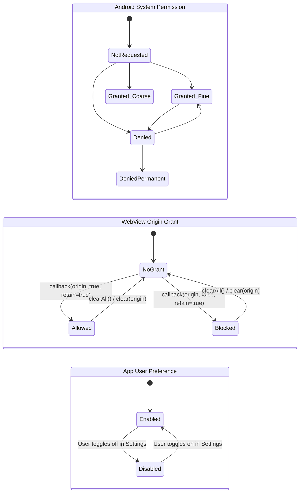
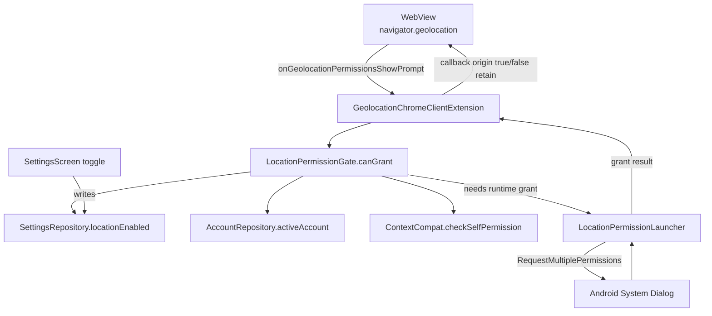
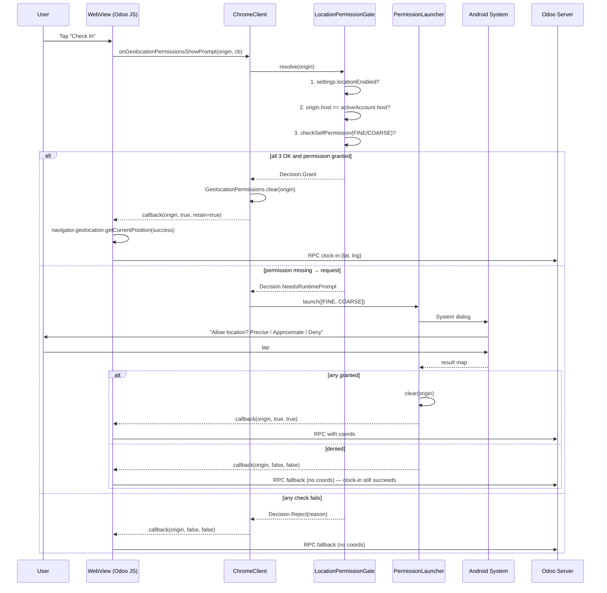

# Design — Location Permission for Odoo Attendances

**Date:** 2026-04-25
**Status:** Design (pre-implementation)
**Scope:** Android only (iOS deferred)
**Supersedes:** `2026-04-25-location-permission-brainstorm.md`

---

## Defaults Adopted

Per user direction:

| Question | Default |
|----------|---------|
| Odoo version | 18.0 |
| Mode | Manual selection (own phones) |
| Mandatory? | **Optional** — Odoo stock behavior; clock-in succeeds without coords |
| Settings toggle | **Yes** — user can opt-out independently of Android permission |
| iOS parity | **Deferred** — separate ticket |
| Geofencing | **No** — out of scope |
| Background location | **No** — never requested |

---

## 1. The Lifecycle Concern (Primary Design Driver)

User's concern (verbatim): *"I have granted the two permissions before, but we still cannot get the permission to do the clock-in."*

This is a **real failure mode** — it has at least 8 known causes when WebView geolocation is wired naïvely. Our design must defend against ALL of them.

### Three Independent State Machines That Must Agree



**The bug we must prevent:** any case where ASP=Granted but the actual clock-in still gets `getCurrentPosition()` failing.

### 8 Known Failure Modes (and how this design defends against each)

| # | Failure mode | Defense |
|---|--------------|---------|
| 1 | `WebChromeClient.onGeolocationPermissionsShowPrompt` not overridden | **Required**: override and wire to native permission state |
| 2 | `WebSettings.setGeolocationEnabled(true)` not set | **Required**: set in WebView setup (also default true on modern Android, but assert explicitly) |
| 3 | WebView caches a previous "denied" decision per origin | **Required**: on every prompt, check Android permission FIRST. If granted natively, call `GeolocationPermissions.getInstance().clear(origin)` to clear stale "blocked" cache, then `callback(origin, true, true)` |
| 4 | Permission granted in Settings AFTER WebView origin was blocked | Same fix as #3 — never trust the WebView's cached origin state when Android says it's granted |
| 5 | `getCurrentPosition` timeout because callback delayed by runtime permission dialog | **Required**: callback MUST be called within 30s (`getCurrentPosition` default timeout). If user is dismissive, call `callback(origin, false, false)` so Odoo's RPC fallback path runs (clock-in completes without coords) |
| 6 | Origin not validated → drive-by website could read GPS | **Required**: reject prompt if origin host ≠ `accountRepository.activeAccount.value?.serverHost` |
| 7 | HTTPS not enforced | Already enforced by `OdooJsonRpcClient.HttpsEnforcement` and DeepLinkValidator — non-issue |
| 8 | App preference disabled but Android permission granted | **Required**: check user preference FIRST. If `settings.locationEnabled == false`, call `callback(origin, false, false)` immediately, regardless of Android state |

---

## 2. Authoritative State Resolution Order

Every time `onGeolocationPermissionsShowPrompt` fires, resolve in this exact order. If ANY step rejects, call `callback(origin, false, false)` and stop:

```
1. is settings.locationEnabled == true ?     → if no, REJECT (user opted out)
2. is origin.host == activeAccount.serverHost ? → if no, REJECT (origin attack defense)
3. has Android FINE or COARSE permission ?   → if no, REQUEST RUNTIME, defer callback
4. (after runtime grant) was grant successful ? → if no, REJECT
5. clear stale WebView origin cache for this origin
6. callback(origin, allow=true, retain=true) ✓
```

**Key invariant:** The 6-step resolution always uses the **freshest live state** read at the moment of the prompt — no caching of "we asked once and it succeeded." This eliminates all "granted but not working" failure modes.

---

## 3. Component Design

### New components

| Component | Responsibility | Lives in |
|-----------|----------------|----------|
| `LocationPermissionGate` | Single source of truth for the resolution order. Pure Kotlin object — no Android dependencies except `Context` for permission check | `app/src/main/java/io/woowtech/odoo/data/location/LocationPermissionGate.kt` |
| `GeolocationChromeClientExtension` | Mixin/extension applied to existing `WebChromeClient` in `MainScreen.kt` — adds the two `onGeolocationPermissions*` overrides | `app/src/main/java/io/woowtech/odoo/ui/main/GeolocationChromeClientExtension.kt` |
| `LocationPermissionLauncher` | Wraps `ActivityResultContracts.RequestMultiplePermissions` for use from Compose. Composable-friendly API. Holds the pending callback during runtime permission dialog | inline in `MainScreen.kt` (it's UI lifecycle state) |

### Modified components

| Component | Change |
|-----------|--------|
| `AndroidManifest.xml` | Add `ACCESS_FINE_LOCATION` + `ACCESS_COARSE_LOCATION` |
| `MainScreen.kt` | Wire `LocationPermissionLauncher` and extend `webChromeClient` |
| `SettingsRepository.kt` | New field: `locationEnabled: Boolean` (default true). Persisted via `EncryptedPrefs.locationEnabled`. |
| `EncryptedPrefs.kt` | Add `locationEnabled` get/set |
| `AppSettings.kt` | Add `locationEnabled: Boolean = true` |
| `SettingsScreen.kt` | New toggle: "Use location for clock-in" with rationale |
| `strings.xml` (+ zh-rTW + zh-rCN) | New strings: toggle label, rationale, denied-once snackbar |

### Component dependency diagram



---

## 4. The Resolution Function — Pseudocode

```kotlin
internal class LocationPermissionGate @Inject constructor(
    private val settingsRepository: SettingsRepository,
    private val accountRepository: AccountRepository,
    @ApplicationContext private val appContext: Context,
) {
    /**
     * Result of the synchronous permission check. If [needsRuntimePrompt],
     * the caller must launch ActivityResultContracts.RequestMultiplePermissions
     * for FINE+COARSE, then re-call [resolve] after the result is delivered.
     */
    sealed class Decision {
        object Grant : Decision()
        data class Reject(val reason: String) : Decision()
        object NeedsRuntimePrompt : Decision()
    }

    fun resolve(origin: String?): Decision {
        // 1. User preference
        if (!settingsRepository.settings.value.locationEnabled) {
            return Decision.Reject("user-opted-out")
        }
        // 2. Origin validation
        val activeHost = accountRepository.activeAccount.value?.serverHost
        if (origin == null || activeHost == null || !originMatches(origin, activeHost)) {
            return Decision.Reject("origin-mismatch:$origin/$activeHost")
        }
        // 3. Android permission
        val hasFine = ContextCompat.checkSelfPermission(
            appContext, Manifest.permission.ACCESS_FINE_LOCATION
        ) == PackageManager.PERMISSION_GRANTED
        val hasCoarse = ContextCompat.checkSelfPermission(
            appContext, Manifest.permission.ACCESS_COARSE_LOCATION
        ) == PackageManager.PERMISSION_GRANTED
        if (!hasFine && !hasCoarse) {
            return Decision.NeedsRuntimePrompt
        }
        return Decision.Grant
    }

    private fun originMatches(origin: String, activeHost: String): Boolean {
        // origin format: "https://example.com" — extract host, normalize to lowercase
        val originHost = Uri.parse(origin).host?.lowercase() ?: return false
        return originHost == activeHost.lowercase()
    }
}
```

---

## 5. WebView Wire-up

```kotlin
// MainScreen.kt (additions to existing webChromeClient)

webChromeClient = object : WebChromeClient() {
    // ... existing overrides ...

    override fun onGeolocationPermissionsShowPrompt(
        origin: String?,
        callback: GeolocationPermissions.Callback?
    ) {
        if (callback == null) return
        when (val decision = locationPermissionGate.resolve(origin)) {
            is LocationPermissionGate.Decision.Grant -> {
                // Defense-in-depth: always clear any stale "blocked" entry
                // for this origin in WebView's per-origin DB. Otherwise a past
                // "denied" choice cached by Chromium can override the live grant.
                origin?.let { GeolocationPermissions.getInstance().clear(it) }
                callback.invoke(origin, true, true)
                Timber.d("Geolocation: granted for %s", origin)
            }
            is LocationPermissionGate.Decision.Reject -> {
                callback.invoke(origin, false, false)
                Timber.d("Geolocation: rejected (%s)", decision.reason)
            }
            LocationPermissionGate.Decision.NeedsRuntimePrompt -> {
                pendingGeolocationRequest = PendingRequest(origin, callback)
                locationPermissionLauncher.launch(arrayOf(
                    Manifest.permission.ACCESS_FINE_LOCATION,
                    Manifest.permission.ACCESS_COARSE_LOCATION,
                ))
                // Re-entry: when the launcher delivers result, we invoke
                // pendingGeolocationRequest with the resolved decision.
            }
        }
    }

    override fun onGeolocationPermissionsHidePrompt() {
        // No-op — we don't show our own UI; system dialog handles its own dismiss.
    }
}
```

### Compose-side launcher

```kotlin
// In MainScreen Composable
var pendingGeolocationRequest by remember { mutableStateOf<PendingRequest?>(null) }
val locationPermissionLauncher = rememberLauncherForActivityResult(
    contract = ActivityResultContracts.RequestMultiplePermissions()
) { grants ->
    val anyGranted = grants.values.any { it }
    pendingGeolocationRequest?.let { req ->
        if (anyGranted) {
            GeolocationPermissions.getInstance().clear(req.origin ?: "")
            req.callback.invoke(req.origin, true, true)
            Timber.d("Geolocation: granted after runtime prompt for %s", req.origin)
        } else {
            req.callback.invoke(req.origin, false, false)
            Timber.d("Geolocation: denied at runtime prompt for %s", req.origin)
        }
        pendingGeolocationRequest = null
    }
}
```

### One-time WebView config

```kotlin
// In OdooWebView() composable, alongside other WebSettings:
settings.setGeolocationEnabled(true)  // explicit; default true but assert
```

---

## 6. End-to-End Flow



**Critical:** the `getCurrentPosition` JS call has a default 30s timeout. The runtime permission dialog must complete inside that window. Modern Android dialogs return immediately on user tap, so 30s is plenty. If the user ignores the dialog and `getCurrentPosition` times out, Odoo's JS already has fallback (RPC without coords) — clock-in completes, no geo-tag stored.

---

## 7. Permission Lifecycle Across App Sessions

This is the heart of the user's concern. Walking through every lifecycle event:

### A. Cold start, never-asked-before
1. App launches → user logs in → opens Attendances → taps clock-in
2. Resolution: settings.locationEnabled=true (default) ✓ origin matches ✓ permission MISSING
3. → NeedsRuntimePrompt → launcher fires → user grants Precise
4. → callback(origin, true, true) → Odoo gets coords → RPC succeeds with lat/lng

### B. User has previously granted, app restarted
1. App launches → opens Attendances → taps clock-in
2. Resolution: settings.locationEnabled=true ✓ origin matches ✓ `checkSelfPermission(FINE) == GRANTED` ✓
3. → Decision.Grant
4. → BEFORE callback: `GeolocationPermissions.getInstance().clear(origin)` to wipe any stale cached "blocked" decision
5. → callback(origin, true, true) → Odoo gets coords ✓

**This is the case the user was worried about. Step 4 is the defense.**

### C. User had granted, then revoked in Android Settings, then comes back
1. App launches → opens Attendances → taps clock-in
2. Resolution: settings.locationEnabled=true ✓ origin matches ✓ `checkSelfPermission == DENIED`
3. → NeedsRuntimePrompt → launcher fires → user grants again (or denies)
4. Outcome matches Android response — no stale state from previous grant

### D. User toggles off in app's own Settings UI
1. settings.locationEnabled = false (persisted)
2. Next clock-in: resolution step 1 fails → callback(origin, false, false) → Odoo fallback path
3. User opens Settings, toggles on → next clock-in passes

### E. User force-stops the app
1. WebView's per-origin GeolocationPermissions DB is cleared by Android (process-state)
2. Next launch: case A or B, depending on Android system permission state

### F. App update bumps target SDK
- Each Android version has tightened permission rules. Resolution function rechecks live state every time, so version bumps don't introduce stale-cache bugs.

---

## 8. UI / UX

### Settings toggle
- Located in `SettingsScreen` under a new **"Privacy"** section (or extend existing "Security" section)
- Label: **"Use location for clock-in"** (en) / **"打卡時使用定位"** (zh-TW) / **"打卡时使用定位"** (zh-CN)
- Description: "Lets Odoo Attendances tag your clock-in with your location. Required by your company policy if enabled."
- Default: **on** (matches Odoo stock behavior — "optional but enabled by default")

### Runtime permission dialog rationale
- Use `ActivityCompat.shouldShowRequestPermissionRationale` — if true (user denied once), show a snackbar BEFORE re-launching the dialog: *"Location is used to record where you clock in. We never track you in the background."*
- If user has selected "Don't ask again": show snackbar with action "Open Settings" that launches `Settings.ACTION_APPLICATION_DETAILS_SETTINGS`

### No new screens
- All UI in existing `SettingsScreen.kt`; one new toggle row.

---

## 9. Testing Plan

### Tier 1 — Unit tests (`LocationPermissionGateTest`)

GIVEN-WHEN-THEN tests, no Android dependencies (mock `Context.checkSelfPermission` via static mock or wrapper interface):

1. `given locationEnabled=false then resolve returns Reject(user-opted-out)`
2. `given locationEnabled=true and no active account then resolve returns Reject(origin-mismatch)`
3. `given mismatched origin host then resolve returns Reject(origin-mismatch)`
4. `given matched origin and FINE granted then resolve returns Grant`
5. `given matched origin and only COARSE granted then resolve returns Grant`
6. `given matched origin and no permission then resolve returns NeedsRuntimePrompt`
7. `given origin uppercase host then resolve normalises and returns Grant`
8. `given origin null then resolve returns Reject`

### Tier 2 — uiautomator2 (`V26-C<sha>: Geolocation grant flow`)

Self-contained per CLAUDE.md test-independence rule:
1. `ensure_logged_in()` baseline
2. `apply_test_hook(location_enabled=true)` (new hook extra)
3. Grant location via `adb shell pm grant io.woowtech.odoo.debug android.permission.ACCESS_FINE_LOCATION`
4. Set mock location: `adb shell appops set android.permission.MOCK_LOCATION allow` + `adb shell setprop ro.testlocation 25.04,121.56`
5. Trigger Odoo clock-in via WebView (or simulate via JS injection: `evaluateJavascript("navigator.geolocation.getCurrentPosition(...)`)
6. Assert WebView received non-zero coords (via console log capture)
7. Cleanup: `adb shell pm revoke io.woowtech.odoo.debug android.permission.ACCESS_FINE_LOCATION`

### Tier 3 — E2E production (`E2E-15: Real clock-in geo-tag persists to hr.attendance`)

1. Real phone, real Odoo, real GPS
2. Clock-in via the in-app WebView
3. Query Odoo via JSON-RPC: `hr.attendance` for current user, latest record
4. Assert `in_latitude` and `in_longitude` are non-zero AND within 100m of phone's actual location

### Test hook addition

Extend `TestHooks.kt` with:
- `--ez location-enabled <bool>` — toggles the new app preference

---

## 10. Risks & Mitigations

| Risk | Mitigation |
|------|------------|
| WebView's stale per-origin "blocked" cache | `GeolocationPermissions.clear(origin)` before every grant |
| Origin spoofing via iframe | Origin host validated against active account's host; rejects 3rd-party origins |
| User grants permission in dialog → callback never called → JS times out at 30s | Launcher result handler always invokes callback (grant or deny path) |
| Race: prompt arrives during config change (rotation) | `android:configChanges` already set on MainActivity (L5 lifecycle fix) — Activity not recreated |
| User denies permanently | Snackbar with "Open Settings" CTA |
| Mock-location apps could fake clock-in | Detect via `Location.isFromMockProvider()` if needed — out of scope v1; flag for security follow-up |
| Battery drain | Single `getCurrentPosition` per clock-in, foreground only — negligible |
| Privacy review (Play Store) | Background NOT requested; declare purpose in Play Data Safety section |
| Permission silently revoked by OS auto-reset (Android 11+) | Resolution function always rechecks — no stale cached "yes" |

---

## 11. Phases

### Phase 1 — Core wiring (~3 hours)
- Manifest permissions
- `LocationPermissionGate.kt` + 8 unit tests
- `GeolocationChromeClientExtension` overrides + `GeolocationPermissions.clear()` defense
- `LocationPermissionLauncher` Compose integration
- `WebSettings.setGeolocationEnabled(true)` explicit
- New `locationEnabled` field in `AppSettings`/`EncryptedPrefs`/`SettingsRepository`

### Phase 2 — Settings UI + i18n (~2 hours)
- New "Use location for clock-in" toggle in `SettingsScreen`
- Strings in en, zh-rTW, zh-rCN
- Rationale snackbar + "Open Settings" intent

### Phase 3 — Tests (~2 hours)
- 8 unit tests for `LocationPermissionGateTest`
- New uiautomator2 V26 with self-contained setup (test-hook driven)
- Extend TestHooks.kt with `--ez location-enabled`

### Phase 4 — Verification (~1 hour)
- `./gradlew :app:testDebugUnitTest` 
- `./gradlew :app:assembleDebug` + `assembleRelease` (R8 must not strip needed code)
- Real-device V26 run
- E2E-15 against live Odoo

### Phase 5 — iOS port (separate ticket)

**Total Android effort: ~1 engineer-day** (smaller than brainstorm estimate because LocationPermissionGate centralises logic in one testable class).

---

## 12. Acceptance Criteria

A pull request is mergeable when:

1. ✅ All 8 `LocationPermissionGateTest` cases pass
2. ✅ `assembleDebug` + `assembleRelease` pass (no R8 strip surprises)
3. ✅ V26 passes on real device — clock-in coords appear in `hr.attendance`
4. ✅ Manual test: revoke permission in Android Settings → next clock-in re-prompts cleanly
5. ✅ Manual test: toggle app Settings off → clock-in succeeds without coords (Odoo fallback)
6. ✅ Strings exist in all 3 locales
7. ✅ Privacy doc updated (CLAUDE.md security section + README troubleshooting)
8. ✅ No `ACCESS_BACKGROUND_LOCATION` declared in manifest
9. ✅ Independent code-architect review passed (this design + implementation)

---

## 13. Independent Code-Architect Review (pending)

Areas for the architect to scrutinize:

1. Is the resolution order correct, or could a step be re-ordered to fail-faster?
2. Is `LocationPermissionGate` the right abstraction (vs putting logic inline in WebChromeClient)?
3. Are there lifecycle scenarios I haven't considered (e.g., WebView recreated due to memory pressure, multi-window split-screen)?
4. Is the `GeolocationPermissions.clear(origin)` defense sufficient, or do we need to clear ALL origins on each grant?
5. Should the runtime permission request be triggered EAGERLY on app launch (after login) or LAZILY on first clock-in attempt? (Currently designed lazy.)
6. Threading: `onGeolocationPermissionsShowPrompt` runs on main thread; `checkSelfPermission` is fast — non-issue. Confirm.
7. Process-death recovery: if app is killed during runtime permission dialog, what happens?
