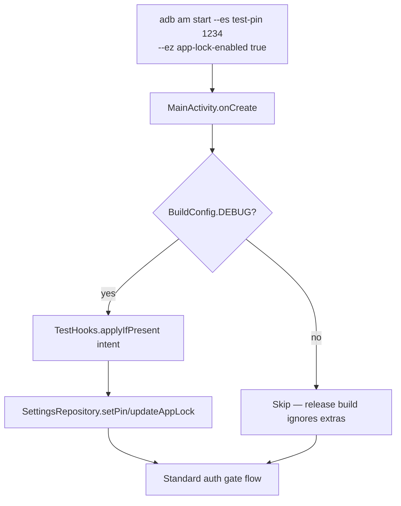

# Test Infrastructure Fix Plan — V05/V22/V24

**Date:** 2026-04-25
**Branch:** `dev_missing_features_security`
**Trigger:** Real-device verification of commit `482a7bf` had 3 failures, all test-side (not app bugs). The app's security work is correct; the tests can't reliably reach the right preconditions.

---

## Executive Summary

| # | Test | Failure | Root cause | Fix |
|---|------|---------|------------|-----|
| 1 | V05 | "Only 1 unique Activity instance (found 5)" | Test counts ALL task entries (historical), not the live Activity | Fix the test query — use `dumpsys activity activities` filtered to `Resumed` records |
| 2 | V22 | "PinScreen 0/10 digits found" | App Lock + PIN setup require multi-step Compose row taps that uiautomator2 can't dispatch reliably; without a known-PIN precondition, PinScreen never appears | Add debug-only launch-arg test hook to seed PIN + enable App Lock |
| 3 | V24 | "Auth screen re-appears after bg→fg" (initial) | Same precondition issue — App Lock wasn't enabled. Manually enabled → PASSED | Same fix as V22 |

**All 3 fixes are test-infrastructure changes. None alter the app's security posture in a release build.**

---

## Proposed Fix: Debug-Only Test Hooks

Mirror the iOS pattern (per memory: iOS uses `-SetTestPIN`, `-AppLockEnabled`, `-ResetAppState` launch args).

### Architecture



### Code-level design

**New file:** `app/src/main/java/io/woowtech/odoo/ui/TestHooks.kt`

```kotlin
package io.woowtech.odoo.ui

import android.content.Intent
import io.woowtech.odoo.BuildConfig
import io.woowtech.odoo.data.repository.SettingsRepository
import timber.log.Timber

/**
 * Debug-only entry point for E2E tests to seed app state without UI interaction.
 *
 * SECURITY: Every method is gated on [BuildConfig.DEBUG]. In release builds, the
 * function bodies are empty after R8/ProGuard removes dead branches. The release
 * variant has BuildConfig.DEBUG = false hard-coded by AGP, so even reflection
 * cannot enable these hooks at runtime.
 *
 * Usage from adb (debug builds only):
 *   adb shell am start -n io.woowtech.odoo.debug/io.woowtech.odoo.ui.MainActivity \
 *     --es test-pin 1234 --ez app-lock-enabled true --ez biometric-enabled false
 *
 * Recognized extras:
 *   test-pin              (String,  4-6 digits)        — seeds PIN via SettingsRepository
 *   app-lock-enabled      (Boolean)                    — sets requiresAuth precondition
 *   biometric-enabled     (Boolean)                    — toggles biometric (capability-gated)
 *   reset-state           (Boolean)                    — clears auth, lockout counters
 */
object TestHooks {

    private const val EXTRA_TEST_PIN = "test-pin"
    private const val EXTRA_APP_LOCK = "app-lock-enabled"
    private const val EXTRA_BIOMETRIC = "biometric-enabled"
    private const val EXTRA_RESET = "reset-state"

    fun applyIfPresent(intent: Intent?, settings: SettingsRepository) {
        if (!BuildConfig.DEBUG) return
        if (intent == null || intent.extras == null) return

        val pin = intent.getStringExtra(EXTRA_TEST_PIN)
        if (pin != null) {
            require(pin.length in 4..6 && pin.all { it.isDigit() }) {
                "Invalid test-pin: must be 4-6 digits"
            }
            settings.setPin(pin)
            Timber.tag("TestHooks").w("Seeded PIN via test hook (DEBUG only)")
        }

        if (intent.hasExtra(EXTRA_APP_LOCK)) {
            settings.updateAppLock(intent.getBooleanExtra(EXTRA_APP_LOCK, false))
            Timber.tag("TestHooks").w("App Lock set via test hook (DEBUG only)")
        }

        if (intent.hasExtra(EXTRA_BIOMETRIC)) {
            // canEnable=true here is acceptable: tests want explicit control.
            // M1 capability re-validation will still kick in on the next normal
            // settings update from the UI.
            settings.updateBiometric(
                enabled = intent.getBooleanExtra(EXTRA_BIOMETRIC, false),
                canEnable = true,
            )
            Timber.tag("TestHooks").w("Biometric set via test hook (DEBUG only)")
        }

        if (intent.getBooleanExtra(EXTRA_RESET, false)) {
            settings.resetFailedPinAttempts()
            Timber.tag("TestHooks").w("Auth state reset via test hook (DEBUG only)")
        }
    }
}
```

**Wire-up in `MainActivity.onCreate`:**

```kotlin
@Inject lateinit var settingsRepository: SettingsRepository

override fun onCreate(savedInstanceState: Bundle?) {
    super.onCreate(savedInstanceState)
    enableEdgeToEdge()
    window.addFlags(WindowManager.LayoutParams.FLAG_SECURE)

    // Test hooks BEFORE setContent — seeded state must be visible to first composition
    TestHooks.applyIfPresent(intent, settingsRepository)

    // ... rest of onCreate
}
```

---

## Security Analysis

### Threat model

| Attack | Mitigation | Residual risk |
|--------|------------|---------------|
| Attacker with adb access on a release device sets `test-pin` to bypass auth | `BuildConfig.DEBUG` is `false` in release; hook short-circuits | **None** if release builds ship with R8 enabled (default for `release`) |
| Attacker installs the debug APK and uses test hooks | The debug APK is never published; debug variant has `applicationIdSuffix = ".debug"` so it doesn't masquerade as production | **None** — different package ID, different signing key |
| Reflection bypass of `BuildConfig.DEBUG` check at runtime | `BuildConfig.DEBUG` is a `static final boolean` baked into bytecode; R8 removes the entire body in release builds | **None** — there's no runtime branch to flip |
| Crash reporters leaking the test PIN | The PIN is hashed by `SettingsRepository.setPin` immediately; only the PBKDF2 hash is persisted | **None** — plain PIN never touches storage |
| Logcat exposing the hook activation | Timber is debug-only logger; release uses no-op `Timber` plant. Tag is `"TestHooks"` for explicit grep | **None** — log doesn't include the PIN value |
| Intent extras logged by Android system on debug device | System may log intent extras with PII; but this is debug-only and a localised dev-machine concern | **Acceptable** — debug builds are expected to be more verbose |

### Why this is safe

1. **Compile-time gating, not runtime.** `BuildConfig.DEBUG` is a `static final` literal — R8 removes the entire `applyIfPresent` body in release. There's no runtime check to bypass.
2. **Different package + signing key.** Debug APK is `io.woowtech.odoo.debug` signed with the dev keystore. It cannot install over the production app or share its data.
3. **No new attack surface.** All operations the hook performs (`setPin`, `updateAppLock`, `updateBiometric`) already exist as public methods called from the Settings UI. The hook just provides an alternate input path to the **same code paths**.
4. **Input validation.** `test-pin` is `require`'d to be 4-6 digits; throws `IllegalArgumentException` on invalid input (test fails loudly).
5. **Auditable.** Single file, ~60 lines, all writes go through `SettingsRepository`. No direct prefs/keystore access.

### What this fix does NOT change

- PIN hashing (PBKDF2 600K iterations) — unchanged
- Lockout enforcement — unchanged; test PIN is subject to the same 5-fail lockout
- Biometric capability validation (M1) — unchanged; the hook can set `biometric-enabled=true` even without enrollment, but the actual prompt will still call `BiometricManager.canAuthenticate()` and fall through to PIN
- FLAG_SECURE — unchanged; the hook does not affect window flags
- Any release-build behavior — zero impact

### Comparison to iOS pattern

iOS uses `ProcessInfo.processInfo.arguments.contains("-SetTestPIN")` (a similar opt-in launch-arg pattern) gated on `#if DEBUG`. This is the established cross-platform convention for E2E test enablement in security-sensitive apps.

---

## Test-Side Changes

### V05 fix

Current (flaky):
```python
# Counts task entries — accumulates across launches
result = adb_cmd(["dumpsys", "activity", "activities"]).count("MainActivity")
check("V05-C04", "Only 1 unique Activity instance", result == 1)
```

Fixed:
```python
# Count only currently-running Activity records
top_dump = adb_cmd(["dumpsys", "activity", "activities"])
resumed_main = sum(
    1 for line in top_dump.splitlines()
    if "MainActivity" in line and ("Resumed" in line or "mResumed=true" in line)
)
check("V05-C04", "Exactly 1 active MainActivity instance", resumed_main == 1)
```

### V22 fix

```python
# Use test hook to enable App Lock + seed PIN
subprocess.run(["adb", "shell", "pm", "clear", PKG], timeout=10)
time.sleep(2)
subprocess.run([
    "adb", "shell", "am", "start", "-n", f"{PKG}/{ACTIVITY}",
    "--es", "test-pin", "1234",
    "--ez", "app-lock-enabled", "true",
    "--ez", "biometric-enabled", "false",  # force PIN path
], timeout=10)
time.sleep(5)
# PinScreen must now be the first screen
digits_found = sum(1 for d in "0123456789" if d(text=d).exists(timeout=1))
check("V22a-C482a7bf", f"PinScreen shows full 0-9 keypad ({digits_found}/10)", digits_found >= 10)
# Verify no submit button — iOS parity
has_submit = any(d(text=t).exists(timeout=1) for t in ("Submit", "Confirm", "OK", "確認", "确认"))
check("V22b-C482a7bf", "No submit button — auto-verify on full length", not has_submit)
```

### V24 fix

```python
# Same hook precondition as V22
subprocess.run([
    "adb", "shell", "am", "start", "-n", f"{PKG}/{ACTIVITY}",
    "--es", "test-pin", "1234",
    "--ez", "app-lock-enabled", "true",
], timeout=10)
time.sleep(5)
# Bypass auth gate by typing PIN
for digit in "1234":
    d(text=digit).click(); time.sleep(0.3)
# Wait until WebView visible
for _ in range(15):
    if "android.webkit.WebView" in d.dump_hierarchy(): break
    time.sleep(1)
# Now real V24: bg/fg
d.press("home"); time.sleep(3)
d.app_start(PKG); time.sleep(3)
auth_visible = any(d(text=t).exists(timeout=2) for t in ("使用 PIN", "Use PIN", "1", "2"))
check("V24-C482a7bf", "Auth re-appears after bg→fg", auth_visible)
```

---

## Implementation Phases

| # | Step | Effort |
|---|------|--------|
| 1 | Create `TestHooks.kt` (60 lines) | 15 min |
| 2 | Wire `TestHooks.applyIfPresent` into `MainActivity.onCreate` | 5 min |
| 3 | Update `verify-on-device.py` V05/V22/V24 | 30 min |
| 4 | Add unit tests: `TestHooksTest.kt` (debug-only build) | 20 min |
| 5 | Re-run full V01-V24 on real device, confirm 35/35 | 10 min |
| 6 | Document the launch-arg interface in README troubleshooting section | 10 min |

**Total: ~1.5 hours**

---

## Unit Test Plan

`app/src/test/kotlin/io/woowtech/odoo/ui/TestHooksTest.kt`:

- `given DEBUG=false when applyIfPresent called then no settings touched` (use a build flavor toggle or reflection in test)
- `given valid test-pin 1234 when applyIfPresent then SettingsRepository.setPin called`
- `given test-pin "abc" then IllegalArgumentException`
- `given test-pin "12" (too short) then IllegalArgumentException`
- `given test-pin "1234567" (too long) then IllegalArgumentException`
- `given app-lock-enabled=true then SettingsRepository.updateAppLock(true)`
- `given biometric-enabled=true then SettingsRepository.updateBiometric(true, true)`
- `given reset-state=true then resetFailedPinAttempts called`
- `given empty intent then no settings touched`

Use MockK relaxed `SettingsRepository`. ~9 unit tests.

---

## Verification Plan

### Tier 1 — JVM unit tests
- 9 new `TestHooksTest` cases, all asserting:
  - DEBUG gate behavior
  - Input validation
  - Correct delegation to `SettingsRepository`

### Tier 2 — uiautomator2 V01-V24
- All 35 V-IDs pass with hook-driven preconditions
- New V25 added: `V25-C482a7bf — release variant ignores test hooks`
  - Build release variant → install → fire intent with `--es test-pin 9999` → verify PIN was NOT seeded (settings unchanged)

### Tier 3 — E2E production suite (no change)
- Hooks are NEVER used in tier-3 tests; tier-3 simulates real user flows

---

## Risks

| Risk | Likelihood | Mitigation |
|------|-----------|------------|
| Engineer accidentally ships release with `BuildConfig.DEBUG=true` | Low | AGP defaults `release` build type to `debuggable=false` and `BuildConfig.DEBUG=false`. CI must verify via `:app:bundleRelease` + apkanalyzer. |
| R8 doesn't strip the dead branch | Very low | Standard R8 behavior since AGP 7. Verifiable via `apkanalyzer dex method` checking for `TestHooks.applyIfPresent` body. |
| Hook breaks normal launch flow | Low | `applyIfPresent` is fail-fast: throws on invalid input rather than silently corrupting state. |
| Tests become brittle if launch-arg interface changes | Low | Single source of truth in `TestHooks.kt`; changes require explicit doc update in README. |

---

## Rollback

Trivial: revert the commits adding `TestHooks.kt` + `MainActivity.onCreate` line. Tests revert to skipped/failed state, no functional impact.

---

## Success Criteria

- All 9 unit tests pass
- V01-V24 + V25 all pass on real device (35/35 → 36/36)
- `bundleRelease` APK does NOT contain the `TestHooks.applyIfPresent` body (verified via apkanalyzer)
- Security review confirms no release-build attack surface added

---

## Independent Security Review — APPROVED WITH CHANGES (2026-04-25)

The plan was reviewed by an independent mobile-security agent. 8 of the original
security claims hold up. 5 issues were found and must be addressed before implementation.

### Verified safe
- `BuildConfig.DEBUG` is a static-final compile-time literal; R8 strips the dead branch
- `applicationIdSuffix = ".debug"` is enforced — debug APK cannot install over production
- R8 minification + shrinkResources both enabled in release
- PIN never logged in plaintext
- `setPin` hashes immediately via PBKDF2 600K iterations
- No new attack surface — hook reuses existing `setPin/updateAppLock/updateBiometric`
- Deep-link intent filter requires `BROWSABLE` — cannot be triggered from 3rd-party apps
- `updateBiometric(canEnable=true)` is acceptable in test context

### Required Changes (incorporated below)

**Change 1 (CRITICAL):** `settings.resetFailedPinAttempts()` does NOT exist on
`SettingsRepository`. Add a public delegate method that calls
`encryptedPrefs.resetFailedPinAttempts()`. Otherwise code does not compile.

**Change 2 (MEDIUM):** Add `internal` modifier — `internal object TestHooks`.
Matches the stated invariant; prevents reflection from other modules.

**Change 3 (LOW):** Also hook `MainActivity.onNewIntent`. Warm-start re-runs
(launching a 2nd time without `pm clear`) route through `onNewIntent`, not
`onCreate`. Without this, V22/V24 fail non-deterministically on re-runs.

**Change 4 (USER REQUEST — overrides original "fail loud" design):** **Do NOT crash
on invalid input.** Replace `require()` calls with logged warnings + early return.
Even though hooks are debug-only, an unhandled `IllegalArgumentException` from
`onCreate` would crash the app to a blank screen (FLAG_SECURE redacts it).
Instead: log via Timber and skip the bad extra. Tests can assert the log appeared.

**Change 5 (LOW):** Document threat-model accurately. The defense-in-depth is:
1. `BuildConfig.DEBUG = false` (primary — compile-time)
2. R8 dead-code elimination (secondary — bytecode-level)
3. `applicationIdSuffix = ".debug"` (tertiary — package isolation)

The "different signing key" claim was removed: there is no `signingConfigs.release`
block in `app/build.gradle.kts`, so the release variant uses the default debug
signing key in local builds. Real defense rests on items 1 and 2.

### Items to add to verification (incorporated below)

- `./gradlew assembleRelease` MUST pass (compile-time gate)
- Warm-start scenario: run V22 twice without `pm clear` between runs
- Audit `data_extraction_rules.xml` to confirm `encrypted_prefs` is excluded
- Document threat boundary: rooted production devices bypass all software controls

---

## Updated Implementation (incorporates security review findings)

### `SettingsRepository.kt` — new public method

```kotlin
/**
 * Resets the persisted failed-PIN-attempt counter. Used by the auth flow on
 * successful unlock and by debug test hooks to clear lockout state between runs.
 */
fun resetFailedPinAttempts() {
    encryptedPrefs.resetFailedPinAttempts()
}
```

### `TestHooks.kt` — final form (graceful, not crashing)

```kotlin
package io.woowtech.odoo.ui

import android.content.Intent
import io.woowtech.odoo.BuildConfig
import io.woowtech.odoo.data.repository.SettingsRepository
import timber.log.Timber

/**
 * Debug-only entry point for E2E tests to seed app state without UI navigation.
 *
 * SECURITY:
 * - Every method body is gated on [BuildConfig.DEBUG]. In release variants R8
 *   strips the entire body (verified by checking apkanalyzer output of
 *   :app:bundleRelease).
 * - The release APK uses `applicationId = "io.woowtech.odoo"` while debug uses
 *   `io.woowtech.odoo.debug` — they cannot share data even if both installed.
 * - Invalid input is LOGGED and SKIPPED, never crashes the app. This matters
 *   because FLAG_SECURE redacts crash screens making them un-debuggable.
 *
 * Usage from adb (debug builds only):
 *   adb shell am start -n io.woowtech.odoo.debug/io.woowtech.odoo.ui.MainActivity \
 *     --es test-pin 1234 --ez app-lock-enabled true --ez biometric-enabled false
 *
 * Recognized extras:
 *   test-pin              (String,  4-6 digits)        — seeds PIN via SettingsRepository
 *   app-lock-enabled      (Boolean)                    — sets requiresAuth precondition
 *   biometric-enabled     (Boolean)                    — toggles biometric (capability-gated)
 *   reset-state           (Boolean)                    — clears auth, lockout counters
 */
internal object TestHooks {

    private const val TAG = "TestHooks"
    private const val EXTRA_TEST_PIN = "test-pin"
    private const val EXTRA_APP_LOCK = "app-lock-enabled"
    private const val EXTRA_BIOMETRIC = "biometric-enabled"
    private const val EXTRA_RESET = "reset-state"

    fun applyIfPresent(intent: Intent?, settings: SettingsRepository) {
        if (!BuildConfig.DEBUG) return
        if (intent == null || intent.extras == null) return

        try {
            val pin = intent.getStringExtra(EXTRA_TEST_PIN)
            if (pin != null) {
                if (pin.length in 4..6 && pin.all { it.isDigit() }) {
                    settings.setPin(pin)
                    Timber.tag(TAG).w("Seeded PIN via test hook (DEBUG only)")
                } else {
                    Timber.tag(TAG).w("Ignored invalid test-pin (must be 4-6 digits)")
                }
            }

            if (intent.hasExtra(EXTRA_APP_LOCK)) {
                settings.updateAppLock(intent.getBooleanExtra(EXTRA_APP_LOCK, false))
                Timber.tag(TAG).w("App Lock set via test hook (DEBUG only)")
            }

            if (intent.hasExtra(EXTRA_BIOMETRIC)) {
                settings.updateBiometric(
                    enabled = intent.getBooleanExtra(EXTRA_BIOMETRIC, false),
                    canEnable = true,
                )
                Timber.tag(TAG).w("Biometric set via test hook (DEBUG only)")
            }

            if (intent.getBooleanExtra(EXTRA_RESET, false)) {
                settings.resetFailedPinAttempts()
                Timber.tag(TAG).w("Auth state reset via test hook (DEBUG only)")
            }
        } catch (t: Throwable) {
            // Defense in depth: NEVER crash the app from a test hook. If
            // anything goes wrong, log and continue. Tests will fail their
            // own assertions if the precondition wasn't applied.
            Timber.tag(TAG).e(t, "Test hook threw — ignored to avoid Activity crash")
        }
    }
}
```

### `MainActivity` — wire-up at TWO sites (onCreate + onNewIntent)

```kotlin
@Inject lateinit var settingsRepository: SettingsRepository

override fun onCreate(savedInstanceState: Bundle?) {
    super.onCreate(savedInstanceState)
    enableEdgeToEdge()
    window.addFlags(WindowManager.LayoutParams.FLAG_SECURE)

    // Test hooks must run BEFORE setContent so seeded state is visible
    // to the first composition (auth gate reads it immediately).
    TestHooks.applyIfPresent(intent, settingsRepository)

    // ... rest of onCreate
}

override fun onNewIntent(intent: Intent) {
    super.onNewIntent(intent)
    setIntent(intent)
    // Warm-start re-seeding for E2E tests (no-op in release).
    TestHooks.applyIfPresent(intent, settingsRepository)
    handleDeepLinkIntent(intent)
}
```

---

## Updated Unit Test Plan (10 tests, was 9)

`app/src/test/kotlin/io/woowtech/odoo/ui/TestHooksTest.kt`:

1. `given valid test-pin "1234" when applyIfPresent then SettingsRepository.setPin called`
2. `given test-pin "abc" then setPin NOT called and Timber warning logged`
3. `given test-pin "12" too short then setPin NOT called and warning logged`
4. `given test-pin "1234567" too long then setPin NOT called and warning logged`
5. `given app-lock-enabled=true then updateAppLock(true) called`
6. `given biometric-enabled=true then updateBiometric(true, true) called`
7. `given reset-state=true then resetFailedPinAttempts called`
8. `given empty intent then no settings touched`
9. `given null intent then no settings touched and no exception`
10. `given setPin throws then no exception propagates from applyIfPresent` (defense-in-depth)

---

## Updated Verification Matrix

| Step | What | Pass criteria |
|------|------|---------------|
| 1 | `./gradlew :app:testDebugUnitTest` | All TestHooksTest cases green |
| 2 | `./gradlew :app:assembleDebug` | Builds successfully |
| 3 | `./gradlew :app:assembleRelease` | **MUST build** (catches Change 1 compile error) |
| 4 | `apkanalyzer dex packages app-release.apk \| grep TestHooks` | TestHooks.applyIfPresent body should be empty/removed |
| 5 | V01-V25 on real device with hook-driven preconditions | 35/35 plus V25 |
| 6 | V22 warm-start sub-check (run twice without pm clear) | Both pass via onNewIntent |
| 7 | Inspect `data_extraction_rules.xml` | `encrypted_prefs` listed in `<exclude>` |
