# WoowTech Odoo Mobile App - Architecture Overview

> **Target Version:** 1.4.1 (versionCode: 21)
> **Date:** 2026-07-29
> **Package:** `io.woowtech.odoo`

---

## Table of Contents

1. [Project Summary](#1-project-summary)
2. [Technology Stack](#2-technology-stack)
3. [High-Level Architecture (Block Diagram)](#3-high-level-architecture)
4. [Module & Package Structure](#4-module--package-structure)
5. [Clean Architecture Layers](#5-clean-architecture-layers)
6. [Navigation Flow & Deep Linking](#6-navigation-flow--deep-linking)
7. [Authentication System & Security](#7-authentication-system)
8. [Data Layer & Odoo API](#8-data-layer--odoo-api)
9. [FCM Push Notifications & Deep Link Routing](#9-fcm-push-notifications--deep-link-routing)
10. [WebView Integration & Session Self-Healing](#10-webview-integration--session-self-healing)
11. [Security Architecture](#11-security-architecture)
12. [Theme & Localization](#12-theme--localization)
13. [Dependency Injection](#13-dependency-injection)
14. [Key Data Flows](#14-key-data-flows)
15. [Database Schema](#15-database-schema)
16. [CI/CD Pipeline & Automated Testing](#16-cicd-pipeline--automated-testing)
17. [Project Statistics](#17-project-statistics)
18. [Directory Structure Reference](#18-directory-structure-reference)

---

## 1. Project Summary

**WoowTech Odoo** is a native Android companion app for Odoo ERP servers. The app wraps the Odoo web interface in an optimized WebView while providing native Android system integrations:

- **Multi-Account Management**: Seamlessly switch between multiple Odoo servers with per-account cookie isolation.
- **Biometric & PIN Lockout**: Hardened authentication using PBKDF2 (600k iterations) and Android KeyStore AES-256-GCM.
- **Firebase Cloud Messaging (FCM)**: Native push notifications for Odoo chatter, discuss, and activity events.
- **Silent Session Self-Healing**: Automatically re-authenticates expired WebView sessions in the background without kicking users back to the login screen.
- **OWL Layout Fixes**: Injects dynamic viewport recalculation scripts for smooth rendering on Odoo 17/18 OWL web framework.
- **Multilingual Support**: Supports English (`en`), Traditional Chinese (`zh-TW`), and Simplified Chinese (`zh-CN`).

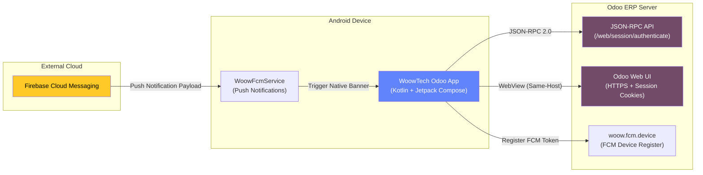

---

## 2. Technology Stack

| Category | Technology | Version / Specification |
|----------|-----------|------------------------|
| **Language** | Kotlin | 2.0.21 |
| **UI Framework** | Jetpack Compose + Material 3 | BOM 2024.02.00 |
| **Architecture** | MVVM + Clean Architecture | Repository-Event Symmetry |
| **DI** | Hilt | 2.50 (KSP) |
| **Database** | Room | 2.6.1 |
| **Networking** | OkHttp + Gson | 4.12.0 / 2.10.1 (No Retrofit) |
| **Push Notifications** | Firebase Cloud Messaging (FCM) | `firebase-messaging` |
| **Security & Crypto** | EncryptedSharedPreferences, KeyStore | PBKDF2 (600k salt), AES-256-GCM |
| **Auth** | BiometricPrompt | `1.2.0-alpha05` |
| **Navigation** | Navigation Compose | `2.7.7` |
| **Logging** | Timber | `5.0.1` (No `android.util.Log`) |
| **Testing** | JUnit 5 + MockK + Turbine + uiautomator2 | 178 Unit Tests, 30 Device Checks |
| **Build & Min/Target SDK** | AGP 8.3.0 / Gradle 8.6 | Min API 29 (Android 10), Target API 34 (Android 14) |

---

## 3. High-Level Architecture

### System Block Diagram

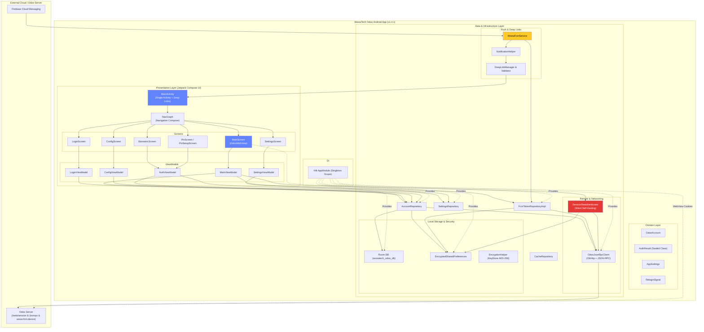

---

## 4. Module & Package Structure

This is a single-module Android application (`:app`) following Clean Architecture layer separation.

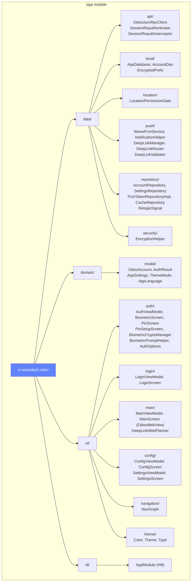

---

## 5. Clean Architecture Layers

### Layer Interactions & Dependency Rule

```mermaid
graph TB
    subgraph "Presentation Layer (Jetpack Compose)"
        SCREENS["Screens & Views<br/>(LoginScreen, MainScreen, ConfigScreen,<br/>SettingsScreen, BiometricScreen, PinScreen)"]
        VMS["ViewModels<br/>(LoginVM, AuthVM, MainVM, ConfigVM, SettingsVM)"]
        SCREENS --> VMS
    end

    subgraph "Domain Layer"
        MODELS["Domain Models<br/>(OdooAccount, AuthResult, AppSettings,<br/>ReloginSignal)"]
        FCM_INTF["FcmTokenRepository Interface"]
    end

    subgraph "Data Layer"
        REPOS["Repositories<br/>(AccountRepository, SettingsRepository,<br/>FcmTokenRepositoryImpl, CacheRepository)"]
        REMOTE["Remote Data Sources<br/>(OdooJsonRpcClient, SessionReauthenticator)"]
        LOCAL_DS["Local Data Sources<br/>(Room DB, EncryptedPrefs, EncryptionHelper)"]
        PUSH_DS["Push & DeepLink Services<br/>(WoowFcmService, NotificationHelper)"]

        REPOS --> REMOTE & LOCAL_DS & PUSH_DS
    end

    VMS --> MODELS
    VMS --> REPOS
    FCM_INTF <|.. FCM_REPO

    style SCREENS fill:#81C784,color:#000
    style VMS fill:#6183FC,color:#fff
    style MODELS fill:#FFB74D,color:#000
    style REPOS fill:#4A6BD9,color:#fff
    style REMOTE fill:#EF5350,color:#fff
    style LOCAL_DS fill:#AB47BC,color:#fff
```

---

### MVVM Pattern

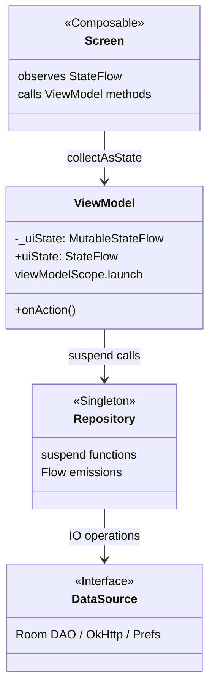


## 6. Navigation Flow & Deep Linking

### Screen State Machine & Deep Link Entry

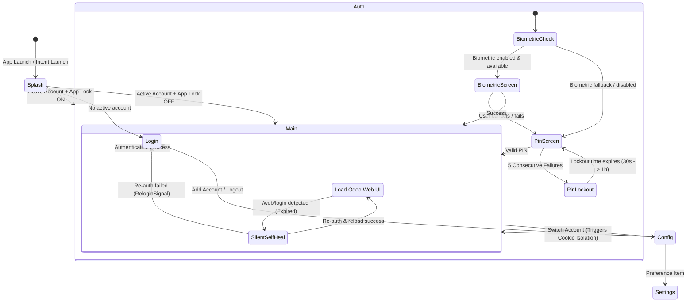

---

## 7. Authentication System

### Multi-Account Auth & Password Encryption

When logging into an Odoo server:
1. `OdooJsonRpcClient` posts credentials to `/web/session/authenticate`.
2. On success, `session_id` cookie is stored in an in-memory `ConcurrentHashMap`.
3. The password is encrypted via **AES-256-GCM** (`EncryptionHelper` backed by Android KeyStore) and stored in `EncryptedSharedPreferences`.
4. Non-sensitive account metadata is written to Room DB (`woowtech_odoo_db`).

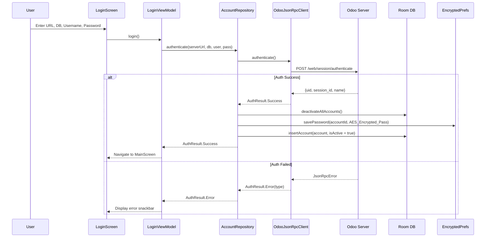

### PIN Security Engineering (PBKDF2)

Unlike naive SHA-256 implementations, PIN hashing in WoowTech Odoo uses **PBKDF2WithHmacSHA256** with 600,000 iterations and a random salt:

- **Salt**: 16-byte cryptographically secure random salt (`SecureRandom`).
- **Hash**: 256-bit derived key from 600,000 iterations.
- **Lockout Timing**: Lockout timers utilize `SystemClock.elapsedRealtime()` instead of `System.currentTimeMillis()` to prevent users from bypassing PIN lockouts by altering device system clocks.
- **Exponential Penalty**: Failure lockout increases progressively: 30s → 5m → 30m → 1h.

---

### Login Wizard (Two-Step Form)

`LoginViewModel` drives the login screen as a two-step wizard (`LoginStep.SERVER_INFO` → `LoginStep.CREDENTIALS`). Step 1 validates connection details client-side — including an explicit rejection of `http://` URLs — before credentials are ever collected, and `login()` normalises the host by prepending `https://` when no scheme was typed.

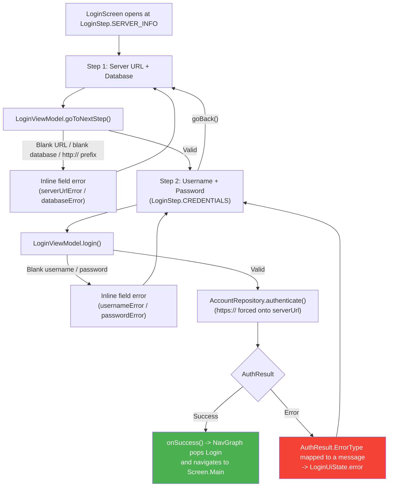

`AuthResult.ErrorType` covers `NETWORK_ERROR`, `INVALID_URL`, `DATABASE_NOT_FOUND`, `INVALID_CREDENTIALS`, `SESSION_EXPIRED`, `HTTPS_REQUIRED`, `SERVER_ERROR` and `UNKNOWN`; the wizard stays on step 2 for every one of them so the user can retry without re-entering the server details.

### AuthResult Type Hierarchy

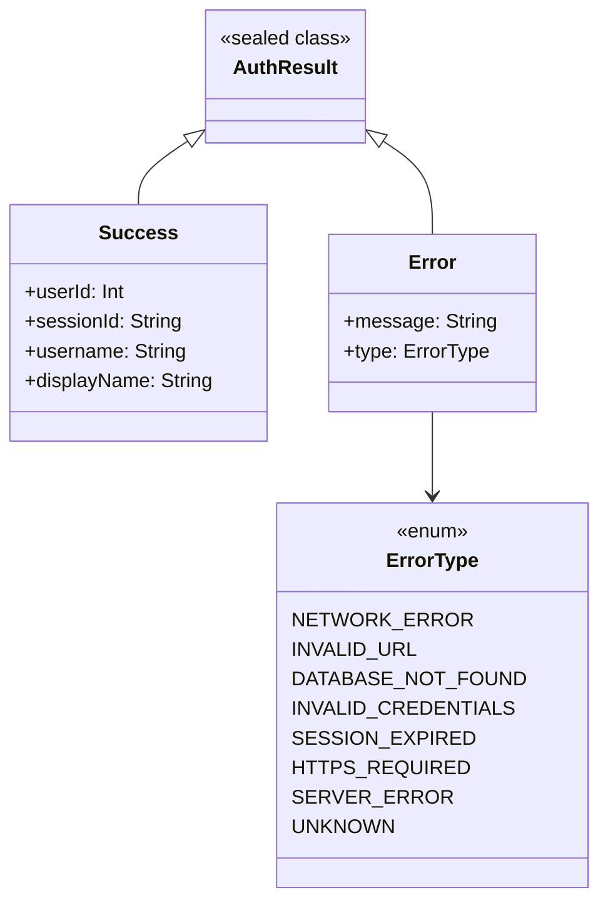

### App Lock Unlock Resolution (`resolveAuthOptions`)

Which controls the lock screen offers is decided by a single pure function,
`resolveAuthOptions` (`ui/auth/AuthOptions.kt`). It is **total** — every input combination
maps to exactly one `AuthAction`, so the lock screen can never render zero controls (the
"bricked App Lock" defect). A biometric counts as usable only when the user enabled it
**and** `BiometricManager.canAuthenticate(BIOMETRIC_STRONG)` succeeds; weak (Class-2)
biometrics are deliberately rejected.

| Biometric enabled AND usable | PIN set | `AuthAction` | Start destination |
|---|---|---|---|
| yes | yes | `BiometricAndPin` | `Screen.Auth` — biometric prompt with a "Use PIN" fallback |
| no | yes | `PinOnly` | `Screen.Pin` — keypad directly, back arrow hidden |
| yes | no | `BiometricOnly` | `Screen.Auth` — legacy installs only |
| no | no | `RecoveryNeeded` | `Screen.Auth` — keyguard-gated recovery |

`SettingsRepository` enforces the invariant `appLockEnabled ⇒ pinEnabled`
(`updateAppLock(true)` is refused when no PIN exists, and `removePin()` disables App Lock
in the same atomic write), so `BiometricOnly` and `RecoveryNeeded` are reachable only on
installs created before that invariant existed.

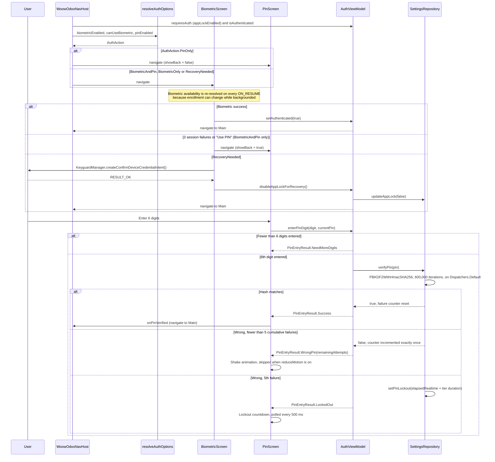

Implementation details that affect usage:

- **Exactly six digits, verified once** — `SettingsRepository.PIN_LENGTH = 6` is the single
  source of truth. `AuthViewModel.enterPinDigit` returns `NeedMoreDigits` below six digits
  and calls `verifyPin` exactly once at six. Verifying at intermediate lengths previously
  burned spurious failures and could lock the user out on a *correct* PIN.
- **Never on the main thread** — 600,000 PBKDF2 iterations cost 1–3 s on mid-range hardware,
  so `setPin`/`verifyPin` run on `Dispatchers.Default`; `PinScreen` shows an `isVerifying`
  spinner that also debounces rapid taps.
- **Legacy hash migration** — a stored hash with no `:` separator is an old unsalted SHA-256
  value; it is verified once and transparently re-hashed with PBKDF2 on success.
- **Two independent failure counters** — biometric failures are session-only
  (`AuthViewModel.MAX_BIOMETRIC_FAILURES = 3`, reset on every composition, never persisted);
  PIN failures are persisted in `EncryptedPrefs` and survive process death.
- **Clock-tamper resistant lockout** — deadlines use `SystemClock.elapsedRealtime()`, so
  changing the device clock cannot shorten a lockout. Tiers escalate 30 s → 5 min → 30 min
  → 1 h at 5, 10, 15 and 20+ cumulative failures.


## 8. Data Layer & Odoo API

### JSON-RPC 2.0 Protocol Implementation

All native network requests use **OkHttp 4.12.0** directly formatted as JSON-RPC 2.0 specifications without Retrofit abstraction:

```json
{
  "jsonrpc": "2.0",
  "method": "call",
  "params": {
    "db": "odoo_db",
    "login": "admin",
    "password": "secret_password"
  },
  "id": 1
}
```

### Cookie & Session Isolation

The OkHttp client uses a custom `CookieJar` backed by a `ConcurrentHashMap<String, MutableList<Cookie>>`. When switching accounts:
1. `isolateCookiesForAccount()` clears the process-global `CookieManager`.
2. The target account's `session_id` cookie is injected for its specific server hostname.
3. Third-party cookies are disabled (`setAcceptThirdPartyCookies(false)`).

---

### `OdooJsonRpcClient` Class

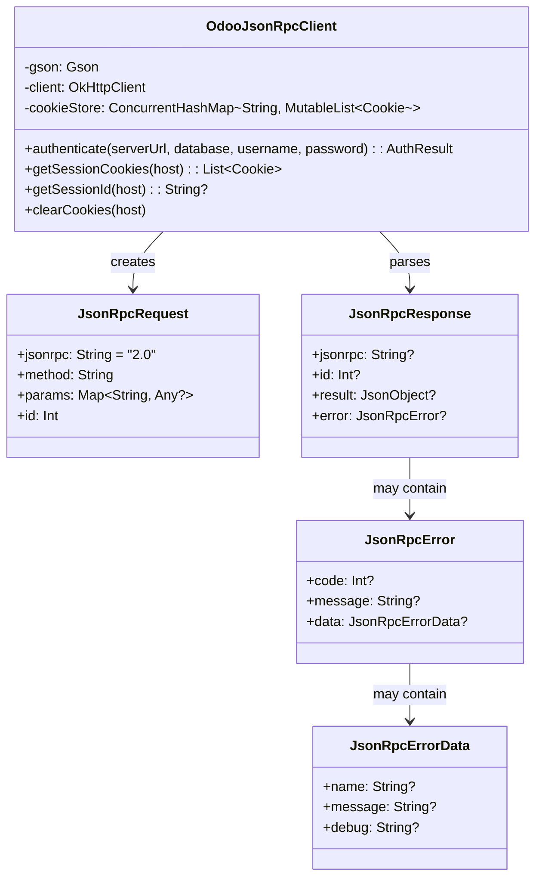

Notes that affect how the client is used:

- The class is a Hilt `@Singleton` with a no-argument constructor; the **same instance** is injected into `SessionReauthenticator`, so a refreshed `session_id` cookie is immediately visible to every caller sharing the cookie jar.
- `authenticate()` is a `suspend` function that runs its whole body on `Dispatchers.IO`.
- Non-`https://` server URLs are rejected **before any network call** with `AuthResult.Error(HTTPS_REQUIRED)`.
- `sessionId` in `AuthResult.Success` is read from the stored `session_id` cookie for the host, not from the JSON-RPC result; it falls back to an empty string when the cookie is missing.
- Error mapping is message-based: an error mentioning "database" maps to `DATABASE_NOT_FOUND`, one mentioning "login"/"password"/"credentials" maps to `INVALID_CREDENTIALS`, anything else maps to `SERVER_ERROR`; transport failures map to `NETWORK_ERROR` and unexpected exceptions to `UNKNOWN`.

### Repository Layer

Four `@Singleton` repositories make up the data layer. `AccountRepository` and `SettingsRepository` are the primary state owners; `FcmTokenRepositoryImpl` owns push-token lifecycle and `CacheRepository` owns cache maintenance.

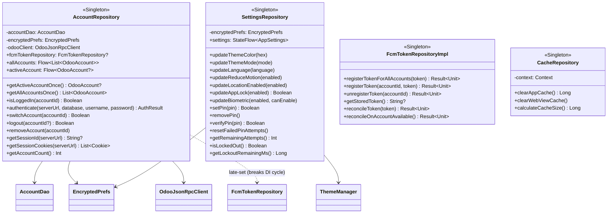

**Notes on the contracts above**

- `AccountRepository.fcmTokenRepository` is a mutable property assigned *after* construction rather than a constructor parameter. This deliberately breaks the cycle `AccountRepository → FcmTokenRepository → AccountDao`, which is already held by `AccountRepository`.
- `getSessionId(serverUrl)` / `getSessionCookies(serverUrl)` strip the scheme and path to a bare host, then read the OkHttp `CookieJar` through `OdooJsonRpcClient`. They are the source of the `session_id` that gets injected into the WebView's `CookieManager`.
- `updateAppLock(true)` is refused (returns `false`, state unchanged) unless a PIN is already set — the PIN is the mandatory unlock floor. `removePin()` symmetrically disables App Lock in the same `saveAppSettings` commit, so `appLockEnabled=true && pinEnabled=false` can never be persisted.
- `setPin` / `verifyPin` are `suspend` and hop to `Dispatchers.Default`: PBKDF2-HMAC-SHA256 at 600,000 iterations with a 16-byte random salt and a 256-bit derived key is far too slow for the main thread. `setPin` accepts exactly 6 digits. `verifyPin` also transparently upgrades any legacy plain SHA-256 hash to the PBKDF2 format on a successful match.
- `updateBiometric(enabled, canEnable)` forces the stored value to `false` whenever `canEnable` is `false`, so biometric unlock can never be armed on a device where `BiometricManager` reports no available strong biometric.


## 9. FCM Push Notifications & Deep Link Routing

### FCM Architecture & Token Lifecycle

FCM registration enforces **Repository-Event Symmetry**:
- **Forward Event**: `login` / `addAccount` → Registers FCM token with server.
- **Inverse Event**: `logout` / `removeAccount` → Unregisters FCM token from server (`woow.fcm.device`).
- **Token Rotation**: `WoowFcmService.onNewToken()` updates all active accounts.
- **Reconciliation**: `reconcileOnAccountAvailable()` runs on app launch or account switch to self-heal stale server-side tokens, guarded by a `Mutex` to prevent concurrent races.

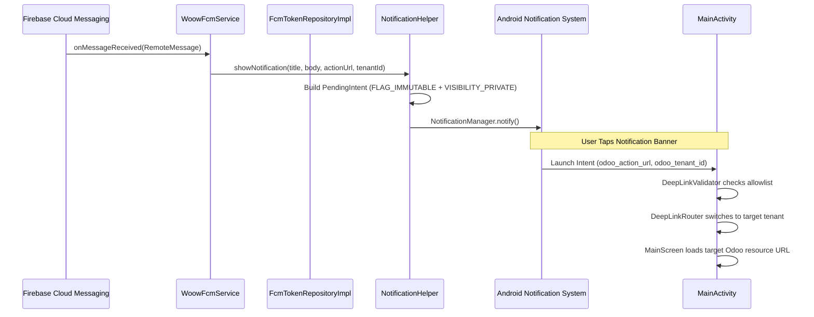

---

## 10. WebView Integration & Session Self-Healing

### Silent Session Self-Healing Flow

When a user's session expires in the WebView, Odoo redirects the WebView to `/web/login`. Instead of kicking the user out to a login screen, `OdooWebView` catches the redirect in `shouldOverrideUrlLoading` and triggers silent self-healing:

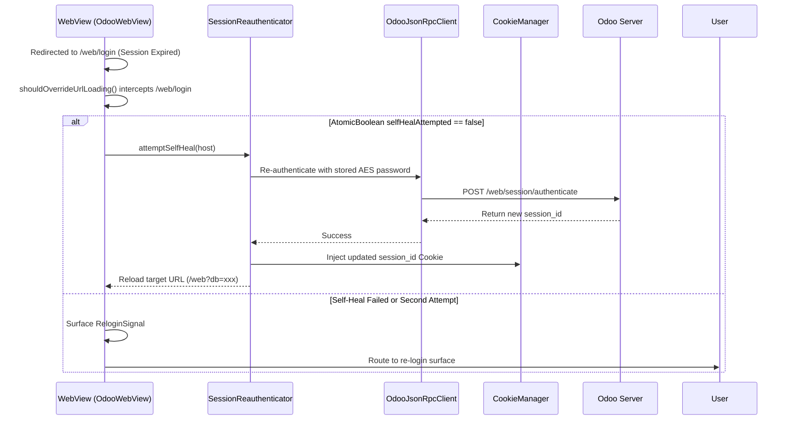

### OWL Framework Viewport JS Injection

To prevent Odoo 17/18 OWL framework viewport collapses on Android WebViews, `onPageFinished` executes a layout recalculation script:

```javascript
(function() {
    document.body.style.minHeight = '100vh';
    document.body.style.height = '100%';
    document.documentElement.style.height = '100%';
    var am = document.querySelector('.o_action_manager');
    if (am) {
        am.style.minHeight = 'calc(100vh - 46px)';
        am.style.height = 'auto';
        am.style.overflow = 'auto';
    }
    window.dispatchEvent(new Event('resize'));
})();
```

---

### WebView Configuration & Handler Map

`OdooWebView` is an `AndroidView`-wrapped `WebView` created once per `MainScreen`. All callbacks that must observe changing inputs (active host, deep link, self-heal callbacks) are wrapped in `rememberUpdatedState`, because the `WebViewClient` / `WebChromeClient` are instantiated a single time at factory time and would otherwise capture stale closures.

The initial load — and every account switch and post-self-heal reload — targets `{serverUrl}/web?db={database}`.

```mermaid
graph TB
    subgraph "MainScreen Composable"
        TOPBAR["TopAppBar<br/>(Menu Icon opens Config)"]
        BANNER["NotificationPermissionBanner<br/>(while POST_NOTIFICATIONS denied)"]
        WV["OdooWebView<br/>(AndroidView wrapping WebView)"]
        LOADER["CircularProgressIndicator<br/>(isLoading)"]
    end

    subgraph "WebSettings"
        JS["javaScriptEnabled = true"]
        DOM["domStorageEnabled = true<br/>databaseEnabled = true"]
        ZOOM["setSupportZoom(true)<br/>builtInZoomControls = true<br/>displayZoomControls = false"]
        VIEWPORT["useWideViewPort = false<br/>loadWithOverviewMode = false<br/>(OWL layout fix)"]
        FILEACC["allowFileAccess = false<br/>allowContentAccess = true"]
        MIXED["mixedContentMode = MIXED_CONTENT_NEVER_ALLOW"]
        WINDOWS["setSupportMultipleWindows(false)<br/>javaScriptCanOpenWindowsAutomatically = true"]
        GEO["setGeolocationEnabled(true)"]
        UA["userAgentString = standard<br/>Chrome 120 Mobile (Pixel 8)"]
    end

    subgraph "Cookie Handling"
        ISOLATE["isolateCookiesForAccount()<br/>removeAllCookies then setCookie<br/>session_id; Path=/; Secure then flush"]
        THIRD["setAcceptThirdPartyCookies(false)"]
    end

    subgraph "WebViewClient"
        SELFHEAL["/web/login intercepted =&gt;<br/>SessionReauthenticator self-heal<br/>(AtomicBoolean one-shot guard)"]
        SAMEHOST["Same-host allowed, blob: allowed,<br/>external URL =&gt; system browser"]
        OWL_FIX["onPageFinished =&gt; OWL viewport JS injection"]
        DEEPLINK["Load-gated deep-link apply<br/>(DeepLinkWebPlanner)"]
        DIAG["shouldInterceptRequest / onReceivedError<br/>(diagnostic logging only)"]
    end

    subgraph "WebChromeClient"
        UPLOAD["onShowFileChooser<br/>(camera via FileProvider + gallery chooser)"]
        POPUP["onCreateWindow / onCloseWindow<br/>(inert: multiple windows disabled)"]
        CONSOLE["onConsoleMessage =&gt; Timber"]
        GEOPROMPT["onGeolocationPermissionsShowPrompt<br/>=&gt; LocationPermissionGate.resolve()"]
    end

    WV --> JS & DOM & ZOOM & VIEWPORT & FILEACC & MIXED & WINDOWS & GEO & UA
    WV --> ISOLATE & THIRD
    WV --> SELFHEAL & SAMEHOST & OWL_FIX & DEEPLINK & DIAG
    WV --> UPLOAD & POPUP & CONSOLE & GEOPROMPT

    style WV fill:#6183FC,color:#fff
```

**Handler responsibilities**

- **`shouldOverrideUrlLoading`** is the single navigation gate. In order: (1) a `/web/login` URL means the session expired and triggers the silent self-heal described below; (2) a URL whose host equals the account host is allowed through; (3) `blob:` URLs are allowed (OWL downloads); (4) everything else is cancelled and handed to the system browser.
- **`onPageFinished`** re-arms the self-heal guard once a real (non-login) page lands, injects the OWL viewport script, and applies any pending notification deep link — but only once `DeepLinkWebPlanner.hostMatches` confirms the loaded page belongs to the target account's host.
- **`onGeolocationPermissionsShowPrompt`** denies immediately when the Activity is not `RESUMED` (the OS dialog cannot be shown), otherwise delegates to `LocationPermissionGate.resolve(origin, activeHost)`, which returns `Grant`, `Reject`, or `NeedsRuntimePrompt`. Every path invokes the WebView callback exactly once, satisfying its 30-second contract.
- **`onShowFileChooser`** builds a chooser combining `ACTION_GET_CONTENT` (MIME type derived from `acceptTypes`, multi-select honoured) with an `ACTION_IMAGE_CAPTURE` extra intent whose output URI comes from `FileProvider`.


## 11. Security Architecture

### Comprehensive Security Layers

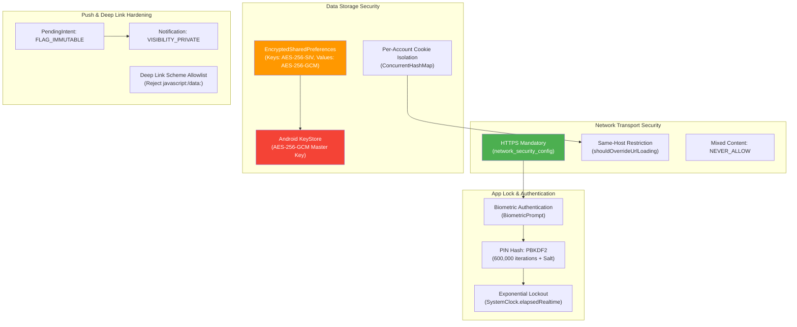

---

### What Gets Encrypted

| Data | Storage | Protection |
|------|---------|------------|
| Passwords | `EncryptedPrefs` (`pwd_{accountId}`) | EncryptedSharedPreferences: values AES-256-GCM, keys AES-256-SIV, under an Android KeyStore `AES256_GCM` master key |
| PIN hash | `EncryptedPrefs` (`pin_hash`) | PBKDF2WithHmacSHA256 — 600,000 iterations, 16-byte `SecureRandom` salt, 256-bit key, persisted as `saltHex:hashHex` (one-way). Legacy unsalted SHA-256 hashes are accepted once and transparently re-hashed to PBKDF2 |
| App Lock state | `EncryptedPrefs` (`app_lock_enabled`, `biometric_enabled`, `pin_enabled`) | AES-256-GCM (EncryptedSharedPreferences) |
| PIN lockout counters | `EncryptedPrefs` (`failed_pin_attempts`, `pin_lockout_until`) | AES-256-GCM; `pin_lockout_until` is a `SystemClock.elapsedRealtime()` stamp, so it cannot be bypassed by changing the device clock |
| Theme & language preferences | `EncryptedPrefs` (`theme_color`, `theme_mode`, `language`) | AES-256-GCM (EncryptedSharedPreferences) |
| FCM token | `EncryptedPrefs` (`fcm_token`) | AES-256-GCM (EncryptedSharedPreferences) |
| Account metadata | Room DB (`woowtech_odoo_db`) | Not encrypted (non-sensitive; never contains passwords) |
| API session cookies | In-memory `ConcurrentHashMap` in `OdooJsonRpcClient` | Volatile — lost on process death; recovered silently by `SessionReauthenticator` / `MainViewModel.selfHealActiveAccount()` |
| WebView session cookies | Process-global `CookieManager` (persisted via `flush()`) | Cleared and re-isolated per account on every account switch (`isolateCookiesForAccount`); third-party cookies disabled |

> Note: `data/security/EncryptionHelper.kt` (Android KeyStore, AES-256-GCM, 12-byte IV) is present in the codebase but currently has no call sites — password confidentiality rests entirely on EncryptedSharedPreferences.


## 12. Theme & Localization

### Theme Engine (`ThemeManager`)
- **Primary Colors**: Dynamic primary color palette with WoowTech Blue (`#6183FC`) as default.
- **Dark Mode**: Supports System Default, Force Light, and Force Dark modes.
- **Edge-to-Edge**: Status bar and navigation bar colors dynamically synchronize with Jetpack Compose `MaterialTheme`.

### Localization Specs
- **Locales**:
  - `values/strings.xml`: English (Default)
  - `values-zh-rTW/strings.xml`: Traditional Chinese (繁體中文)
  - `values-zh-rCN/strings.xml`: Simplified Chinese (簡體中文)
- **Runtime Switching**: Instant dynamic locale updating without requiring app process restarts.

---

### Available Theme Colors

The primary color is user-selectable in `SettingsScreen`'s `ColorPickerDialog` and applied through `ThemeManager.setPrimaryColorFromHex()`.

**Brand colors** (`SettingsScreen.brandColors`, mirrored by `ui/theme/Color.kt`):

| Color | Hex | Constant | Note |
|-------|-----|----------|------|
| Primary Blue | `#6183FC` | `BrandPrimaryBlue` / `WoowTechBlue` | Default |
| White | `#FFFFFF` | `BrandWhite` | - |
| Light Gray | `#EFF1F5` | `BrandLightGray` | - |
| Gray | `#646262` | `BrandGray` | - |
| Deep Gray | `#212121` | `BrandDeepGray` | - |

**Brand accent colors** (`SettingsScreen.accentColors`):

| Color | Hex | Constant |
|-------|-----|----------|
| Cyan | `#7BDBE0` | `AccentCyan` |
| Yellow | `#F8D158` | `AccentYellow` |
| Sky Blue | `#65C2E0` | `AccentSkyBlue` |
| Royal Blue | `#6791DE` | `AccentRoyalBlue` |
| Green | `#8CD37F` | `AccentGreen` |
| Brown | `#B17148` | `AccentBrown` |
| Sand | `#F1C692` | `AccentSand` |
| Orange | `#E66D3E` | `AccentOrange` |
| Coral | `#F45D6D` | `AccentCoral` |
| Lavender | `#C09FE0` | `AccentLavender` |

**Custom color**: the dialog also accepts a free-form `#RRGGBB` value; invalid input is rejected by `ThemeManager.setPrimaryColorFromHex()`, which keeps the previous color.

**Fixed roles**: only `primary` follows the user's selection. `secondary` is always `AccentSkyBlue` (`#65C2E0`) and `tertiary` always `AccentCoral` (`#F45D6D`) in both `createLightColorScheme()` and `createDarkColorScheme()`.


## 13. Dependency Injection

### Hilt `AppModule` Wiring

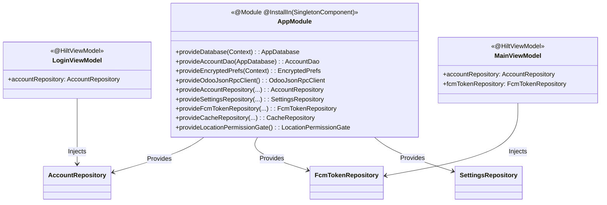

---

## 14. Key Data Flows

### App Launch & Auth Routing Flow

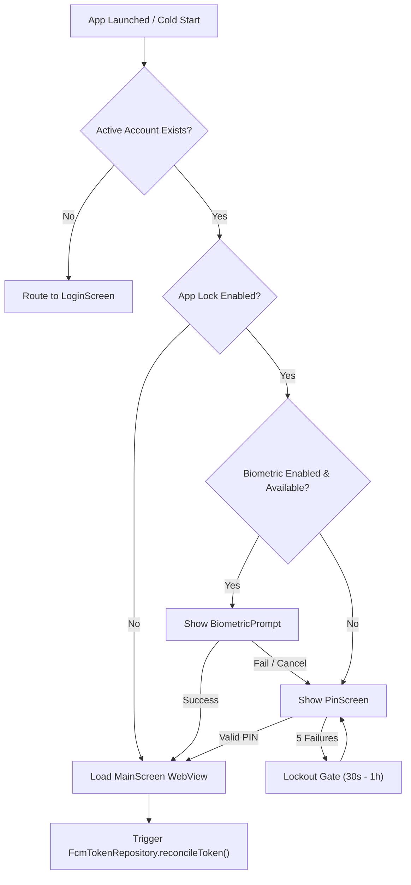

---

### Account Switch Flow

Switching accounts is more than a Room flag flip: because `OdooJsonRpcClient` keys its cookie store by **host**, re-authenticating as account B overwrites account A's `session_id` for that host. `AccountRepository.switchAccount()` therefore unregisters the outgoing account's FCM token *before* re-authenticating, while A's cookie is still live.

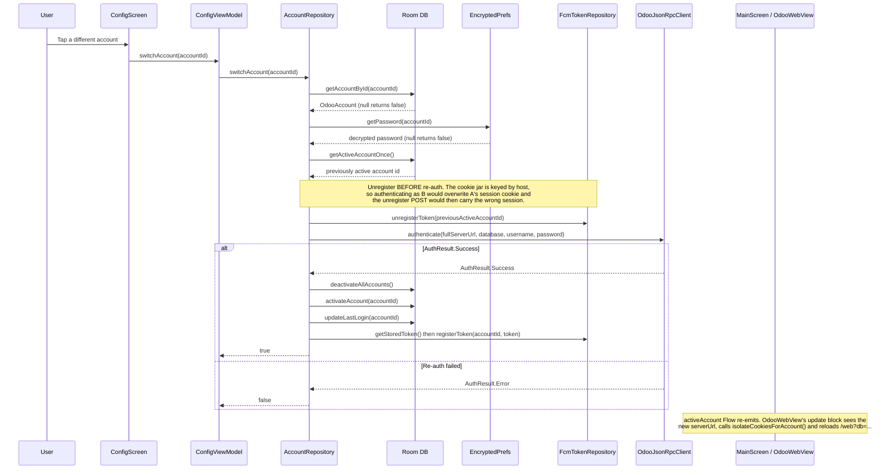

**Ordering trade-off (documented in `AccountRepository.switchAccount`)**: if the re-auth fails after the unregister, the previous account's `woow.fcm.device` record is already deactivated server-side. That account stays local but stops receiving notifications until the next successful login or FCM token rotation — accepted as the lesser evil versus an unregister POST carrying the new account's cookie and corrupting the new record.

**Switch only registers the switched-to account.** It must not call `reconcileOnAccountAvailable()` (the login path's helper, which upserts the token for *every* logged-in account) because that would immediately undo the deliberate unregister above.

### Theme Change Flow

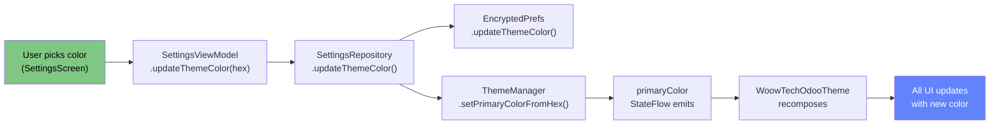


## 15. Database Schema

### Room Entity Definition: `OdooAccount`

```sql
CREATE TABLE IF NOT EXISTS `accounts` (
    `id` TEXT NOT NULL PRIMARY KEY,
    `serverUrl` TEXT NOT NULL,
    `database` TEXT NOT NULL,
    `username` TEXT NOT NULL,
    `displayName` TEXT NOT NULL,
    `avatarBase64` TEXT,
    `userId` INTEGER NOT NULL,
    `lastLogin` INTEGER NOT NULL,
    `isActive` INTEGER NOT NULL
);
```

*Note: User passwords are **never** stored in Room DB. Passwords are saved separately in `EncryptedSharedPreferences` under encrypted keys (`pwd_{accountId}`).*

---

### Room Database

- **Name:** `woowtech_odoo_db`
- **Version:** 2
- **Entities:** `OdooAccount`
- **DAO:** `AccountDao`
- **Migrations:** `MIGRATION_1_2` — adds the nullable `tenantId` column used to route multi-account push-notification deep links. Existing rows migrate with `tenantId = NULL` and repopulate it on the next successful FCM device registration.

### AccountDao Operations

`AccountDao` (`app/src/main/java/io/woowtech/odoo/data/local/AccountDao.kt`) is the only entry point to the `accounts` table. Reactive reads return `Flow`; every other operation is a `suspend` function.

| Operation | Method | Type |
|-----------|--------|------|
| Get all accounts (reactive, `lastLogin DESC`) | `getAllAccounts()` | `Flow<List<OdooAccount>>` |
| Get active account (reactive) | `getActiveAccount()` | `Flow<OdooAccount?>` |
| Get active account (one-shot) | `getActiveAccountOnce()` | `suspend OdooAccount?` |
| Get all accounts (one-shot, `lastLogin DESC`) | `getAllAccountsList()` | `suspend List<OdooAccount>` |
| Get account by id | `getAccountById(id)` | `suspend OdooAccount?` |
| Find duplicate | `findAccount(serverUrl, database, username)` | `suspend OdooAccount?` |
| Resolve tenant → account | `getAccountByTenantId(tenantId)` | `suspend OdooAccount?` |
| Persist tenant id | `updateTenantId(id, tenantId)` | `suspend` |
| Insert/Replace | `insertAccount(account)` | `suspend` (`OnConflictStrategy.REPLACE`) |
| Update account | `updateAccount(account)` | `suspend` |
| Delete account (entity) | `deleteAccount(account)` | `suspend` |
| Delete account by id | `deleteAccountById(id)` | `suspend` |
| Activate account | `activateAccount(id)` | `suspend` |
| Deactivate all | `deactivateAllAccounts()` | `suspend` |
| Update last login | `updateLastLogin(id, timestamp)` | `suspend` |
| Count accounts | `getAccountCount()` | `suspend Int` |

**Multi-tenant routing note:** `getAccountByTenantId` and `updateTenantId` read/write the `tenantId` column on `OdooAccount`. The tenant id is returned by the Odoo server at FCM device-registration time and is the key used to decide which local account an incoming push notification belongs to. It is nullable (older server plugin, or an account that never completed FCM registration); an unresolved tenant id causes the deep link to be **dropped**, never mis-routed to the currently active account.

**Activation invariant:** activating an account is always a two-step sequence — `deactivateAllAccounts()` followed by `activateAccount(id)` — because `getActiveAccount()` is a `LIMIT 1` query over `isActive = 1` and would be non-deterministic if two rows were active at once.

### Entity Relationship Diagram

```mermaid
erDiagram
    ODOO_ACCOUNT {
        string id PK "UUID"
        string serverUrl "Odoo server URL"
        string database "Database name"
        string username "Login username"
        string displayName "User display name"
        string encryptedPassword "Nullable column, never written"
        string avatarBase64 "Base64 avatar (nullable)"
        int userId "Odoo user ID (nullable)"
        long lastLogin "Timestamp"
        boolean isActive "Active account flag"
        string tenantId "Tenant id for FCM deep-link routing (nullable, added in v2)"
    }

    ENCRYPTED_PREFS {
        string pwd_accountId "Account password (EncryptedSharedPreferences)"
        string theme_color "Hex color string"
        string theme_mode "system|light|dark"
        boolean reduce_motion "Motion preference"
        boolean app_lock_enabled "App lock flag"
        boolean biometric_enabled "Biometric flag"
        boolean pin_enabled "PIN flag"
        string pin_hash "PBKDF2 saltHex:hashHex (600k iterations)"
        int failed_pin_attempts "Attempt counter"
        long pin_lockout_until "Lockout deadline (elapsedRealtime)"
        string language "Language code"
        boolean location_enabled "Location sharing opt-out"
        string fcm_token "Cached FCM registration token"
        boolean post_notif_permission_requested "One-shot POST_NOTIFICATIONS dialog flag"
    }

    COOKIE_STORE {
        string host "Server hostname"
        list cookies "Session cookies (in-memory ConcurrentHashMap)"
    }

    ODOO_ACCOUNT ||--|| ENCRYPTED_PREFS : "password stored in"
    ODOO_ACCOUNT ||--o| COOKIE_STORE : "session for"
```

*The `encryptedPassword` column exists on the entity for historical reasons but is never populated — the password used for JSON-RPC calls is read from `EncryptedSharedPreferences` under `pwd_{accountId}`. The cookie store is not persisted: `OdooJsonRpcClient` keeps a `ConcurrentHashMap<String, MutableList<Cookie>>` keyed by host for the process lifetime only.*


## 16. CI/CD Pipeline & Automated Testing

### Automated Quality Gates
- **Unit Tests**: 178 unit tests (JUnit 5 + MockK + Turbine).
- **Device Verification**: 30 automated device checks via `scripts/verify-on-device.py` (uiautomator2).
- **E2E Production Tests**: 22 E2E production tests via `scripts/e2e-production-test.py`.
- **Engineering Rules**:
  - **Mega-Commit Cap**: Commits touching >15 files or >1000 LOC must be split into focused commits.
  - **Test Independence**: Every test owns its setup, execution, and teardown; zero test dependencies.

---

### GitHub Actions Workflow

Defined in `.github/workflows/build.yml` (`permissions: contents: write`, required by the release step).

```mermaid
graph LR
    subgraph "Triggers"
        PUSH["Push to main"]
        PR["Pull Request to main"]
        MANUAL["Manual Dispatch"]
    end

    subgraph "Build Job (ubuntu-latest)"
        CHECKOUT["Checkout Code<br/>(actions/checkout@v4)"]
        JDK["Setup JDK 17<br/>(temurin, setup-java@v4)"]
        CHMOD["chmod +x gradlew"]
        GRADLE["Setup Gradle<br/>(gradle/actions/setup-gradle@v4)"]
        BUILD["./gradlew assembleDebug --stacktrace<br/>(GRADLE_OPTS -Xmx4g)"]
        UPLOAD["Upload APK Artifact<br/>(90-day retention, fail if missing)"]
        RELEASE["Create GitHub Release<br/>(softprops/action-gh-release@v1)"]
    end

    PUSH --> CHECKOUT
    PR --> CHECKOUT
    MANUAL --> CHECKOUT

    CHECKOUT --> JDK --> CHMOD --> GRADLE --> BUILD --> UPLOAD --> RELEASE
```

**Scope of the pipeline (important):**

- The job builds the **debug** APK only. Release builds (`assembleRelease`, R8 + resource shrinking) are produced locally, not by CI.
- CI does **not** execute any tests. The unit-test suite, the `scripts/verify-on-device.py` device checks and `scripts/e2e-production-test.py` are run manually — the quality gates above are process rules, not enforced pipeline stages.
- The release step is unconditional (it also fires on pull requests) and uses a hardcoded tag `v1.0.0-build${{ github.run_number }}`. This does not track the real app version (`versionName = "1.4.1"`, `versionCode = 21` in `app/build.gradle.kts`) — a known inconsistency to fix before the workflow is used for distribution.

### Build & Test Commands

```bash
# Build debug APK
# -> applicationId io.woowtech.odoo.debug, versionName 1.4.1-debug, no minification
./gradlew assembleDebug

# Build release APK
# -> R8 minification + resource shrinking driven by proguard-rules.pro
./gradlew assembleRelease

# Run the JVM test suite (JUnit 5 + MockK + Turbine + MockWebServer,
# plus Robolectric/Compose render tests via the JUnit vintage engine)
./gradlew test
```

The unit-test source set lives in `app/src/test/kotlin/`. `testOptions.unitTests.isIncludeAndroidResources = true` is required so the Robolectric + Compose render tests (for example the PIN dots shake animation) can resolve merged Android resources on the JVM classpath.


## 17. Project Statistics

| Metric | Value |
|--------|-------|
| **Main Kotlin Files** | 46 files |
| **Main Lines of Code (LOC)** | ~8,919 lines |
| **Test Kotlin Files** | 41 files |
| **Test Lines of Code (LOC)** | ~7,093 lines |
| **Unit Test Cases** | 178 tests |
| **Screens** | 7 (Login, Biometric, PIN, PinSetup, Main, Config, Settings) |
| **ViewModels** | 5 |
| **Repositories** | 4 (Account, Settings, FCMToken, Cache) |
| **App Version** | 1.4.1 (versionCode: 21) |
| **Min / Target SDK** | API 29 (Android 10) / API 34 (Android 14) |

---

## 18. Directory Structure Reference

```
Woow_odoo_app/
├── .github/
│   └── workflows/
│       └── build.yml                          # CI/CD workflow
├── app/
│   ├── build.gradle.kts                       # App build script (v1.4.1)
│   ├── proguard-rules.pro                     # ProGuard rules
│   └── src/
│       ├── main/
│       │   ├── AndroidManifest.xml
│       │   └── java/io/woowtech/odoo/
│       │       ├── WoowOdooApp.kt             # Application class (Timber, FCM setup)
│       │       ├── data/
│       │       │   ├── api/
│       │       │   │   ├── OdooJsonRpcClient.kt
│       │       │   │   ├── SessionReauthInterceptor.kt
│       │       │   │   └── SessionReauthenticator.kt
│       │       │   ├── local/
│       │       │   │   ├── AccountDao.kt
│       │       │   │   ├── AppDatabase.kt
│       │       │   │   └── EncryptedPrefs.kt
│       │       │   ├── location/
│       │       │   │   └── LocationPermissionGate.kt
│       │       │   ├── push/
│       │       │   │   ├── DeepLinkManager.kt
│       │       │   │   ├── DeepLinkRouter.kt
│       │       │   │   ├── DeepLinkValidator.kt
│       │       │   │   ├── NotificationHelper.kt
│       │       │   │   └── WoowFcmService.kt
│       │       │   ├── repository/
│       │       │   │   ├── AccountRepository.kt
│       │       │   │   ├── CacheRepository.kt
│       │       │   │   ├── FcmTokenRepository.kt
│       │       │   │   ├── FcmTokenRepositoryImpl.kt
│       │       │   │   ├── ReloginSignal.kt
│       │       │   │   └── SettingsRepository.kt
│       │       │   └── security/
│       │       │       └── EncryptionHelper.kt
│       │       ├── di/
│       │       │   └── AppModule.kt
│       │       ├── domain/model/
│       │       │   ├── AppSettings.kt
│       │       │   ├── AuthResult.kt
│       │       │   └── OdooAccount.kt
│       │       └── ui/
│       │           ├── MainActivity.kt
│       │           ├── TestHooks.kt
│       │           ├── auth/
│       │           │   ├── AuthOptions.kt
│       │           │   ├── AuthViewModel.kt
│       │           │   ├── BiometricCryptoManager.kt
│       │           │   ├── BiometricPromptHelper.kt
│       │           │   ├── BiometricScreen.kt
│       │           │   ├── PinScreen.kt
│       │           │   └── PinSetupScreen.kt
│       │           ├── config/
│       │           │   ├── ConfigScreen.kt
│       │           │   ├── ConfigViewModel.kt
│       │           │   ├── SettingsScreen.kt
│       │           │   └── SettingsViewModel.kt
│       │           ├── login/
│       │           │   ├── LoginScreen.kt
│       │           │   └── LoginViewModel.kt
│       │           ├── main/
│       │           │   ├── DeepLinkWebPlanner.kt
│       │           │   ├── MainScreen.kt
│       │           │   └── MainViewModel.kt
│       │           ├── navigation/
│       │           │   └── NavGraph.kt
│       │           └── theme/
│       │               ├── Color.kt
│       │               ├── Theme.kt
│       │               └── Type.kt
│       └── test/kotlin/io/woowtech/odoo/      # 41 test files (178 unit tests)
├── docs/
│   ├── architecture-overview.md               # THIS FILE (v1.4.1)
│   └── plans/                                 # Feature specs & plans
├── scripts/
│   ├── e2e-production-test.py                 # 22 E2E production tests
│   └── verify-on-device.py                    # 30 device verification checks
├── build.gradle.kts
├── gradle.properties
├── settings.gradle.kts
└── README.md
```
