# WoowTech Odoo Mobile App - Architecture Overview

> **Scanned commit:** `d65cdd9bbfe3eaaee5bc1b6ff74e33a38b209b71`
> **Version:** 1.0.20 (versionCode: 20)
> **Date:** 2026-03-22
> **Package:** `io.woowtech.odoo`

---

## Table of Contents

1. [Project Summary](#1-project-summary)
2. [Technology Stack](#2-technology-stack)
3. [High-Level Architecture (Block Diagram)](#3-high-level-architecture)
4. [Module & Package Structure](#4-module--package-structure)
5. [Clean Architecture Layers](#5-clean-architecture-layers)
6. [Navigation Flow](#6-navigation-flow)
7. [Authentication System](#7-authentication-system)
8. [Data Layer & Odoo API](#8-data-layer--odoo-api)
9. [WebView Integration](#9-webview-integration)
10. [Security Architecture](#10-security-architecture)
11. [Theme & Localization](#11-theme--localization)
12. [Dependency Injection](#12-dependency-injection)
13. [Key Data Flows](#13-key-data-flows)
14. [Database Schema](#14-database-schema)
15. [CI/CD Pipeline](#15-cicd-pipeline)
16. [Project Statistics](#16-project-statistics)
17. [Directory Structure Reference](#17-directory-structure-reference)

---

## 1. Project Summary

**WoowTech Odoo** is a native Android app that provides a mobile interface to Odoo ERP servers. The app wraps the Odoo web interface in a WebView while adding native Android features:

- Multi-account management (connect to multiple Odoo servers)
- Biometric & PIN authentication
- Session management with encrypted credential storage
- Customizable theme (colors, dark mode)
- Bilingual support (English + Traditional Chinese)

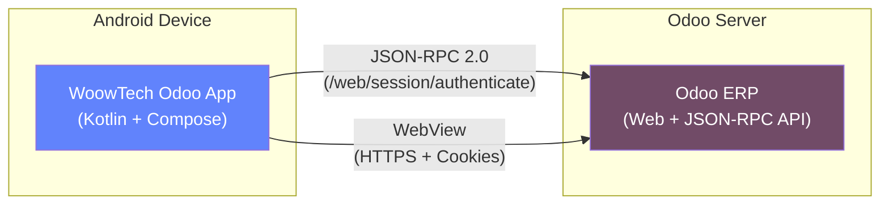

---

## 2. Technology Stack

| Category | Technology | Version |
|----------|-----------|---------|
| **Language** | Kotlin | 2.0.21 |
| **UI Framework** | Jetpack Compose + Material 3 | BOM 2024.02.00 |
| **Architecture** | MVVM + Clean Architecture | - |
| **DI** | Hilt | 2.50 |
| **Database** | Room | 2.6.1 |
| **Network** | OkHttp + Gson | 4.12.0 / 2.10.1 |
| **Security** | EncryptedSharedPreferences, Android KeyStore | AES-256-GCM |
| **Auth** | BiometricPrompt | 1.2.0-alpha05 |
| **Navigation** | Navigation Compose | Latest |
| **Build** | AGP + Gradle | 8.3.0 / 8.6 |
| **CI/CD** | GitHub Actions | - |
| **Min SDK** | Android 10 (API 29) | - |
| **Target SDK** | Android 14 (API 34) | - |
| **Java** | 17 | - |

---

## 3. High-Level Architecture

### System Block Diagram

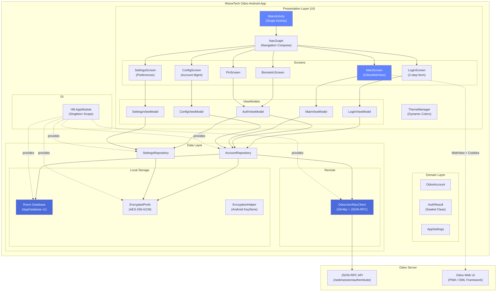

---

## 4. Module & Package Structure

This is a **single-module** Android project (`:app`).

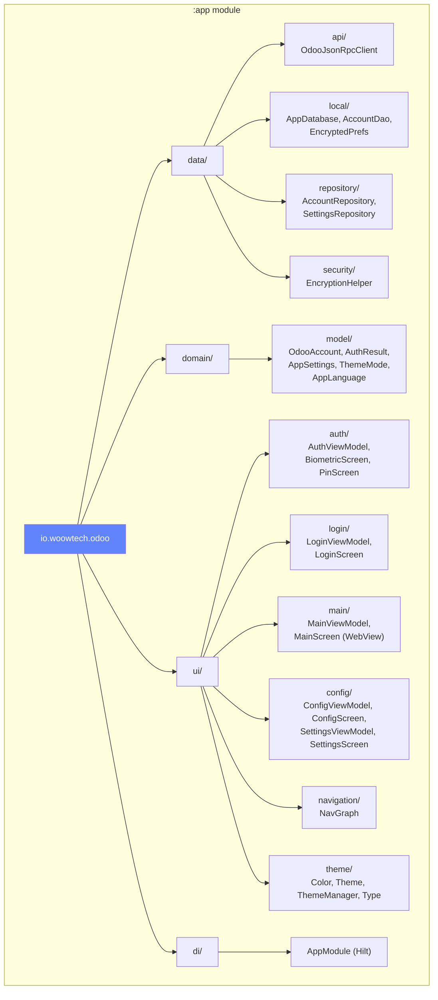

---

## 5. Clean Architecture Layers

### Layer Diagram

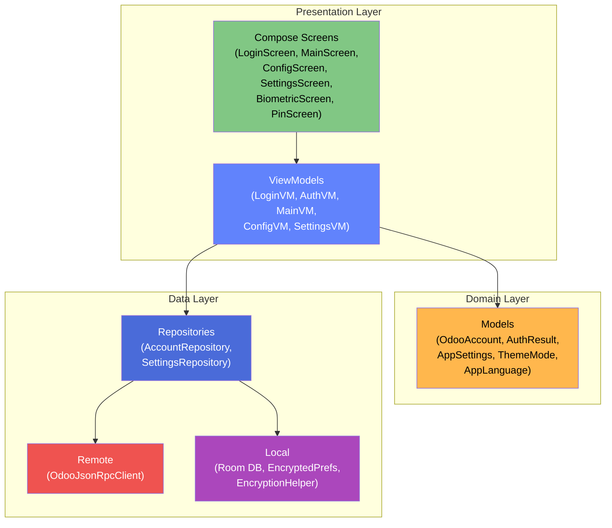

### MVVM Pattern

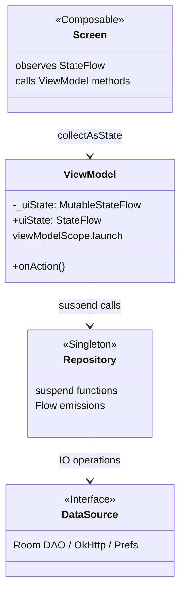

---

## 6. Navigation Flow

### Screen Navigation Graph

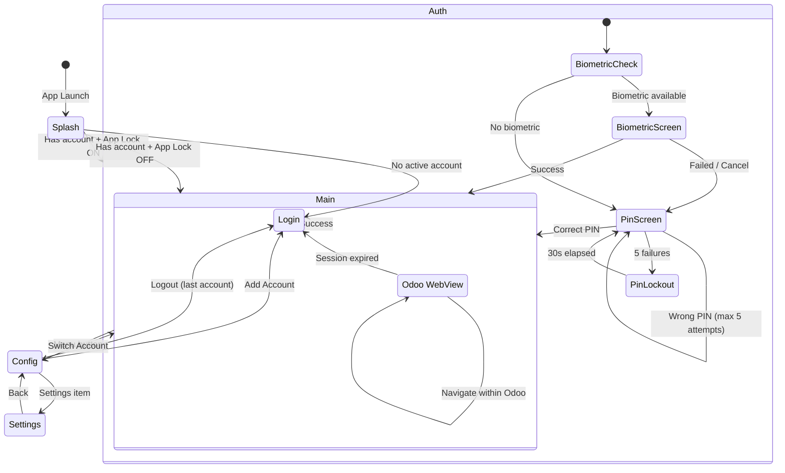

### Navigation Routes

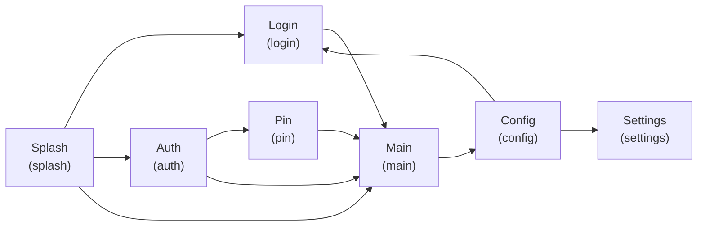

---

## 7. Authentication System

### Authentication Flow (UML Sequence)

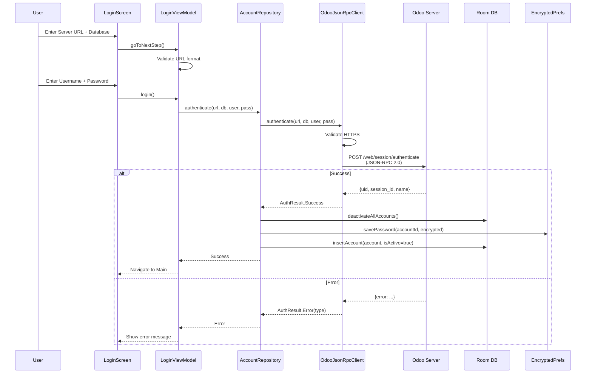

### App Lock Authentication

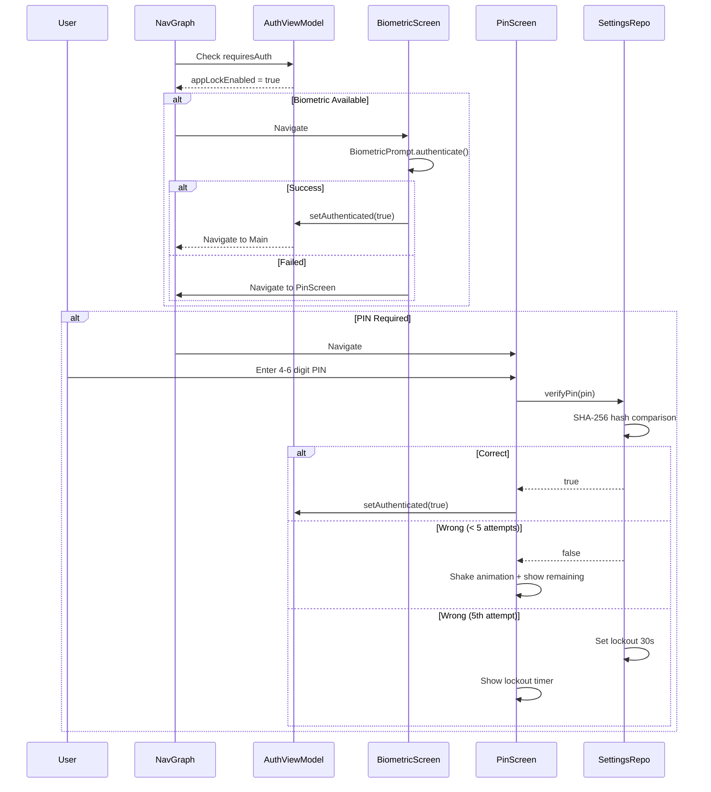

### AuthResult Type Hierarchy

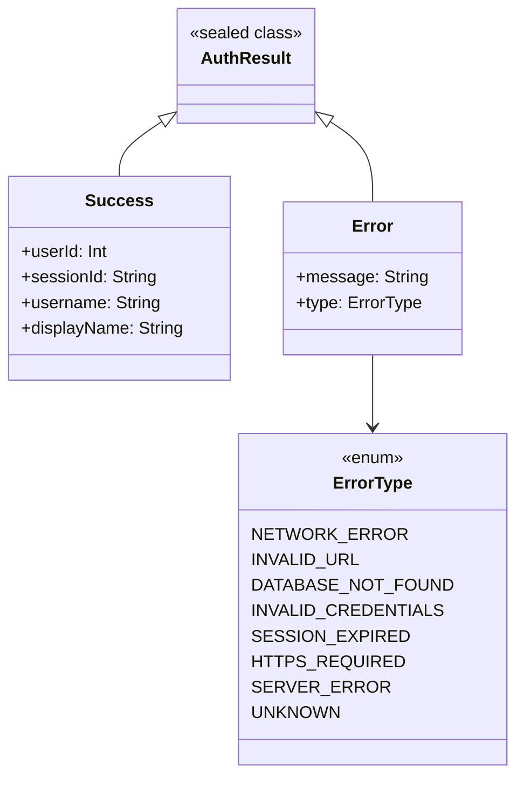

---

## 8. Data Layer & Odoo API

### JSON-RPC Communication

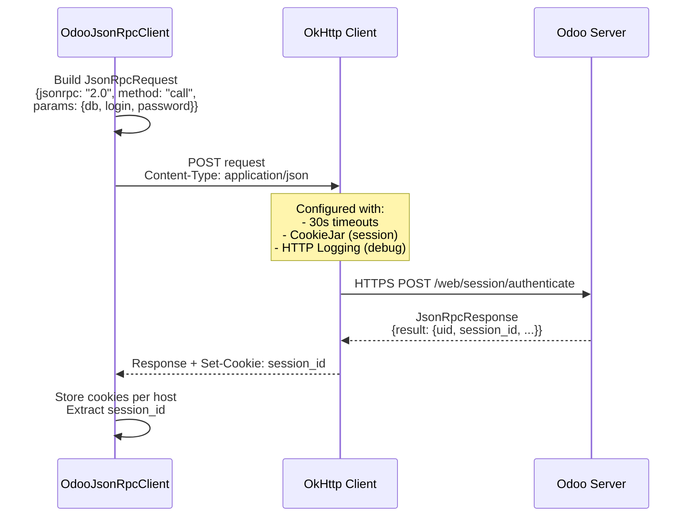

### OdooJsonRpcClient Class

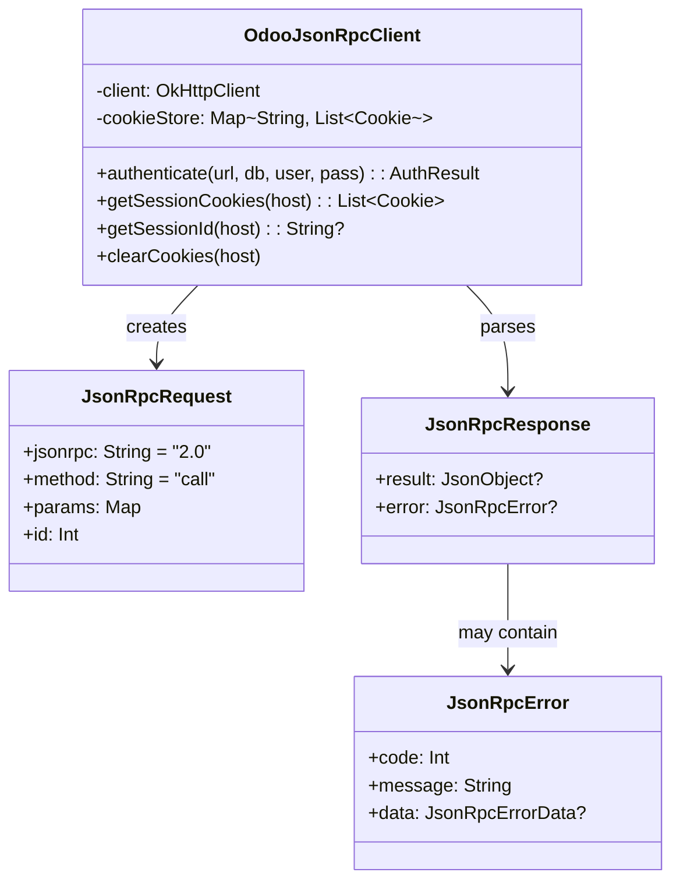

### Repository Layer

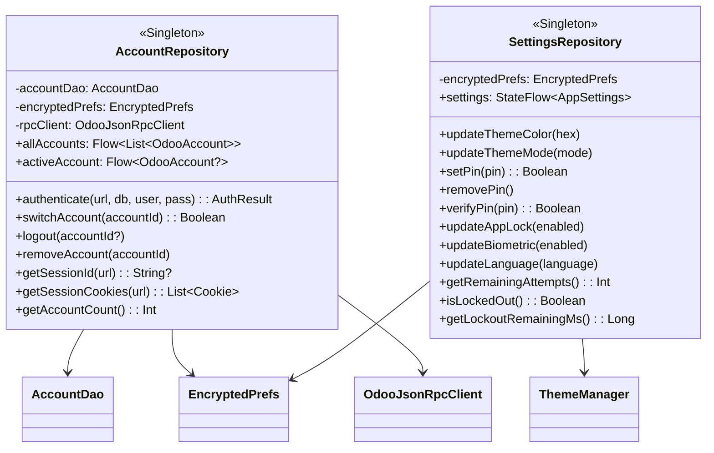

---

## 9. WebView Integration

### WebView Architecture

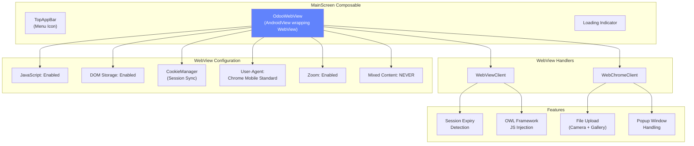

### WebView Session Sync Flow

```mermaid
sequenceDiagram
    participant MVM as MainViewModel
    participant AccRepo as AccountRepository
    participant RPC as OdooJsonRpcClient
    participant WV as WebView
    participant CM as CookieManager

    MVM->>AccRepo: getActiveAccountOnce()
    AccRepo-->>MVM: OdooAccount (url, db, user)

    MVM->>AccRepo: getSessionId(serverUrl)
    AccRepo->>RPC: getSessionId(host)
    RPC-->>AccRepo: session_id cookie
    AccRepo-->>MVM: sessionId

    MVM-->>WV: Load URL: {serverUrl}/web

    Note over WV,CM: Before WebView loads:
    WV->>CM: setCookie(url, "session_id={id}")
    CM->>CM: Flush cookies

    WV->>WV: loadUrl(serverUrl + "/web")

    Note over WV: Post-load JS injection:
    WV->>WV: evaluateJavascript(<br/>"document.body.style.height='100vh';<br/>window.dispatchEvent(new Event('resize'))")

    alt Session Expired
        WV->>WV: Redirect detected → /web/login
        WV-->>MVM: Trigger re-auth flow
    end
```

---

## 10. Security Architecture

### Security Layers

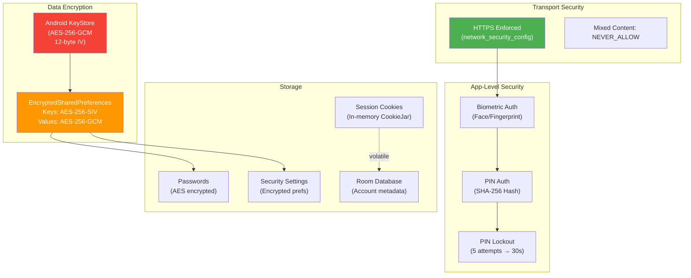

### What Gets Encrypted

| Data | Storage | Encryption |
|------|---------|------------|
| Passwords | EncryptedPrefs (`pwd_{id}`) | AES-256-GCM via EncryptionHelper |
| PIN Hash | EncryptedPrefs (`pin_hash`) | SHA-256 (one-way) |
| Security settings | EncryptedPrefs | AES-256-GCM (EncryptedSharedPreferences) |
| Theme preferences | EncryptedPrefs | AES-256-GCM (EncryptedSharedPreferences) |
| Account metadata | Room DB | Not encrypted (non-sensitive) |
| Session cookies | In-memory Map | Volatile (lost on process death) |

---

## 11. Theme & Localization

### Theme System

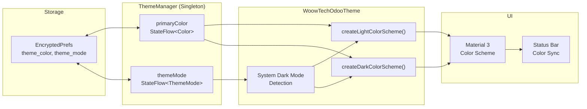

### Available Theme Colors

| Color | Hex | Name |
|-------|-----|------|
| WoowTech Blue | `#6183FC` | Default |
| Red | `#E53935` | - |
| Pink | `#D81B60` | - |
| Purple | `#8E24AA` | - |
| Deep Purple | `#5E35B1` | - |
| Indigo | `#3949AB` | - |
| Teal | `#00897B` | - |
| Green | `#43A047` | - |
| Orange | `#FB8C00` | - |
| Brown | `#6D4C41` | - |

### Localization

| Language | Code | Resource Directory |
|----------|------|-------------------|
| English | `en` | `values/strings.xml` (171+ strings) |
| Traditional Chinese | `zh-TW` | `values-zh-rTW/strings.xml` |
| System Default | - | Follows device locale |

---

## 12. Dependency Injection

### Hilt Module

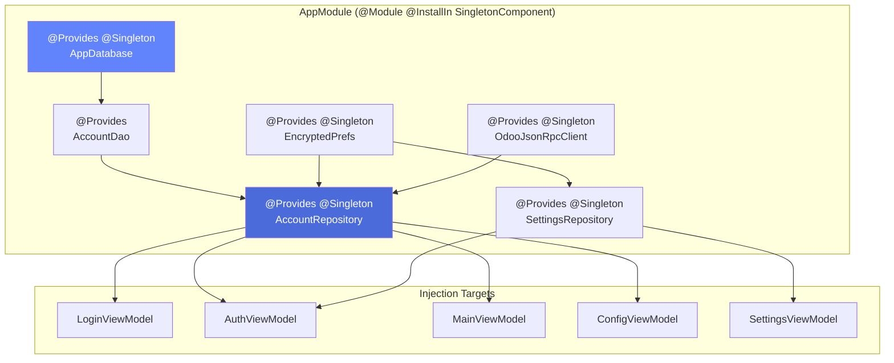

### Dependency Graph

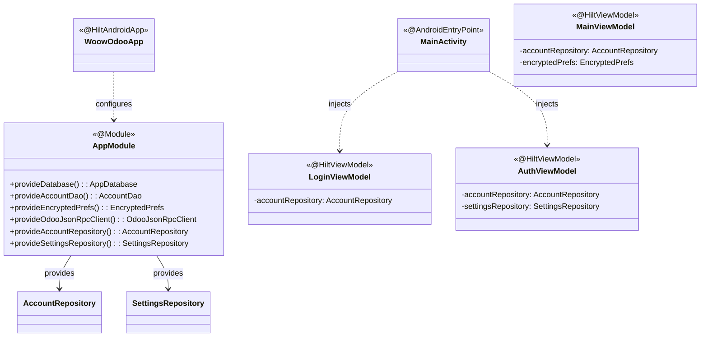

---

## 13. Key Data Flows

### Login Flow

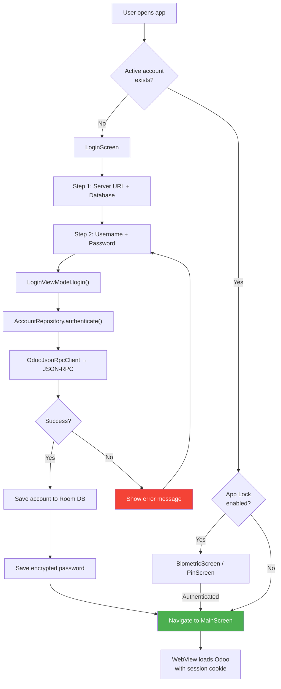

### Account Switch Flow

```mermaid
sequenceDiagram
    participant User
    participant ConfigScreen
    participant ConfigVM as ConfigViewModel
    participant AccRepo as AccountRepository
    participant RPC as OdooJsonRpcClient
    participant Prefs as EncryptedPrefs
    participant Room as Room DB

    User->>ConfigScreen: Tap different account
    ConfigScreen->>ConfigVM: switchAccount(accountId)
    ConfigVM->>AccRepo: switchAccount(accountId)

    AccRepo->>Room: getAccountById(accountId)
    Room-->>AccRepo: OdooAccount

    AccRepo->>Prefs: getPassword(accountId)
    Prefs-->>AccRepo: decrypted password

    AccRepo->>RPC: authenticate(url, db, user, pass)
    RPC-->>AccRepo: AuthResult.Success

    AccRepo->>Room: deactivateAllAccounts()
    AccRepo->>Room: activateAccount(accountId)
    AccRepo->>Room: updateLastLogin(accountId)

    AccRepo-->>ConfigVM: true
    ConfigVM-->>ConfigScreen: Account switched

    Note over ConfigScreen: NavGraph detects<br/>activeAccount change<br/>→ MainScreen reloads
```

### Theme Change Flow

```mermaid
graph LR
    USER["User picks color<br/>(SettingsScreen)"] --> SVM["SettingsViewModel<br/>.updateThemeColor(hex)"]
    SVM --> SREPO["SettingsRepository<br/>.updateThemeColor()"]
    SREPO --> PREFS["EncryptedPrefs<br/>.updateThemeColor()"]
    SREPO --> TM["ThemeManager<br/>.setPrimaryColorFromHex()"]
    TM --> FLOW["primaryColor<br/>StateFlow emits"]
    FLOW --> THEME["WoowTechOdooTheme<br/>recomposes"]
    THEME --> UI["All UI updates<br/>with new color"]

    style USER fill:#81C784,color:#000
    style UI fill:#6183FC,color:#fff
```

---

## 14. Database Schema

### Entity Relationship Diagram

```mermaid
erDiagram
    ODOO_ACCOUNT {
        string id PK "UUID"
        string serverUrl "Odoo server URL"
        string database "Database name"
        string username "Login username"
        string displayName "User display name"
        string encryptedPassword "NOT stored in Room"
        string avatarBase64 "Base64 avatar"
        int userId "Odoo user ID"
        long lastLogin "Timestamp"
        boolean isActive "Active account flag"
    }

    ENCRYPTED_PREFS {
        string pwd_accountId "AES encrypted password"
        string theme_color "Hex color string"
        string theme_mode "SYSTEM|LIGHT|DARK"
        boolean app_lock_enabled "App lock flag"
        boolean biometric_enabled "Biometric flag"
        boolean pin_enabled "PIN flag"
        string pin_hash "SHA-256 hash"
        int failed_pin_attempts "Attempt counter"
        long pin_lockout_until "Lockout timestamp"
        string language "Language code"
        boolean reduce_motion "Motion preference"
    }

    COOKIE_STORE {
        string host "Server hostname"
        list cookies "Session cookies (in-memory)"
    }

    ODOO_ACCOUNT ||--|| ENCRYPTED_PREFS : "password stored in"
    ODOO_ACCOUNT ||--o| COOKIE_STORE : "session for"
```

### Room Database

- **Name:** `woowtech_odoo_db`
- **Version:** 1
- **Entities:** `OdooAccount`
- **DAO:** `AccountDao`

### AccountDao Operations

| Operation | Method | Type |
|-----------|--------|------|
| Get all accounts | `getAllAccounts()` | `Flow<List<OdooAccount>>` |
| Get active account | `getActiveAccount()` | `Flow<OdooAccount?>` |
| Find duplicate | `findAccount(url, db, user)` | `OdooAccount?` |
| Insert/Replace | `insertAccount(account)` | suspend |
| Delete account | `deleteAccountById(id)` | suspend |
| Activate account | `activateAccount(id)` | suspend |
| Deactivate all | `deactivateAllAccounts()` | suspend |
| Update last login | `updateLastLogin(id, time)` | suspend |
| Count accounts | `getAccountCount()` | `Int` |

---

## 15. CI/CD Pipeline

### GitHub Actions Workflow

```mermaid
graph LR
    subgraph "Triggers"
        PUSH["Push to main"]
        PR["Pull Request to main"]
        MANUAL["Manual Dispatch"]
    end

    subgraph "Build Job (ubuntu-latest)"
        CHECKOUT["Checkout Code<br/>(actions/checkout@v4)"]
        JDK["Setup JDK 17<br/>(temurin)"]
        GRADLE["Setup Gradle"]
        BUILD["./gradlew assembleDebug"]
        UPLOAD["Upload APK Artifact<br/>(90-day retention)"]
        RELEASE["Create GitHub Release<br/>(with APK)"]
    end

    PUSH --> CHECKOUT
    PR --> CHECKOUT
    MANUAL --> CHECKOUT

    CHECKOUT --> JDK --> GRADLE --> BUILD --> UPLOAD --> RELEASE
```

### Build Commands

```bash
# Build debug APK
./gradlew assembleDebug

# Build release APK (with ProGuard)
./gradlew assembleRelease
```

---

## 16. Project Statistics

| Metric | Value |
|--------|-------|
| **Kotlin Files** | 23 |
| **Lines of Kotlin** | ~4,491 |
| **Screens** | 6 (Login, Biometric, PIN, Main, Config, Settings) |
| **ViewModels** | 5 |
| **Repositories** | 2 |
| **Data Models** | 5 |
| **Gradle Modules** | 1 (`:app`) |
| **Locales** | 2 (English, Traditional Chinese) |
| **Min SDK** | 29 (Android 10) |
| **Target SDK** | 34 (Android 14) |
| **App Version** | 1.0.20 |
| **Unit Tests** | 0 (framework available, not yet written) |
| **APK Size** | ~63 MB (debug) |

---

## 17. Directory Structure Reference

```
Woow_odoo_app/
├── .github/
│   └── workflows/
│       └── build.yml                     # CI/CD pipeline
├── app/
│   ├── build.gradle.kts                  # App build config
│   ├── proguard-rules.pro                # ProGuard rules
│   └── src/main/
│       ├── AndroidManifest.xml
│       ├── java/io/woowtech/odoo/
│       │   ├── WoowOdooApp.kt            # Hilt Application
│       │   ├── data/
│       │   │   ├── api/
│       │   │   │   └── OdooJsonRpcClient.kt    # Odoo JSON-RPC
│       │   │   ├── local/
│       │   │   │   ├── AccountDao.kt           # Room DAO
│       │   │   │   ├── AppDatabase.kt          # Room Database
│       │   │   │   └── EncryptedPrefs.kt       # Encrypted storage
│       │   │   ├── repository/
│       │   │   │   ├── AccountRepository.kt    # Account ops
│       │   │   │   └── SettingsRepository.kt   # Settings ops
│       │   │   └── security/
│       │   │       └── EncryptionHelper.kt     # AES encryption
│       │   ├── di/
│       │   │   └── AppModule.kt                # Hilt DI config
│       │   ├── domain/model/
│       │   │   ├── AppSettings.kt              # Settings model
│       │   │   ├── AuthResult.kt               # Auth sealed class
│       │   │   └── OdooAccount.kt              # Room entity
│       │   └── ui/
│       │       ├── MainActivity.kt             # Single Activity
│       │       ├── auth/
│       │       │   ├── AuthViewModel.kt
│       │       │   ├── BiometricScreen.kt
│       │       │   └── PinScreen.kt
│       │       ├── config/
│       │       │   ├── ConfigScreen.kt
│       │       │   ├── ConfigViewModel.kt
│       │       │   ├── SettingsScreen.kt
│       │       │   └── SettingsViewModel.kt
│       │       ├── login/
│       │       │   ├── LoginScreen.kt
│       │       │   └── LoginViewModel.kt
│       │       ├── main/
│       │       │   ├── MainScreen.kt           # Odoo WebView
│       │       │   └── MainViewModel.kt
│       │       ├── navigation/
│       │       │   └── NavGraph.kt
│       │       └── theme/
│       │           ├── Color.kt
│       │           ├── Theme.kt
│       │           └── Type.kt
│       └── res/
│           ├── values/
│           │   ├── strings.xml                 # English (171+ strings)
│           │   ├── colors.xml
│           │   └── themes.xml
│           ├── values-zh-rTW/
│           │   └── strings.xml                 # Traditional Chinese
│           ├── xml/
│           │   ├── network_security_config.xml
│           │   ├── file_paths.xml
│           │   ├── backup_rules.xml
│           │   └── data_extraction_rules.xml
│           └── drawable/
│               ├── logo_woowtech.xml           # WoowTech logo
│               └── ic_launcher_*.xml           # Launcher icons
├── docs/
│   ├── architecture-overview.md          # THIS FILE
│   └── plans/                            # Implementation PRDs (13 files)
├── releases/                             # Published APKs
├── build.gradle.kts                      # Root build config
├── settings.gradle.kts                   # Module definitions
├── gradle/
│   └── libs.versions.toml                # Dependency catalog
├── gradle.properties
└── README.md
```

---

*This document was auto-generated by analyzing commit `d65cdd9` of the WoowTech Odoo project.*
