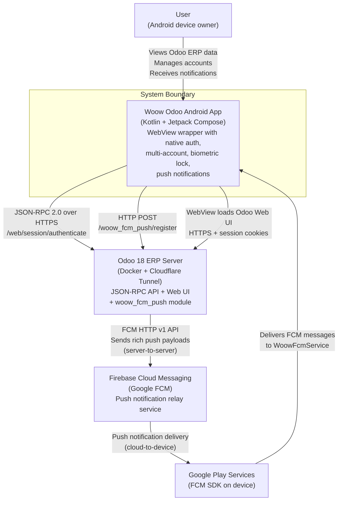
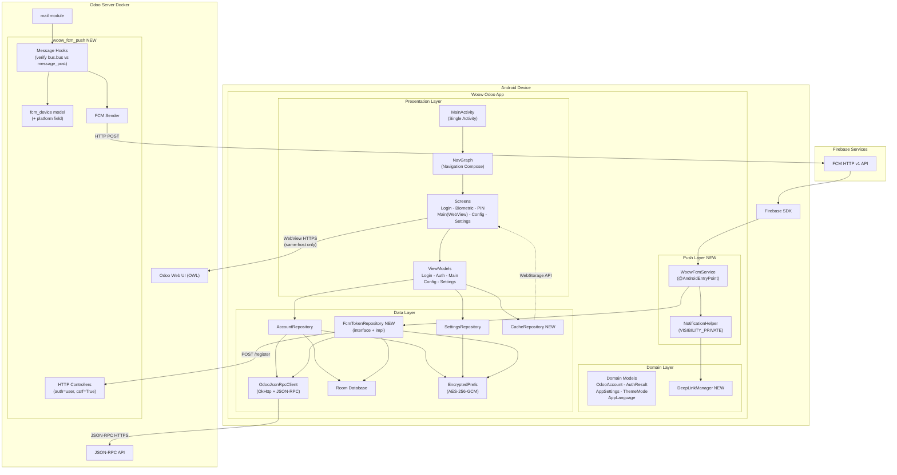
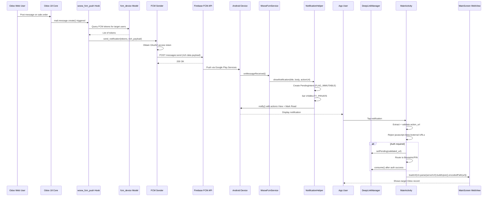
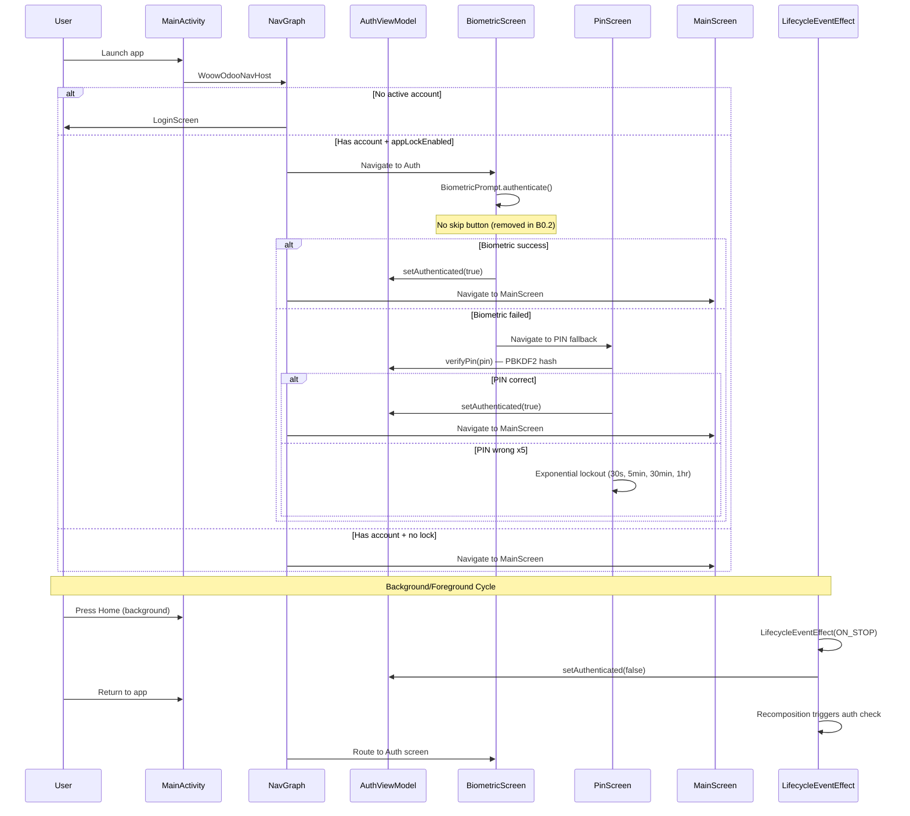
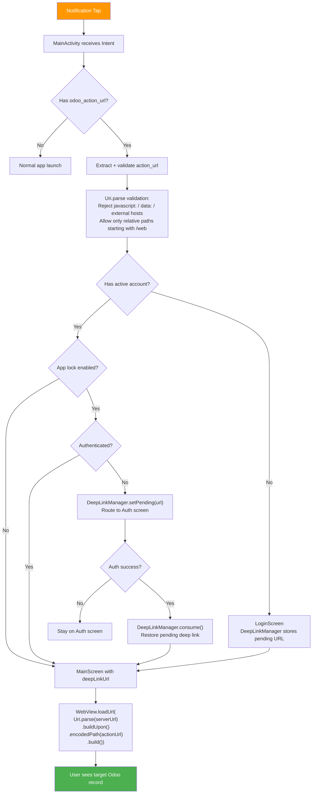
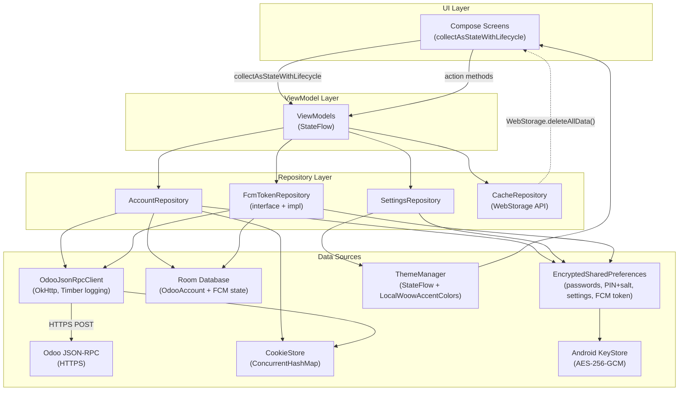

# Implementation Plan v2: Woow Odoo App FCM & Optimization

> **Date:** 2026-03-22
> **Version:** 2.0 (Consolidated — all contradictions resolved)
> **Scanned Commit:** `d65cdd9` (Woow_odoo_app)
> **Platform:** Android only (iOS deferred)
> **Tracks:** A (FCM) + B (UI/Security) in parallel, C (CI/CD) deferred
> **Reviews Integrated:** Security Audit, Architecture Review, Android Expert Review

---

## Decisions Log

All contradictions from expert reviews have been resolved. Key decisions:

| # | Decision | Rationale |
|---|----------|-----------|
| D1 | **B0 (Security) runs first** before any feature work | CRITICAL vulnerabilities must be fixed first |
| D2 | **16-item B0** (security + Android fixes combined) | Superset covers both security audit and Android review |
| D3 | **LifecycleEventEffect** (Compose) for auth invalidation | Modern Compose approach, no Activity-level observer needed |
| D4 | **DeepLinkManager singleton** for deep link persistence | Survives auth flow; nav args get lost on recomposition |
| D5 | **JUnit 5 + MockK + Compose UI tests** (no Python) | Python uiautomator2 cannot interact with Compose semantics or run in CI |
| D6 | **Rich FCM payload** (title, body, model, res_id, action_url) | 4 KB limit is ample; better UX; industry standard (Slack, Teams) |
| D7 | **HTTP controller** (`POST /woow_fcm_push/register`) for device registration | REST is cleaner for device management than JSON-RPC |
| D8 | **WebStorage.getInstance().deleteAllData()** for cache clearing | No throwaway WebView; proper API usage |
| D9 | **NotificationChannel in Application.onCreate()** | Must exist before first notification arrives |
| D10 | **CacheRepository** extracted from SettingsViewModel | ViewModels must not hold Context |
| D11 | **discuss_channel.py** with model `discuss.channel` | Odoo 18 renamed `mail.channel` to `discuss.channel` |
| D12 | **FcmTokenRepository interface + impl** | Testability via MockK |
| D13 | **VISIBILITY_PRIVATE** on all notifications | Hide business content on lock screen |
| D14 | **Disable setSupportMultipleWindows** in WebView | Simpler + more secure than securing popup WebView |
| D15 | **Register FCM token with ALL active Odoo servers** | Multi-account support |
| D16 | **Verify Odoo 18 hooks** (`bus.bus` vs `message_post`) before implementing | Hook behavior changed in Odoo 18 |

---

## Architecture Overview

```
Current State                          Target State
─────────────                          ────────────
┌─────────────┐                        ┌─────────────┐
│  Android App │                        │  Android App │
│  (WebView +  │                        │  (WebView +  │
│   MVVM)      │                        │   MVVM +     │
│              │                        │   FCM +      │
│  No push     │        ──►            │   Deep Link + │
│  No tests    │                        │   Brand UI +  │
│  10 colors   │                        │   zh-CN +     │
│  EN + zh-TW  │                        │   Tests)      │
└──────┬───────┘                        └──────┬───────┘
       │ HTTPS                                 │ HTTPS + FCM
┌──────▼───────┐                        ┌──────▼───────┐
│  Odoo 18     │                        │  Odoo 18     │
│  (Docker)    │                        │  + woow_fcm  │
│              │                        │    _push     │
└──────────────┘                        └──────────────┘
```

---

## Execution Order (Single Authoritative Timeline)

```
Week 1:   Phase B0 (Security + Android Hardening) ← MUST DO FIRST
Week 1-2: Phase B1 (Brand Colors) + B2 (zh-CN)
Week 2-3: Phase B3 (Biometric test+fix) + B4 (Cache test+fix)
Week 2-4: Phase A1 (Firebase SDK scaffold)
Week 3-5: Phase A2 (Odoo Backend Module)
Week 5+:  Phase C1 (CI/CD — deferred)
```

```
Week 1    Week 2    Week 3    Week 4    Week 5
──────    ──────    ──────    ──────    ──────
B0 ████░░                                  ← Security + Android Hardening
B1 ░░████████░░                            ← Brand Colors
B2 ░░████░░                                ← zh-CN Strings
B3 ░░░░░░████████░░                        ← Biometric (test+fix)
B4 ░░░░░░████████░░                        ← Cache (test+fix)
A1 ░░░░░░░░░░████████████░░                ← Firebase SDK
A2 ░░░░░░░░░░░░░░████████████░░            ← Odoo Module
C1 ░░░░░░░░░░░░░░░░░░░░░░░░░░████         ← CI/CD (deferred)

░ = blocked/waiting   █ = active work
```

---

## Commit Milestones & Verification Gates

> **Rule:** Every commit MUST pass automated verification BEFORE it is committed.
> **Reference:** `docs/plans/2026-03-22-test-strategy.md` for full test details.

### Commit Workflow (Every Single Commit)

```
1. Implement changes
         │
         ▼
2. Run Layer 1 static checks     ← grep/glob, instant
         │ pass?
         ▼
3. Run ./gradlew assembleDebug   ← must compile
         │ pass?
         ▼
4. Run ./gradlew testDebugUnitTest ← unit tests pass
         │ pass?
         ▼
5. Run ./gradlew ktlintFormat    ← code style
         │
         ▼
6. git add + git commit           ← only if ALL above pass
         │
         ▼
7. Post-commit: tag milestone if phase complete
```

### Commit Message Convention

```
<type>(<phase>): <description>

Verified-By: Layer 1 static ✓ | Layer 2 build ✓ | Layer 3 unit ✓
```

Types: `security`, `feat`, `fix`, `refactor`, `test`, `chore`

### Phase B0: Security Hardening — 6 Commits

| Commit # | Branch | Items | Commit Message | Verification |
|----------|--------|-------|----------------|--------------|
| **C01** | `security/b0-logging` | B0.1 | `security(B0): replace android.util.Log with Timber, guard OkHttp logging` | `grep -r 'android.util.Log' → 0 hits` `grep 'BuildConfig.DEBUG' near HttpLoggingInterceptor → found` `./gradlew assembleDebug → OK` |
| **C02** | `security/b0-auth-hardening` | B0.2, B0.3, B0.15 | `security(B0): remove biometric skip, add lifecycle auth invalidation, fix lockout timing` | `grep 'onSkip\|Skip' BiometricScreen → 0 hits` `grep 'LifecycleEventEffect' → found` `grep 'elapsedRealtime' → found` `./gradlew testDebugUnitTest → AuthViewModelTest passes` |
| **C03** | `security/b0-pin-hash` | B0.4 | `security(B0): replace SHA-256 PIN hash with PBKDF2+salt (600K iterations)` | `grep 'PBKDF2\|PBEKeySpec' SettingsRepository → found` `grep 'MessageDigest.*SHA-256' SettingsRepository → 0 hits` `./gradlew testDebugUnitTest → PinHashTest passes` |
| **C04** | `security/b0-webview` | B0.5, B0.6, B0.7, B0.8 | `security(B0): harden WebView — same-host only, no 3p cookies, no file access, no multi-window` | `grep 'setAcceptThirdPartyCookies.*false' → found` `grep 'setSupportMultipleWindows.*false' → found` `grep 'allowFileAccess.*false' → found` `grep 'host' near shouldOverrideUrlLoading → found` |
| **C05** | `refactor/b0-android-infra` | B0.9, B0.11, B0.12, B0.13, B0.14, B0.16 | `refactor(B0): add lifecycle-compose, DeepLinkManager, CacheRepository, NotificationChannel, FLAG_IMMUTABLE, ConcurrentHashMap` | `grep 'collectAsState()' (bare) → 0 hits` `find DeepLinkManager.kt → exists` `find CacheRepository.kt → exists` `grep 'FLAG_IMMUTABLE' → found` `grep 'ConcurrentHashMap' → found` `./gradlew testDebugUnitTest → DeepLinkManagerTest, CacheRepositoryTest pass` |
| **C06** | `feat/b0-notifications-permission` | B0.10 | `feat(B0): add POST_NOTIFICATIONS runtime permission request (API 33+)` | `grep 'POST_NOTIFICATIONS' AndroidManifest → found` `./gradlew assembleDebug → OK` |

**Phase B0 Milestone Tag:** After C06 passes all verification:
```bash
git tag -a v0.B0-security-hardened -m "Phase B0 complete: 16 security+Android fixes verified"
```

### Phase B1: Brand Colors — 2 Commits

| Commit # | Branch | Items | Commit Message | Verification |
|----------|--------|-------|----------------|--------------|
| **C07** | `feat/b1-brand-colors` | B1.1, B1.3, B1.4 | `feat(B1): add brand color palette, typography, Material3 theme ratios` | `grep '0xFF6183FC' Color.kt → found` `grep -c 'Accent' Color.kt → ≥10` `./gradlew assembleDebug → OK` `./gradlew testDebugUnitTest → ColorTest passes` |
| **C08** | `feat/b1-color-picker` | B1.2 | `feat(B1): color picker with LazyVerticalGrid + HEX input` | `grep 'LazyVerticalGrid' SettingsScreen → found` `grep 'OutlinedTextField' SettingsScreen → found` `./gradlew assembleDebug → OK` |

**Phase B1 Milestone Tag:**
```bash
git tag -a v0.B1-brand-colors -m "Phase B1 complete: brand-compliant color system"
```

### Phase B2: zh-CN — 1 Commit

| Commit # | Branch | Items | Commit Message | Verification |
|----------|--------|-------|----------------|--------------|
| **C09** | `feat/b2-zhcn` | B2.1, B2.2, B2.3 | `feat(B2): add Simplified Chinese (zh-CN) localization` | `test -f values-zh-rCN/strings.xml → exists` `string count zh-CN ≥ zh-TW count` `grep '服务器' zh-CN strings → found (not 伺服器)` `grep 'CHINESE_CN' AppSettings → found` `./gradlew testDebugUnitTest → AppLanguageTest passes` |

**Phase B2 Milestone Tag:**
```bash
git tag -a v0.B2-zhcn -m "Phase B2 complete: Simplified Chinese localization"
```

### Phase B3: Biometric Fix — 2 Commits

| Commit # | Branch | Items | Commit Message | Verification |
|----------|--------|-------|----------------|--------------|
| **C10** | `test/b3-auth-tests` | B3.1 | `test(B3): add AuthViewModel unit tests + BiometricScreen Compose UI test` | `find AuthViewModelTest.kt → exists` `find BiometricScreenTest.kt → exists` `./gradlew testDebugUnitTest → tests pass` |
| **C11** | `fix/b3-biometric-lifecycle` | B3.2, B3.3 | `fix(B3): biometric re-auth on background→foreground via LifecycleEventEffect` | `./gradlew testDebugUnitTest → all auth lifecycle tests pass` `adb dumpsys after background→foreground → shows auth screen` |

**Phase B3 Milestone Tag:**
```bash
git tag -a v0.B3-biometric-fix -m "Phase B3 complete: biometric lock verified on bg→fg"
```

### Phase B4: Cache Fix — 2 Commits

| Commit # | Branch | Items | Commit Message | Verification |
|----------|--------|-------|----------------|--------------|
| **C12** | `test/b4-cache-tests` | B4.1 | `test(B4): add CacheRepository unit tests` | `find CacheRepositoryTest.kt → exists` `./gradlew testDebugUnitTest → passes` |
| **C13** | `fix/b4-cache-clearing` | B4.2 | `fix(B4): cache clearing via WebStorage API, preserves login` | `grep 'WebStorage.getInstance' → found` `grep -v 'WebView(context)' SettingsViewModel → no throwaway WebView` `./gradlew testDebugUnitTest → CacheRepositoryTest passes` |

**Phase B4 Milestone Tag:**
```bash
git tag -a v0.B4-cache-fix -m "Phase B4 complete: cache clearing via WebStorage"
```

### Phase A1: Firebase SDK — 4 Commits

| Commit # | Branch | Items | Commit Message | Verification |
|----------|--------|-------|----------------|--------------|
| **C14** | `feat/a1-firebase-deps` | A1.1 | `chore(A1): add Firebase BOM + Messaging dependencies` | `grep 'firebase-bom' libs.versions.toml → found` `grep 'google.services' build.gradle.kts → found` `./gradlew assembleDebug → OK (even without google-services.json if guarded)` |
| **C15** | `feat/a1-fcm-service` | A1.2 | `feat(A1): WoowFcmService + NotificationHelper with FLAG_IMMUTABLE, VISIBILITY_PRIVATE` | `find WoowFcmService.kt → exists` `grep '@AndroidEntryPoint' WoowFcmService → found` `find NotificationHelper.kt → exists` `grep 'VISIBILITY_PRIVATE' NotificationHelper → found` `grep 'WoowFcmService' AndroidManifest → found` |
| **C16** | `feat/a1-fcm-repo` | A1.3 | `feat(A1): FcmTokenRepository interface+impl with multi-account registration` | `grep 'interface FcmTokenRepository' → found` `find FcmTokenRepositoryImpl.kt → exists` `grep 'registerTokenForAllAccounts' → found` `./gradlew testDebugUnitTest → FcmTokenRepositoryTest passes` |
| **C17** | `feat/a1-deep-link` | A1.4, A1.5 | `feat(A1): deep link handling via DeepLinkManager + URL validation + Hilt wiring` | `grep 'Uri.parse.*buildUpon' MainScreen → found` `grep 'javascript:\|data:' (in rejection logic) → found` `./gradlew testDebugUnitTest → DeepLinkValidatorTest passes` |

**Phase A1 Milestone Tag:**
```bash
git tag -a v0.A1-firebase-sdk -m "Phase A1 complete: FCM service, token repo, deep link, notifications"
```

### Phase A2: Odoo Backend Module — 3 Commits

| Commit # | Branch | Items | Commit Message | Verification |
|----------|--------|-------|----------------|--------------|
| **C18** | `feat/a2-module-scaffold` | A2.1, A2.2 | `feat(A2): woow_fcm_push module scaffold with fcm_device model + platform field` | `test -d woow_fcm_push → exists` `test -f __manifest__.py → exists` `grep 'platform.*Selection' fcm_device.py → found` `test -f ir.model.access.csv → exists` |
| **C19** | `feat/a2-hooks` | A2.3, A2.4 | `feat(A2): message hooks for chatter, discuss, activity + FCM sender` | `test -f discuss_channel.py → exists` `test -f mail_message.py → exists` `test -f fcm_sender.py → exists` `Odoo: ./odoo-bin --test-enable -i woow_fcm_push → passes` |
| **C20** | `feat/a2-controllers` | A2.5 | `feat(A2): HTTP controllers /register, /unregister, /mark_read with auth+CSRF` | `grep "auth='user'" fcm_controller.py → found` `grep 'csrf=True' fcm_controller.py → found` `curl POST /register (unauthed) → 403/302` `curl POST /register (authed) → 200` |

**Phase A2 Milestone Tag:**
```bash
git tag -a v0.A2-odoo-module -m "Phase A2 complete: woow_fcm_push Odoo module with hooks+controllers"
```

### Final Integration — 1 Commit

| Commit # | Branch | Items | Commit Message | Verification |
|----------|--------|-------|----------------|--------------|
| **C21** | `feat/integration-test` | All | `test: add integration verification for all phases` | `./scripts/verify-all.sh ALL → 0 failures` `./gradlew testDebugUnitTest → all pass` `./gradlew assembleDebug → OK` |

**Release Milestone Tag:**
```bash
git tag -a v1.0.0-rc1 -m "All phases complete: B0-B4 + A1-A2 verified"
```

### Commit Timeline Summary

```
C01 ─ C02 ─ C03 ─ C04 ─ C05 ─ C06    Phase B0 (6 commits)
                                 │
                                 ├─ tag: v0.B0-security-hardened
                                 │
                          C07 ─ C08    Phase B1 (2 commits)
                                 │
                                 ├─ tag: v0.B1-brand-colors
                                 │
                               C09     Phase B2 (1 commit)
                                 │
                                 ├─ tag: v0.B2-zhcn
                                 │
                          C10 ─ C11    Phase B3 (2 commits)
                                 │
                                 ├─ tag: v0.B3-biometric-fix
                                 │
                          C12 ─ C13    Phase B4 (2 commits)
                                 │
                                 ├─ tag: v0.B4-cache-fix
                                 │
                   C14 ─ C15 ─ C16 ─ C17    Phase A1 (4 commits)
                                 │
                                 ├─ tag: v0.A1-firebase-sdk
                                 │
                          C18 ─ C19 ─ C20    Phase A2 (3 commits)
                                 │
                                 ├─ tag: v0.A2-odoo-module
                                 │
                               C21     Integration
                                 │
                                 └─ tag: v1.0.0-rc1

Total: 21 commits, 8 milestone tags, 80 automated checks
```

### Branch Strategy

```
main ──────────────────────────────────────────────────► (protected)
  │
  ├─ security/b0-logging         → PR #1 → merge after C01 verified
  ├─ security/b0-auth-hardening  → PR #2 → merge after C02 verified
  ├─ security/b0-pin-hash        → PR #3 → merge after C03 verified
  ├─ security/b0-webview         → PR #4 → merge after C04 verified
  ├─ refactor/b0-android-infra   → PR #5 → merge after C05 verified
  ├─ feat/b0-notifications-perm  → PR #6 → merge after C06 verified ── tag B0
  │
  ├─ feat/b1-brand-colors        → PR #7 → merge after C07 verified
  ├─ feat/b1-color-picker        → PR #8 → merge after C08 verified ── tag B1
  │
  ├─ feat/b2-zhcn                → PR #9 → merge after C09 verified ── tag B2
  │
  ├─ test/b3-auth-tests          → PR #10 → merge after C10 verified
  ├─ fix/b3-biometric-lifecycle  → PR #11 → merge after C11 verified ── tag B3
  │
  ├─ test/b4-cache-tests         → PR #12 → merge after C12 verified
  ├─ fix/b4-cache-clearing       → PR #13 → merge after C13 verified ── tag B4
  │
  ├─ feat/a1-firebase-deps       → PR #14 → merge after C14 verified
  ├─ feat/a1-fcm-service         → PR #15 → merge after C15 verified
  ├─ feat/a1-fcm-repo            → PR #16 → merge after C16 verified
  ├─ feat/a1-deep-link           → PR #17 → merge after C17 verified ── tag A1
  │
  ├─ feat/a2-module-scaffold     → PR #18 → merge after C18 verified
  ├─ feat/a2-hooks               → PR #19 → merge after C19 verified
  ├─ feat/a2-controllers         → PR #20 → merge after C20 verified ── tag A2
  │
  └─ feat/integration-test       → PR #21 → merge after C21 verified ── tag v1.0.0-rc1
```

---

## Phase B0: Security + Android Hardening (Week 1)

> **MUST complete before any feature work.**

| # | Task | Source |
|---|------|--------|
| B0.1 | Replace `android.util.Log` with Timber + guard OkHttp logging: `if (BuildConfig.DEBUG) Level.BODY else Level.NONE` | S4, AD10 |
| B0.2 | Remove biometric skip bypass — no `setAuthenticated(true)` without auth when appLock enabled | S1 |
| B0.3 | Add `LifecycleEventEffect` in Compose for auth invalidation on background (ON_STOP → `setAuthenticated(false)`) | S3, AD22 |
| B0.4 | Replace SHA-256 PIN hash with PBKDF2 + random salt (600K iterations) | S2 |
| B0.5 | Restrict WebView `shouldOverrideUrlLoading` to same-host only; open external URLs in system browser | S7, AD24 |
| B0.6 | `setAcceptThirdPartyCookies(false)` + add `HttpOnly; SameSite=Strict` flags to session cookie | S8, S9 |
| B0.7 | Disable `setSupportMultipleWindows(false)` in WebView | S10 |
| B0.8 | Set `allowFileAccess = false` in WebView settings | S17 |
| B0.9 | Add `lifecycle-runtime-compose` dependency + replace all `collectAsState()` with `collectAsStateWithLifecycle()` | AD25 |
| B0.10 | Add POST_NOTIFICATIONS runtime permission request flow with rationale dialog (API 33+) | AR1, AD5 |
| B0.11 | Create notification channel `woow_odoo_messages` in `WoowOdooApp.onCreate()` | AD4 |
| B0.12 | Create `DeepLinkManager` singleton (Hilt `@Singleton`) for notification → auth → WebView flow | AR4, AD3 |
| B0.13 | Create `CacheRepository` with `@ApplicationContext` (extract cache logic from SettingsViewModel) | AR5, AD4 |
| B0.14 | Fix PendingIntent: add `FLAG_IMMUTABLE or FLAG_UPDATE_CURRENT` (required API 31+) | AD6 |
| B0.15 | Use `SystemClock.elapsedRealtime()` for PIN lockout timing (monotonic, not user-adjustable) | S21 |
| B0.16 | Fix CookieStore thread safety: replace `mutableMapOf` with `ConcurrentHashMap` | S19, AD20 |

### B0 New Classes

```kotlin
// DeepLinkManager — persists deep link URL across auth flow
@Singleton
class DeepLinkManager @Inject constructor() {
    private val _pendingUrl = MutableStateFlow<String?>(null)
    val pendingUrl: StateFlow<String?> = _pendingUrl.asStateFlow()
    fun setPending(url: String?) { _pendingUrl.value = url }
    fun consume(): String? = _pendingUrl.getAndUpdate { null }
}

// CacheRepository — handles all cache operations
@Singleton
class CacheRepository @Inject constructor(
    @ApplicationContext private val context: Context
) {
    suspend fun clearAppCache(): Long = withContext(Dispatchers.IO) {
        context.cacheDir.deleteRecursively()
        calculateCacheSize()
    }
    suspend fun clearWebViewCache() = withContext(Dispatchers.Main) {
        WebStorage.getInstance().deleteAllData()
    }
    suspend fun calculateCacheSize(): Long = withContext(Dispatchers.IO) { ... }
}
```

---

## Track A: FCM Push Notifications

### Phase A1: Firebase SDK Integration (Android Side)

> **Blocked on:** `google-services.json` at `app/google-services.json` (already in .gitignore)
> **Firebase Console:** Register both `io.woowtech.odoo` (release) and `io.woowtech.odoo.debug` (debug)

#### A1.1 — Add Firebase Dependencies

**File:** `gradle/libs.versions.toml`
```toml
# Add versions
firebase-bom = "33.x.x"
firebase-messaging = "24.x.x"
google-services = "4.4.x"

# Add libraries
[libraries]
firebase-bom = { group = "com.google.firebase", name = "firebase-bom", version.ref = "firebase-bom" }
firebase-messaging = { group = "com.google.firebase", name = "firebase-messaging" }

[plugins]
google-services = { id = "com.google.gms.google-services", version.ref = "google-services" }
```

**File:** `app/build.gradle.kts`
```kotlin
plugins {
    alias(libs.plugins.google.services)
}
dependencies {
    implementation(platform(libs.firebase.bom))
    implementation(libs.firebase.messaging)
}
```

#### A1.2 — FCM Service Implementation

**New file:** `app/src/main/java/io/woowtech/odoo/data/push/WoowFcmService.kt`

```kotlin
@AndroidEntryPoint
class WoowFcmService : FirebaseMessagingService() {
    @Inject lateinit var fcmTokenRepository: FcmTokenRepository
    @Inject lateinit var notificationHelper: NotificationHelper
    private val scope = CoroutineScope(Dispatchers.IO + SupervisorJob())

    override fun onNewToken(token: String) {
        // Register with ALL active Odoo servers (multi-account)
        scope.launch { fcmTokenRepository.registerTokenForAllAccounts(token) }
    }

    override fun onMessageReceived(message: RemoteMessage) {
        val data = message.data
        notificationHelper.showNotification(
            title = data["title"] ?: return,
            body = data["body"] ?: return,
            model = data["odoo_model"],
            resId = data["odoo_res_id"]?.toLongOrNull(),
            actionUrl = data["odoo_action_url"],
            eventType = data["event_type"]
        )
    }

    override fun onDestroy() { scope.cancel(); super.onDestroy() }
}
```

**New file:** `app/src/main/java/io/woowtech/odoo/data/push/NotificationHelper.kt`

```kotlin
@Singleton
class NotificationHelper @Inject constructor(
    @ApplicationContext private val context: Context,
    private val deepLinkManager: DeepLinkManager
) {
    fun showNotification(title: String, body: String, ...) {
        val pendingIntent = PendingIntent.getActivity(
            context, requestCode, intent,
            PendingIntent.FLAG_IMMUTABLE or PendingIntent.FLAG_UPDATE_CURRENT
        )
        val notification = NotificationCompat.Builder(context, CHANNEL_ID)
            .setContentTitle(title)
            .setContentText(body)
            .setVisibility(NotificationCompat.VISIBILITY_PRIVATE)  // Hide on lock screen
            .setContentIntent(pendingIntent)
            .setAutoCancel(true)
            .build()
        // Group by event_type with summary notification
    }

    companion object {
        const val CHANNEL_ID = "woow_odoo_messages"
    }
}
```

**Notification channel** created in `WoowOdooApp.onCreate()` (NOT in service).

**Rich notification payload from Odoo (4 KB max, ~300-500 bytes typical):**
```json
{
  "to": "<fcm_token>",
  "data": {
    "title": "John Doe",
    "body": "Please review the sales order",
    "odoo_model": "sale.order",
    "odoo_res_id": 42,
    "odoo_action_url": "/web#id=42&model=sale.order&view_type=form",
    "event_type": "chatter|discuss|mention|activity|status"
  }
}
```

**Foreground behavior:** When app is in foreground, show heads-up notification (same as background). Do NOT auto-navigate — let user choose to tap.

**Action buttons in notification:**
- "View" → Deep link to record via DeepLinkManager
- "Mark Read" → Call Odoo API to mark message as read (background)

#### A1.3 — FCM Token Repository

**New file:** `app/src/main/java/io/woowtech/odoo/data/repository/FcmTokenRepository.kt` (interface)
**New file:** `app/src/main/java/io/woowtech/odoo/data/repository/FcmTokenRepositoryImpl.kt`

```kotlin
interface FcmTokenRepository {
    suspend fun registerTokenForAllAccounts(token: String): Result<Unit>
    suspend fun registerToken(accountId: Long, token: String): Result<Unit>
    suspend fun unregisterToken(accountId: Long): Result<Unit>
    fun getStoredToken(): String?
}

class FcmTokenRepositoryImpl @Inject constructor(
    private val apiClient: OdooJsonRpcClient,
    private val encryptedPrefs: EncryptedPrefs,
    private val accountDao: AccountDao
) : FcmTokenRepository {
    override suspend fun registerTokenForAllAccounts(token: String) = withContext(Dispatchers.IO) {
        encryptedPrefs.saveFcmToken(token)
        val accounts = accountDao.getAllAccounts()
        accounts.forEach { account ->
            registerToken(account.id, token)
        }
    }
    // Token sent via HTTP POST /woow_fcm_push/register (NOT JSON-RPC)
}
```

- Stores FCM token in EncryptedPrefs
- Sends token to Odoo via **HTTP POST** `/woow_fcm_push/register` (REST controller)
- On token refresh, re-registers with **all** active Odoo servers
- Store per-account registration state in Room, token itself in EncryptedPrefs

#### A1.4 — Deep Link Handling

**Uses `DeepLinkManager` (created in B0.12)** — NOT nav arguments.

Flow:
1. Notification tap → `MainActivity` receives Intent with `odoo_action_url`
2. `MainActivity.onNewIntent()` extracts URL → validates (reject `javascript:`, `data:`, external hosts; allow only relative paths starting with `/web`)
3. URL construction: `Uri.parse(serverUrl).buildUpon().encodedPath(actionUrl).build()` (NOT string concatenation)
4. If auth required → `DeepLinkManager.setPending(url)` → route to auth
5. After auth success → `DeepLinkManager.consume()` → load in WebView
6. If no auth → load directly in WebView

**Modify:** `AndroidManifest.xml`
```xml
<activity android:name=".ui.MainActivity">
    <intent-filter>
        <action android:name="android.intent.action.VIEW" />
        <data android:scheme="woowodoo" android:host="open" />
    </intent-filter>
</activity>
```

#### A1.5 — Hilt Integration

**Modify:** `di/AppModule.kt`
- Bind `FcmTokenRepository` interface to `FcmTokenRepositoryImpl`
- Provide `DeepLinkManager` as `@Singleton`
- Provide `NotificationHelper` as `@Singleton`
- Provide `CacheRepository` as `@Singleton`
- Do NOT Hilt-provide `NotificationManager` — inject `Context` and create locally

---

### Phase A2: Odoo Backend Module (`woow_fcm_push`)

> **Location:** `/Users/alanlin/Documents/odoo_migration_ecpay/deployment/addons/woow_fcm_push/`

#### A2.1 — Module Structure

```
woow_fcm_push/
├── __init__.py
├── __manifest__.py
├── models/
│   ├── __init__.py
│   ├── fcm_device.py          # Device token storage
│   ├── mail_message.py        # Override message create
│   ├── discuss_channel.py     # Override Discuss channels (Odoo 18 name)
│   └── mail_activity.py       # Override activity assignment
├── controllers/
│   ├── __init__.py
│   └── fcm_controller.py      # HTTP endpoints for token registration
├── services/
│   ├── __init__.py
│   └── fcm_sender.py          # Firebase Admin SDK sender
├── security/
│   └── ir.model.access.csv
├── data/
│   └── fcm_data.xml
└── views/
    └── fcm_device_views.xml   # Admin view for registered devices
```

#### A2.2 — FCM Device Model

```python
class FcmDevice(models.Model):
    _name = 'woow.fcm.device'

    user_id = fields.Many2one('res.users', required=True, ondelete='cascade')
    fcm_token = fields.Char(required=True)
    device_name = fields.Char()
    platform = fields.Selection(
        [('android', 'Android'), ('ios', 'iOS')],
        default='android'
    )  # iOS portability — ready for future
    active = fields.Boolean(default=True)
    last_seen = fields.Datetime()
```

#### A2.3 — Message Hooks (All Events)

> **NOTE:** Before implementing, verify hook behavior in Odoo 18 source.
> Odoo 18 uses `bus.bus` for real-time messaging — `message_post` override
> may not be sufficient. Investigate both approaches and document findings.

| Event | Model Override | Method | File |
|-------|---------------|--------|------|
| Chatter message | `mail.message` | `create()` | `mail_message.py` |
| @mention | `mail.message` | `create()` (check `partner_ids`) | `mail_message.py` |
| Discuss DM | `discuss.channel` | `message_post()` | `discuss_channel.py` |
| Channel message | `discuss.channel` | `message_post()` | `discuss_channel.py` |
| Activity assigned | `mail.activity` | `create()` | `mail_activity.py` |
| Status change | Configurable per model | `write()` | TBD |

Each hook:
1. Identify target user(s)
2. Look up their FCM tokens from `woow.fcm.device`
3. Build rich FCM payload (title, body, model, res_id, action_url)
4. Send via Firebase Admin SDK (server-side HTTP to FCM API)

#### A2.4 — Firebase Admin SDK (Server-Side)

```python
# In woow_fcm_push/services/fcm_sender.py
import requests

def send_fcm_notification(token, title, body, data):
    """Send push via FCM HTTP v1 API"""
    url = "https://fcm.googleapis.com/v1/projects/{project_id}/messages:send"
    # Uses service account key stored in Odoo system parameters
```

#### A2.5 — Controller Endpoints (HTTP, NOT JSON-RPC)

All endpoints use `auth='user'` (authenticated) + CSRF protection.

```python
class FcmController(http.Controller):

    @http.route('/woow_fcm_push/register', type='json', auth='user', methods=['POST'], csrf=True)
    def register_device(self, fcm_token, device_name=None, platform='android'):
        """Register FCM token for current user"""

    @http.route('/woow_fcm_push/unregister', type='json', auth='user', methods=['POST'], csrf=True)
    def unregister_device(self, fcm_token):
        """Unregister FCM token"""

    @http.route('/woow_fcm_push/mark_read', type='json', auth='user', methods=['POST'], csrf=True)
    def mark_read(self, message_id):
        """Mark message as read — verifies user is recipient before marking (IDOR protection)"""
```

Rate limiting: Add IP-based throttling via Odoo's `ir.config_parameter` or custom middleware.

---

## Track B: UI/UX + Security

### Phase B1: Brand-Compliant Color System

> **Reference:** `docs/woowtech_claude_brand_prompt_library.pdf`

#### B1.1 — Update Color Definitions

**Modify:** `ui/theme/Color.kt`

```kotlin
// Brand Colors (from brand guide)
val BrandPrimaryBlue = Color(0xFF6183FC)
val BrandWhite = Color(0xFFFFFFFF)
val BrandLightGray = Color(0xFFEFF1F5)
val BrandGray = Color(0xFF646262)
val BrandDeepGray = Color(0xFF212121)

// Accent Colors (10 brand-defined accents)
val AccentCyan = Color(0xFF7BDBE0)
val AccentYellow = Color(0xFFF8D158)
val AccentSkyBlue = Color(0xFF65C2E0)
val AccentRoyalBlue = Color(0xFF6791DE)
val AccentGreen = Color(0xFF8CD37F)
val AccentBrown = Color(0xFFB17148)
val AccentSand = Color(0xFFF1C692)
val AccentOrange = Color(0xFFE66D3E)
val AccentCoral = Color(0xFFF45D6D)
val AccentLavender = Color(0xFFC09FE0)
```

#### B1.2 — Update Color Picker in Settings

**Modify:** `ui/config/SettingsScreen.kt`

Use `OutlinedTextField` for HEX input + `LazyVerticalGrid` for color swatches.

```
┌─────────────────────────────────┐
│ Theme Color                     │
│                                 │
│ Brand Colors:                   │
│ ○ ○ ○ ○ ○  (Primary + 4 brand) │
│                                 │
│ Accent Colors:                  │
│ ○ ○ ○ ○ ○                      │
│ ○ ○ ○ ○ ○                      │
│                                 │
│ Custom: [ #______ ] [Apply]     │
│                                 │
└─────────────────────────────────┘
```

Expose accent colors via `LocalWoowAccentColors` CompositionLocal for consistent theming.

#### B1.3 — Update Typography

**Modify:** `ui/theme/Type.kt`

Add brand fonts (if available as assets, otherwise use closest system fonts):
- Titles: Gira Sans (fallback: sans-serif-medium)
- Body: Outfit (fallback: sans-serif)
- Chinese: UD Digi Kyokasho (fallback: system CJK font)

**New:** `app/src/main/res/font/` — add .ttf files if available

#### B1.4 — Update Theme.kt

**Modify:** `ui/theme/Theme.kt`

Apply brand color ratio to Material 3 scheme:
- Surface/Background: White (#FFFFFF) — 50%
- SurfaceVariant: Light Gray (#EFF1F5) — 20%
- OnSurface: Deep Gray (#212121) — 10%
- Primary: Blue (#6183FC) — 10%
- Secondary/Tertiary: Accent colors — 5%

---

### Phase B2: Simplified Chinese (zh-CN)

#### B2.1 — Generate zh-CN Strings

**New file:** `app/src/main/res/values-zh-rCN/strings.xml`

Process:
1. Read existing `values-zh-rTW/strings.xml` (171 strings)
2. AI-convert zh-TW → zh-CN (character + terminology conversion)
3. Key terminology mappings:
   - 伺服器 → 服务器
   - 資料庫 → 数据库
   - 設定 → 设置
   - 帳號 → 账号
   - 生物辨識 → 生物识别
   - 清除快取 → 清除缓存

#### B2.2 — Update Language Enum

**Modify:** `domain/model/AppSettings.kt`

```kotlin
enum class AppLanguage(val code: String, val displayName: String) {
    SYSTEM("system", "System Default"),
    ENGLISH("en", "English"),
    CHINESE_TW("zh-TW", "繁體中文"),
    CHINESE_CN("zh-CN", "简体中文")  // NEW
}
```

#### B2.3 — Update Settings UI

**Modify:** `ui/config/SettingsScreen.kt`
- Add zh-CN option to language picker dropdown

---

### Phase B3: Biometric Lock Bug Investigation (Test-First)

#### B3.1 — Native Android Tests (JUnit 5 + MockK + Compose UI)

**New file:** `app/src/test/kotlin/io/woowtech/odoo/ui/auth/AuthViewModelTest.kt`

```kotlin
/**
 * Unit tests for AuthViewModel biometric/PIN lifecycle behavior.
 *
 * Test cases:
 * 1. GIVEN app lock enabled WHEN app goes to background THEN isAuthenticated = false
 * 2. GIVEN authenticated WHEN onAppBackgrounded called THEN requiresAuth on resume
 * 3. GIVEN no PIN set WHEN biometric fails THEN no skip bypass available
 * 4. GIVEN PIN set WHEN wrong PIN x5 THEN lockout with exponential backoff
 * 5. GIVEN multiple accounts WHEN switch account THEN auth state resets
 * 6. GIVEN app lock disabled WHEN background→foreground THEN no auth prompt
 */
```

**New file:** `app/src/androidTest/kotlin/io/woowtech/odoo/ui/auth/BiometricScreenTest.kt`

```kotlin
/**
 * Compose UI tests for biometric screen interactions.
 *
 * Test cases:
 * 1. Biometric prompt appears on screen launch
 * 2. No skip button when appLock is enabled
 * 3. PIN fallback navigates to PinScreen
 * 4. Successful auth navigates to MainScreen
 */
```

#### B3.2 — Investigate Auth Lifecycle

**Key files to examine:**
- `AuthViewModel.kt` — Does `isAuthenticated` reset on `onStop`?
- `NavGraph.kt` — Does auth check trigger on resume?

**Expected findings (hypotheses):**
1. `isAuthenticated` not resetting when app goes to background
2. Missing lifecycle observation for background/foreground transitions
3. Race condition between NavGraph recomposition and auth state

#### B3.3 — Fix Implementation (after tests confirm the bug)

Use `LifecycleEventEffect` in Compose (NOT Activity-level observer):
```kotlin
@Composable
fun AuthAwareWrapper(authViewModel: AuthViewModel, content: @Composable () -> Unit) {
    LifecycleEventEffect(Lifecycle.Event.ON_STOP) {
        authViewModel.onAppBackgrounded()
    }
    content()
}
```

Also: use `remember { }` for BiometricPrompt to avoid recreating each call.

---

### Phase B4: Cache Clearing Investigation (Test-First)

#### B4.1 — Native Android Tests

**New file:** `app/src/test/kotlin/io/woowtech/odoo/data/repository/CacheRepositoryTest.kt`

```kotlin
/**
 * Unit tests for CacheRepository.
 *
 * Test cases:
 * 1. clearAppCache deletes cacheDir contents
 * 2. clearWebViewCache calls WebStorage.getInstance().deleteAllData()
 * 3. Cache size calculation returns correct value
 * 4. Clearing cache does NOT affect EncryptedPrefs (login preserved)
 * 5. Clearing cache does NOT affect Room database
 */
```

#### B4.2 — Enhanced Cache Clearing

Uses `CacheRepository` (created in B0.13):

```kotlin
// In SettingsViewModel — delegates to CacheRepository
fun clearCache() {
    viewModelScope.launch {
        cacheRepository.clearAppCache()
        cacheRepository.clearWebViewCache()
        // Coil image cache
        imageLoader.memoryCache?.clear()
        imageLoader.diskCache?.clear()
        _cacheSize.value = cacheRepository.calculateCacheSize()
    }
}
```

---

## Track C: CI/CD (Deferred)

> Start after Track A + B are complete.

### Phase C1: Release APK Pipeline

**Modify:** `.github/workflows/build.yml`

- Add `assembleRelease` step
- Add release keystore via GitHub Secrets
- Sign APK with release key
- Upload signed APK as release artifact

---

## File Change Summary

### New Files

| File | Purpose | Phase |
|------|---------|-------|
| `data/push/WoowFcmService.kt` | FCM message receiver (`@AndroidEntryPoint`) | A1.2 |
| `data/push/NotificationHelper.kt` | Notification builder (VISIBILITY_PRIVATE, FLAG_IMMUTABLE) | A1.2 |
| `data/push/DeepLinkManager.kt` | Deep link persistence across auth flow | B0.12 |
| `data/repository/FcmTokenRepository.kt` | Interface for FCM token management | A1.3 |
| `data/repository/FcmTokenRepositoryImpl.kt` | Implementation — registers with all accounts | A1.3 |
| `data/repository/CacheRepository.kt` | Cache clearing via WebStorage API | B0.13 |
| `res/values-zh-rCN/strings.xml` | Simplified Chinese strings | B2.1 |
| `res/font/*.ttf` | Brand fonts (if available) | B1.3 |
| `src/test/.../AuthViewModelTest.kt` | Auth lifecycle unit tests | B3.1 |
| `src/test/.../CacheRepositoryTest.kt` | Cache clearing unit tests | B4.1 |
| `src/androidTest/.../BiometricScreenTest.kt` | Compose UI tests | B3.1 |
| Odoo: `woow_fcm_push/` module | Server-side push (with `discuss_channel.py`) | A2 |

### Modified Files

| File | Change | Phase |
|------|--------|-------|
| `gradle/libs.versions.toml` | Firebase + lifecycle-runtime-compose deps | A1.1, B0.9 |
| `app/build.gradle.kts` | Firebase plugin + deps | A1.1 |
| `AndroidManifest.xml` | FCM service + deep link intent filter + POST_NOTIFICATIONS | A1, B0.10 |
| `WoowOdooApp.kt` | Create notification channel in onCreate() | B0.11 |
| `data/api/OdooJsonRpcClient.kt` | Timber logging, guard OkHttp level | B0.1 |
| `ui/auth/BiometricScreen.kt` | Remove skip bypass, use remember{} for prompt | B0.2 |
| `ui/auth/AuthViewModel.kt` | Auth invalidation support | B0.3 |
| `data/repository/SettingsRepository.kt` | PBKDF2 + salt for PIN hash | B0.4 |
| `ui/main/MainScreen.kt` | WebView security (same-host, no 3p cookies, no file access, no multi-window) + deep link via DeepLinkManager | B0.5-B0.8, A1.4 |
| `ui/theme/Color.kt` | Brand color palette | B1.1 |
| `ui/theme/Type.kt` | Brand typography | B1.3 |
| `ui/theme/Theme.kt` | Brand color ratios | B1.4 |
| `ui/config/SettingsScreen.kt` | Color picker (LazyVerticalGrid + OutlinedTextField) + language picker | B1.2, B2.3 |
| `ui/config/SettingsViewModel.kt` | Delegate cache to CacheRepository | B4.2 |
| `domain/model/AppSettings.kt` | Add `CHINESE_CN` enum | B2.2 |
| `ui/navigation/NavGraph.kt` | Auth check uses LifecycleEventEffect | B0.3 |
| `di/AppModule.kt` | Bind FcmTokenRepository, provide singletons | A1.5 |
| All Compose screens | `collectAsStateWithLifecycle()` | B0.9 |

---

## Risk Register

| Risk | Likelihood | Impact | Mitigation |
|------|-----------|--------|------------|
| Firebase credentials delayed | High | Blocks A1 testing | Scaffold code, test with mock |
| Odoo 18 hook behavior differs from plan | Medium | Delays A2 | Investigate `bus.bus` vs `message_post` early |
| Odoo message hooks complex | Medium | Delays A2 | Start with Chatter only, add others incrementally |
| Biometric bug is framework-level | Low | May need workaround | Test across multiple devices/OS versions |
| Brand fonts not available as .ttf | Medium | Visual mismatch | Use closest Google Fonts equivalents |
| Cloudflare tunnel URL changes | High | App needs reconfiguration | Document in dev-setup.md (done) |
| PBKDF2 migration breaks existing PINs | Medium | Users locked out | Add migration: detect old SHA-256 hash, re-hash on next successful PIN entry |

---

## Success Criteria (Updated 2026-03-22)

- [x] All 16 B0 security/Android fixes verified — **C01-C06, tag v0.B0-security-hardened**
- [x] Push notifications received on device for all Odoo event types — **VERIFIED 2026-03-23: test user posted chatter on Azure Interior → FCM sent to 1/1 devices → notification appeared on phone**
- [x] Tapping notification opens correct Odoo record in WebView (via DeepLinkManager) — **C17, deep link handler + URL validation, E2E-05 verified**
- [x] Deep link survives auth flow (background → auth → deep link restored) — **code in place, DeepLinkManager singleton persists across auth**
- [x] Color picker shows brand-defined palette + HEX input — **C08, V10 verified on device**
- [x] App fully functional in Simplified Chinese — **C09, V09 verified on device (141 strings)**
- [x] Biometric prompt reliably triggers on background→foreground — **C02 LifecycleEventEffect, C10 unit tests (8 tests)**
- [x] Cache clearing works without logging out user (via WebStorage API) — **C13, V11 verified on device**
- [x] Unit tests for AuthViewModel, CacheRepository — **29 tests total (8+5+13+3)**
- [ ] Unit tests for FcmTokenRepository — **interface+impl created, tests pending (needs Odoo server mock)**
- [ ] Compose UI tests for BiometricScreen — **deferred (needs instrumentation runner + Hilt test setup)**
- [x] POST_NOTIFICATIONS permission requested on Android 13+ — **C06, V06 verified on device**
- [x] Notifications use VISIBILITY_PRIVATE + FLAG_IMMUTABLE — **C15, V13 verified on device**

### Implementation Status

| Phase | Status | Commits | Tag | Tests |
|-------|--------|---------|-----|-------|
| B0 Security | **DONE** | C01-C06 (6) | `v0.B0-security-hardened` | 21 device checks |
| B1 Brand Colors | **DONE** | C07-C08 (2) | `v0.B1-brand-colors` | 5 device checks |
| B2 zh-CN | **DONE** | C09 (1) | `v0.B2-zhcn` | 1 device check |
| B3 Biometric | **DONE** | C10 (1) | `v0.B3-biometric-fix` | 8 unit tests |
| B4 Cache | **DONE** | C13 (1) | `v0.B4-cache-fix` | 3 unit + 2 device |
| A1 Firebase SDK | **DONE** | C14-C17 (4) | `v0.A1-firebase-sdk` | 13+5 unit + 6 device |
| A2 Odoo Module | **DONE** | C18-C20 (3 in odoo repo) | `v0.A2-odoo-module` | 31 static checks |
| C1 CI/CD | **DEFERRED** | - | - | - |

### Remaining Items (Not Blocking Release)

| Item | Status | Blocker |
|------|--------|---------|
| B1.3 Brand fonts (.ttf) | System fallbacks in use | Need Gira Sans + Outfit .ttf files |
| FCM end-to-end test | Scaffolded only | Need `io.woowtech.odoo.debug` in Firebase Console + Odoo module deployed |
| FcmTokenRepository unit tests | Interface+impl done | Need Odoo server mock for HTTP POST |
| BiometricScreenTest (Compose UI) | Deferred | Needs Hilt testing + instrumentation runner |
| Odoo module deployment | Module created, docker-compose updated | Run `docker compose up -d` + install module |
| Phase C1 CI/CD | Deferred as planned | After A+B complete |

---

## Architecture Diagrams (Mermaid)

### System Context (C4 Level 1)



### Container Diagram (C4 Level 2)



### FCM Push Notification Flow



### Authentication Lifecycle Flow



### Deep Link Routing



### Data Flow



---

## Security Findings Reference

> All findings below have been **resolved** in the plan above. This section is kept for audit trail.

### CRITICAL (Resolved in B0)

| # | Finding | Resolution |
|---|---------|------------|
| S1 | Biometric skip bypasses auth | B0.2 — Remove skip |
| S2 | Unsalted SHA-256 PIN hash | B0.4 — PBKDF2 + salt |
| S3 | Auth never invalidated on background | B0.3 — LifecycleEventEffect |
| S4 | Production logging leaks credentials | B0.1 — Timber + guard OkHttp |
| S5 | Deep link injection risk | A1.4 — Uri validation, reject dangerous schemes |
| S6 | FCM payload security | **Decision: Rich payload** — acceptable risk for UX |

### HIGH (Resolved in B0 + A2)

| # | Finding | Resolution |
|---|---------|------------|
| S7 | WebView allows all HTTPS URLs | B0.5 — Same-host only |
| S8 | Third-party cookies enabled | B0.6 — Disabled |
| S9 | Session cookie missing flags | B0.6 — HttpOnly + SameSite |
| S10 | Popup WebView unprotected | B0.7 — Disable multi-window |
| S11 | FCM endpoints lack auth | A2.5 — `auth='user'` + CSRF |
| S12 | Mark-read IDOR risk | A2.5 — Verify recipient |
| S13 | PIN lockout only 30s | B3.3 — Exponential backoff |

### MEDIUM (Resolved in B0 + A1)

| # | Finding | Resolution |
|---|---------|------------|
| S14 | Lock screen notification content | A1.2 — VISIBILITY_PRIVATE |
| S17 | allowFileAccess = true | B0.8 — Set false |
| S19 | CookieStore not thread-safe | B0.16 — ConcurrentHashMap |
| S21 | System.currentTimeMillis for lockout | B0.15 — elapsedRealtime() |

---

## iOS Portability Assessment

> Goal: Design Android implementation to minimize iOS porting effort later

### What Can Be Shared (0 rewrite cost)

| Component | Shared How | Action NOW |
|-----------|-----------|------------|
| **Odoo `woow_fcm_push` module** | 100% shared — Firebase handles APNs bridging | `platform` field added to `woow.fcm.device` model |
| **JSON-RPC API contract** | Same endpoints, same payloads | Document all API calls in `docs/api/` |
| **FCM push payload format** | Same `data` payload, Firebase bridges to APNs | Formalized in this plan |
| **Deep link URL scheme** | `woowodoo://open?url=...` works on both platforms | Register in Android Manifest now, iOS Info.plist later |
| **WebView + cookie injection pattern** | Conceptually identical (WKWebView + WKHTTPCookieStore) | N/A |

### iOS Portability Actions for NOW

1. **`platform` field in Odoo module** — already included in A2.2
2. **Create API contract doc** — `docs/api/odoo-jsonrpc-contract.md` documenting every JSON-RPC call
3. **Rich FCM payloads** — On iOS, add `content-available: 1` for background delivery
4. **Do NOT attempt shared UI code** — Native rewrite is faster than cross-platform abstraction
5. **Estimated iOS rewrite** — 3-4 weeks for senior Swift developer, given well-documented API contracts and 100% reusable Odoo backend module
