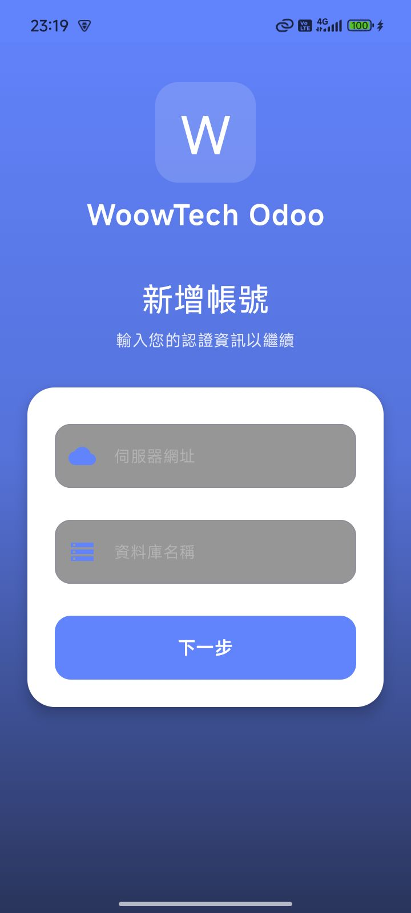
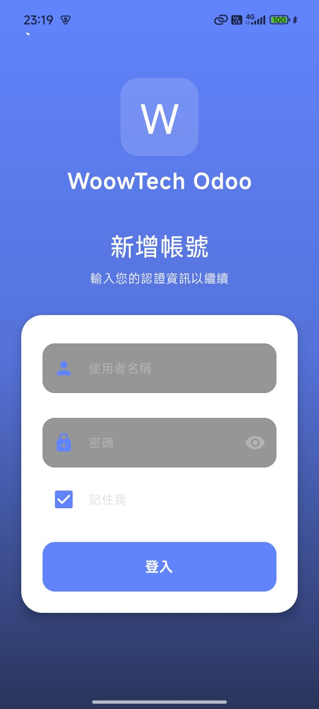
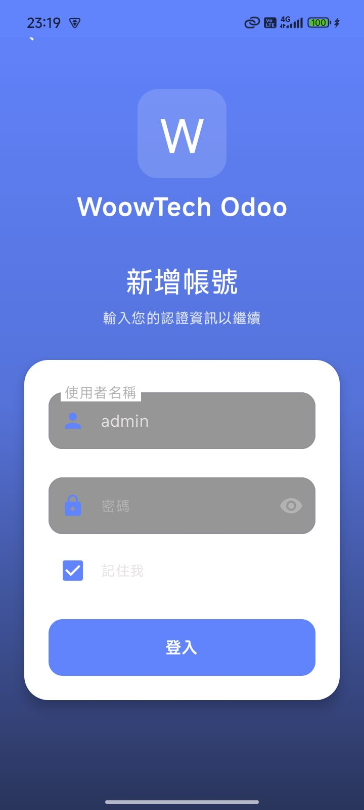
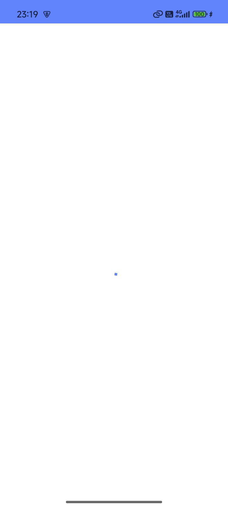
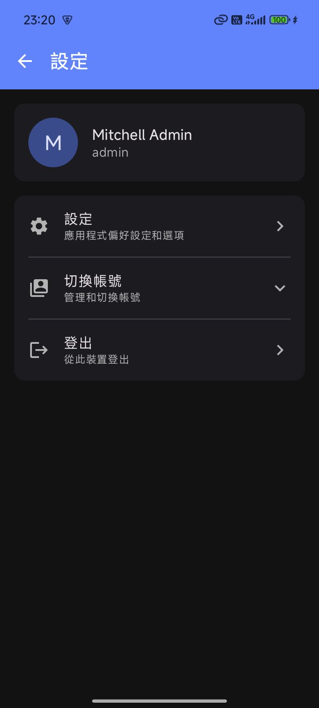
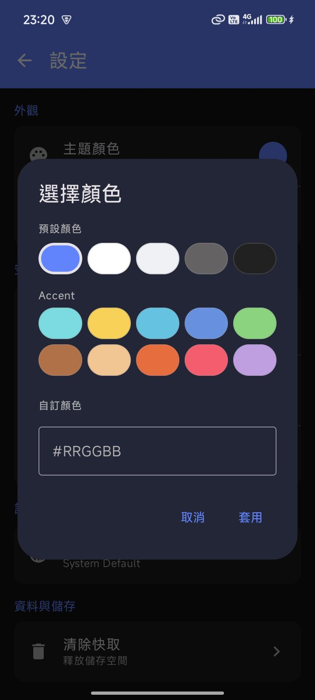
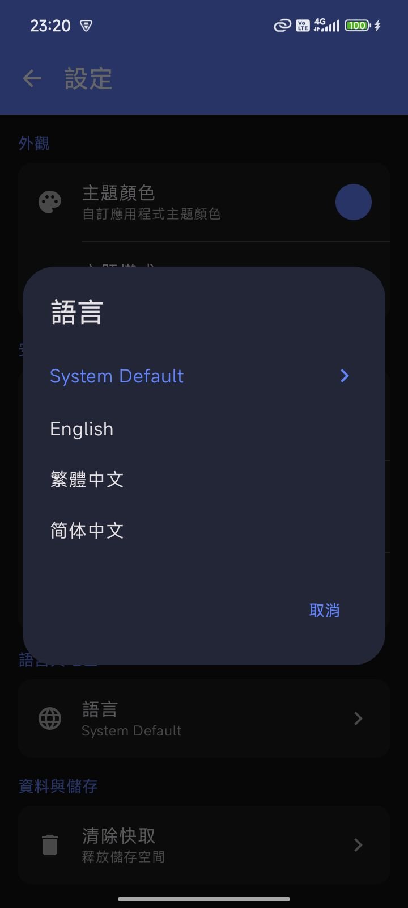
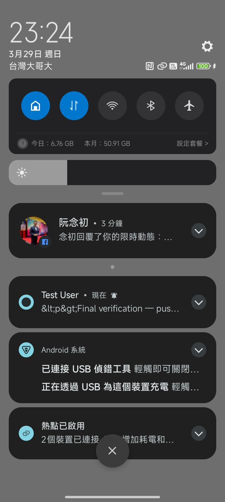

# Verification Report: Woow Odoo Android App

> **Date:** 2026-03-29 23:21:12
> **Device:** dew_p_global (SDK 35)
> **Result:** **16 passed, 3 failed** out of 19

---

## How to Read

📱 = Phone side | 🖥️ = Server side

---

## Step 1 [📱 Phone]: Launch app — fresh install, no account

- ✅ Login screen shown with server URL field

---

## Step 2 [📱 Phone]: Enter server URL

- ✅ Server URL entered

---

## Step 3 [📱 Phone]: Enter database name: odoo18_ecpay

- ✅ Database name entered

---

## Step 4 [📱 Phone]: Tap Next → credentials screen

- ✅ Credentials screen shown

---

## Step 5 [📱 Phone]: Enter username: admin

- ✅ Username entered

---

## Step 6 [📱 Phone]: Enter password and tap Login

- ✅ Login successful — WoowTech Odoo title visible

---

## Step 7 [📱 Phone]: Odoo WebView fully loaded

- ✅ Odoo web dashboard visible inside app

---

## Step 8 [📱 Phone]: Open menu → Config screen

- ✅ Config screen with account info

---

## Step 9 [📱 Phone]: Open Settings

- ✅ Settings screen visible

---

## Step 10 [📱 Phone]: Open color picker

- ✅ Brand preset colors visible
- ✅ HEX input (#RRGGBB) visible after scroll

---

## Step 11 [📱 Phone]: Check language picker

- ✅ 简体中文 option available

---

## Step 12 [🖥️ Server]: Login to Odoo as test user

- ✅ Logged in as test@woowtech.com (uid=636)

---

## Step 13 [🖥️ Server]: Find Azure Interior contact

- ✅ Found Azure Interior (id=15)

---

## Step 14 [🖥️ Server]: Post chatter comment on Azure Interior

- ✅ Comment posted — message_id=6875

---

## Step 15 [🖥️ Server]: Odoo module sends FCM push

- ✅ Log:  INFO odoo18_ecpay odoo.addons.woow_fcm_push.services.fcm_sender: FCM sent to 0/1 devices: Test User

---

## Step 16 [📱 Phone]: Notification appears on phone

- ❌ Sender 'Test User' visible in notification
- ❌ Message preview visible

---

## Step 17 [📱 Phone]: Tap notification → app opens

- ❌ App opens after tapping notification

---

## Step 18 [📱 Phone]: 3 grouped notifications

---

## Summary

| Checks | 19 |
|---|---|
| Passed | 16 |
| Failed | 3 |
| Screenshots | 14 |
