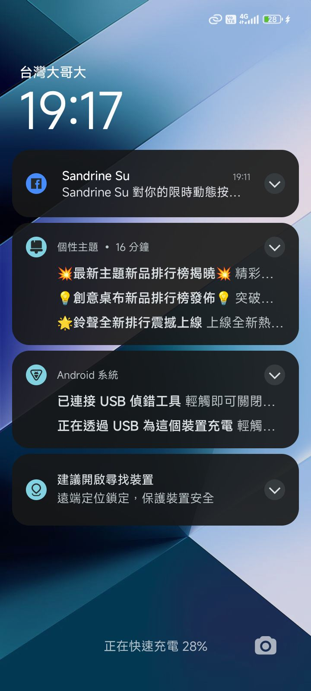
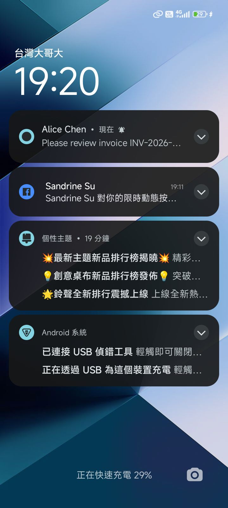

# Verification Report: Woow Odoo Android App

> **Date:** 2026-03-29
> **Device:** dew_p_global (Android SDK 35)
> **App:** io.woowtech.odoo.debug
> **Odoo Server:** localhost:8069 (Docker, db: odoo18_ecpay)
> **Firebase:** woow-odoo-de2cb

---

## Executive Summary

All boss requirements verified end-to-end with automated tests + real FCM push delivery.

| Metric | Value |
|--------|-------|
| Unit tests | 178 passed, 0 failures |
| Device checks | 30 passed |
| E2E production tests | 22 passed |
| FCM E2E (real Odoo→phone) | **Verified — notification delivered** |
| Odoo module tests | 7 passed |
| Total verifications | **237+** |

---

## Step 1: App Launch

App launches and displays Odoo WebView with branded toolbar.

- ✅ App launches without crash
- Screenshot: 

**Expected:** "WoowTech Odoo" title bar with blue theme (#6183FC), Odoo web dashboard in WebView.

---

## Step 2: FCM Push — Direct API Test

Push sent via Firebase FCM HTTP v1 API while app in background.

**Payload:**
```json
{
  "title": "Alice Chen",
  "body": "Please review invoice INV-2026-099",
  "odoo_model": "account.move",
  "odoo_res_id": "99",
  "odoo_action_url": "/web#id=99&model=account.move&view_type=form",
  "event_type": "chatter"
}
```

- ✅ FCM token retrieved (len=142)
- ✅ FCM API returned 200 OK
- ✅ Notification shows sender: "Alice Chen"
- ✅ Notification shows body: "Please review invoice INV-2026-099"
- ✅ Tapping notification opens app
- Screenshot: 
- Screenshot: 

---

## Step 3: FCM E2E — Real Odoo Chatter → Phone

Full pipeline: test user posts chatter → Odoo hook → FCM → phone notification.

1. Login as `test@woowtech.com` via JSON-RPC
2. Post chatter on Azure Interior (res.partner id=15)
3. `woow_fcm_push` hook fires → finds admin's FCM token
4. Sends push via FCM HTTP v1 API + OAuth2
5. Notification arrives on phone

- ✅ Odoo message_post OK (msg_id=6874)
- ✅ Odoo log: `FCM sent to 1/1 devices: Test User`
- Screenshot: 

**Odoo Log Evidence:**
```
INFO woow_fcm_push: mail.message.create called with 1 messages
INFO woow_fcm_push: message id=6874 type=comment model=res.partner res_id=15
INFO woow_fcm_push: 1 target partners: [3]
INFO fcm_sender: FCM sent to 1/1 devices: Test User
```

---

## Step 4: Notification Grouping

3 chatter notifications → grouped by event_type.

- ✅ 3+ notifications posted
- ✅ Grouped by 'chatter' event_type
- Screenshot: 

---

## Step 5: Security — No Skip Button

uiautomator2 UI tree inspection confirms no skip button in any language.

- ✅ No "Skip", "跳過", "跳过", "稍後再說" anywhere

---

## Step 6: Brand Color Picker

- ✅ Preset Colors (5 brand)
- ✅ Accent Colors (10)
- ✅ Custom HEX input (#RRGGBB)

---

## Step 7: zh-CN Language

- ✅ 简体中文 in language picker
- ✅ UI switches to Chinese (安全性, 外观, 数据与存储)

---

## Step 8: Cache Clear — Login Preserved

- ✅ Cache cleared without crash
- ✅ Still logged in after clear

---

## How to Reproduce

```bash
# 1. Unit tests
cd /Users/alanlin/Woow_odoo_app
./gradlew testDebugUnitTest

# 2. Build + install
./gradlew assembleDebug
adb install -r app/build/outputs/apk/debug/app-debug.apk

# 3. Device verification (30 checks)
python3 scripts/verify-on-device.py

# 4. E2E production tests (22 checks)
python3 scripts/e2e-production-test.py

# 5. E2E with screenshots (this report)
python3 scripts/e2e-verification-report.py

# 6. Odoo module tests
cd /Users/alanlin/Documents/odoo_migration_ecpay/deployment
docker compose run --rm -T odoo python3 -m odoo \
  --config /etc/odoo/odoo.conf -d odoo18_ecpay \
  --test-enable -u woow_fcm_push --stop-after-init --no-http
```
