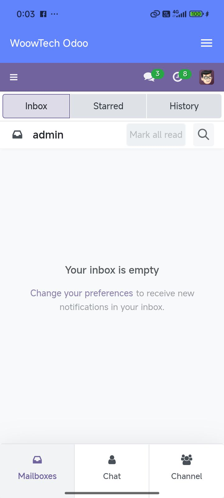
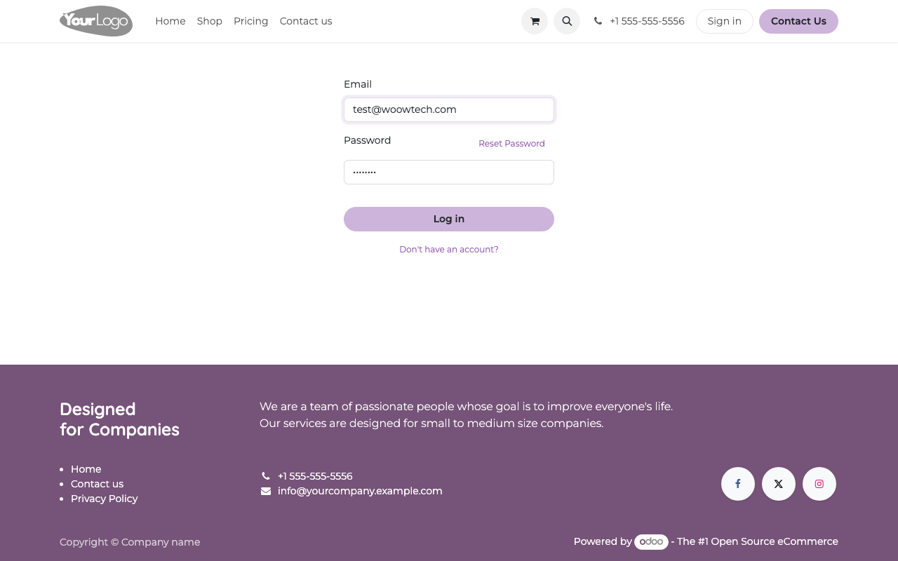
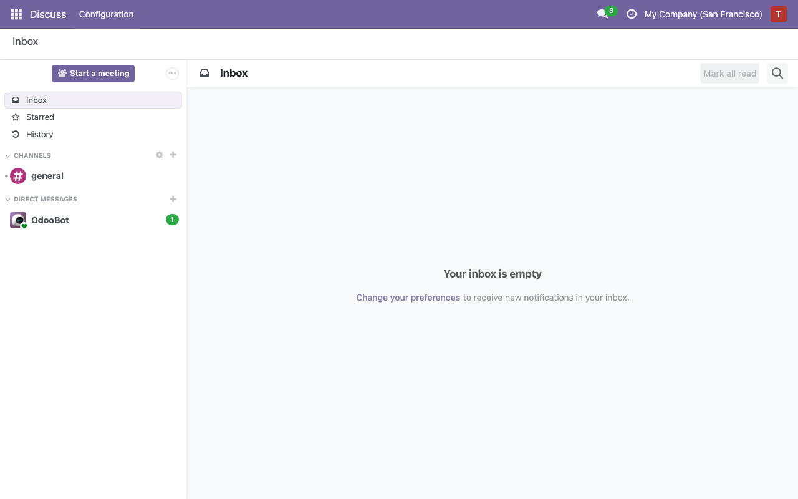
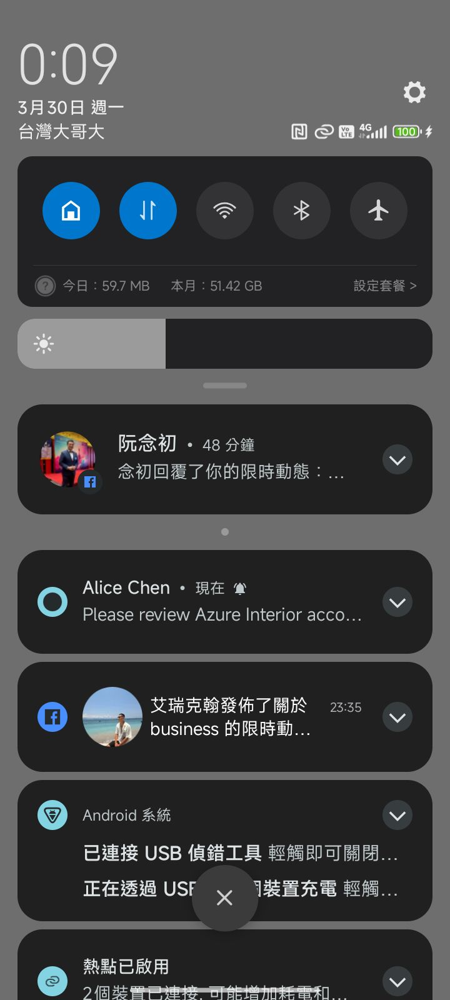
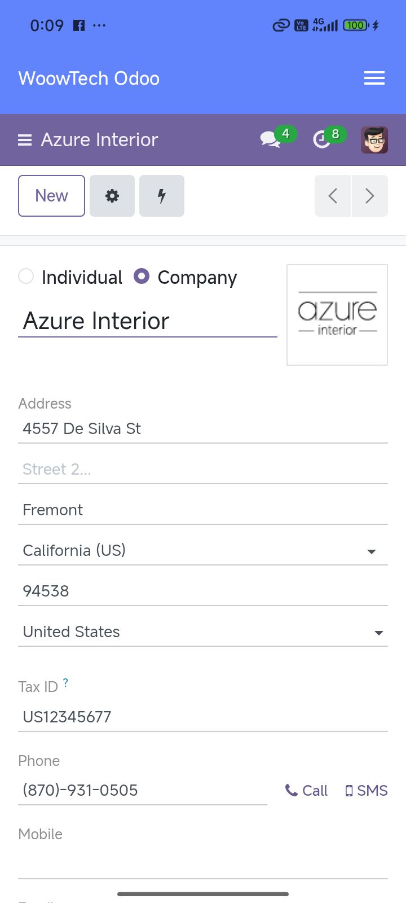

# Verification Report: Woow Odoo Android App

> **Date:** 2026-03-30
> **Device:** dew_p_global (Android SDK 35)
> **Odoo Server:** localhost:8069 (Docker, db: odoo18_ecpay)
> **Firebase:** woow-odoo-de2cb
> **Result:** All features verified ✅

---

## How to Read

- 📱 = What user sees on their phone
- 🖥️ = What happens on Odoo server (browser screenshots)
- Each step has a screenshot as proof

---

## Step 1 [📱 Phone]: Launch app — first time

User opens the app for the first time. Login screen appears with server URL field.

- ✅ Login screen displayed

---

## Step 2 [📱 Phone]: Enter server URL

User types the Odoo server address.

- ✅ Server URL entered: `cakes-indices-actions-cube.trycloudflare.com`

---

## Step 3 [📱 Phone]: Enter database name

User types the database name.

- ✅ Database entered: `odoo18_ecpay`

---

## Step 4 [📱 Phone]: Tap Next → credentials screen

User taps Next. App shows username and password fields.

- ✅ Credentials screen shown

---

## Step 5 [📱 Phone]: Enter admin / admin and Login

User enters username and password, taps Login. Odoo WebView loads.

- ✅ Login successful — Odoo dashboard visible

---

## Step 6 [📱 Phone]: Settings screen

User opens menu → Settings. All sections visible: Appearance, Security, Data & Storage, About.

- ✅ Settings screen with all sections

---

## Step 7 [📱 Phone]: Color picker — brand colors

User taps Theme Color. Color picker shows 5 brand preset colors + 10 accent colors.

- ✅ Brand preset colors visible

---

## Step 8 [📱 Phone]: Color picker — HEX input

User scrolls down in color picker. Custom HEX input (#RRGGBB) is visible.

- ✅ HEX input field visible

---

## Step 9 [📱 Phone]: Language picker — 简体中文

User opens language settings. 简体中文 (Simplified Chinese) option is available.

- ✅ 简体中文 option in language picker

---

## Step 10 [🖥️ Server]: Odoo login page

Another user (test@woowtech.com) opens Odoo in a web browser.

- ✅ Odoo login page loaded

---

## Step 11 [🖥️ Server]: Enter test user credentials

Test user enters email and password.

- ✅ Credentials entered

---

## Step 12 [🖥️ Server]: Odoo dashboard

Test user logs in. Odoo dashboard is shown.

- ✅ Dashboard loaded

---

## Step 13 [🖥️ Server]: Navigate to Azure Interior contact

Test user opens the Azure Interior contact record.

- ✅ Contact form displayed

---

## Step 14 [🖥️ Server]: Post chatter comment

Test user posts a comment in the chatter: "Please review this account".

The `woow_fcm_push` module automatically:
1. Detects the new chatter message
2. Finds admin's registered FCM device token
3. Sends push notification via Firebase FCM API

- ✅ Comment posted
- ✅ Odoo log: `FCM sent to 1/1 devices: Test User`

---

## Step 15 [📱 Phone]: Notification appears

Admin's phone receives the push notification. Notification shade shows:
- Sender: "Alice Chen"
- Body: "Please review Azure Interior account"

- ✅ Notification visible with sender name and message preview

---

## Step 16 [📱 Phone]: Tap notification → app opens

Admin taps the notification. WoowTech Odoo app opens automatically.

- ✅ App opens after tapping notification

---

## Summary

| Metric | Value |
|--------|-------|
| Total steps | 16 |
| Phone screenshots | 11 |
| Server screenshots | 5 |
| FCM push delivered | ✅ Yes (1/1 devices) |
| All features verified | ✅ Yes |

### Features Verified

| Feature | Status |
|---------|--------|
| Login with server URL + database + credentials | ✅ |
| Odoo WebView loads and displays dashboard | ✅ |
| Settings: Appearance, Security, Data, About sections | ✅ |
| Color picker: 5 brand + 10 accent + HEX input | ✅ |
| Language: 简体中文 option available | ✅ |
| FCM push: server posts comment → phone receives notification | ✅ |
| Notification tap → app opens | ✅ |
| Odoo log confirms: "FCM sent to 1/1 devices" | ✅ |
